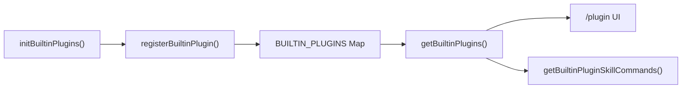

# 内置插件

## 概览

内置插件是随 Claude Code CLI 打包的插件，通过 `/plugin` UI 提供启用/禁用管理。每个内置插件可以提供技能（Skill）、会话钩子（Hooks）和 MCP 服务器，并且可以通过 GrowthBook 特性开关动态控制可用性。

## 插件标识

内置插件使用 `{name}@builtin` 格式的 ID，与市场插件（`{name}@{marketplace}`）区分：

```typescript
export const BUILTIN_MARKETPLACE_NAME = 'builtin'

function isBuiltinPluginId(pluginId: string): boolean {
  return pluginId.endsWith(`@${BUILTIN_MARKETPLACE_NAME}`)
}
```

## 注册流程



### 注册内置插件

```typescript
// 在初始化时调用
export function registerBuiltinPlugin(
  definition: BuiltinPluginDefinition,
): void {
  BUILTIN_PLUGINS.set(definition.name, definition)
}
```

### 初始化入口

```typescript
// 通常在 main.tsx 或 init.ts 中调用
import { initBuiltinPlugins } from '../plugins/initBuiltinPlugins.js'
initBuiltinPlugins()
```

## 启用/禁用管理

`getBuiltinPlugins()` 根据用户设置返回已启用和已禁用的插件列表：

```typescript
export function getBuiltinPlugins(): {
  enabled: LoadedPlugin[]
  disabled: LoadedPlugin[]
} {
  const settings = getSettings_DEPRECATED()
  const enabled: LoadedPlugin[] = []
  const disabled: LoadedPlugin[] = []

  for (const [name, definition] of BUILTIN_PLUGINS) {
    // 1. 检查可用性
    if (definition.isAvailable && !definition.isAvailable()) {
      continue  // 完全跳过不可用的插件
    }

    // 2. 确定启用状态：用户设置 > 默认值 > true
    const pluginId = `${name}@${BUILTIN_MARKETPLACE_NAME}`
    const userSetting = settings?.enabledPlugins?.[pluginId]
    const isEnabled = userSetting !== undefined
      ? userSetting === true
      : (definition.defaultEnabled ?? true)

    // 3. 构建 LoadedPlugin 对象
    const plugin: LoadedPlugin = {
      name,
      manifest: {
        name,
        description: definition.description,
        version: definition.version,
      },
      path: BUILTIN_MARKETPLACE_NAME,  // 无文件系统路径
      source: pluginId,
      repository: pluginId,
      enabled: isEnabled,
      isBuiltin: true,
      hooksConfig: definition.hooks,
      mcpServers: definition.mcpServers,
    }

    if (isEnabled) {
      enabled.push(plugin)
    } else {
      disabled.push(plugin)
    }
  }

  return { enabled, disabled }
}
```

## 技能命令转换

内置插件的技能被转换为统一的 `Command` 对象：

```typescript
export function getBuiltinPluginSkillCommands(): Command[] {
  const { enabled } = getBuiltinPlugins()  // 仅从已启用插件获取
  const commands: Command[] = []

  for (const plugin of enabled) {
    const definition = BUILTIN_PLUGINS.get(plugin.name)
    if (!definition?.skills) continue
    for (const skill of definition.skills) {
      commands.push(skillDefinitionToCommand(skill))
    }
  }

  return commands
}
```

### 转换细节

```typescript
function skillDefinitionToCommand(definition: BundledSkillDefinition): Command {
  return {
    type: 'prompt',
    name: definition.name,
    description: definition.description,
    hasUserSpecifiedDescription: true,
    allowedTools: definition.allowedTools ?? [],
    argumentHint: definition.argumentHint,
    whenToUse: definition.whenToUse,
    model: definition.model,
    disableModelInvocation: definition.disableModelInvocation ?? false,
    userInvocable: definition.userInvocable ?? true,
    contentLength: 0,
    // source = 'bundled'（而非 'builtin'）
    // 'builtin' 在 Command 中表示硬编码斜杠命令（/help, /clear）
    // 'bundled' 使技能出现在 Skill tool 列表中
    source: 'bundled',
    loadedFrom: 'bundled',
    hooks: definition.hooks,
    context: definition.context,
    agent: definition.agent,
    isEnabled: definition.isEnabled ?? (() => true),
    isHidden: !(definition.userInvocable ?? true),
    progressMessage: 'running',
    getPromptForCommand: definition.getPromptForCommand,
  }
}
```

## 插件定义结构

```typescript
type BuiltinPluginDefinition = {
  // 基本信息
  name: string                      // 插件名称（唯一标识）
  description: string              // 描述（UI 显示）
  version: string                  // 版本号

  // 启用控制
  defaultEnabled?: boolean        // 默认启用状态（默认 true）
  isAvailable?: () => boolean      // 动态可用性检查（如 GrowthBook）

  // 提供的功能
  skills?: BundledSkillDefinition[]   // 技能列表
  hooks?: HooksSettings           // 会话级别钩子
  mcpServers?: McpServerConfig[] // MCP 服务器配置
}
```

## 可用性检查示例

```typescript
// 通过 GrowthBook 特性开关控制可用性
registerBuiltinPlugin({
  name: 'my-plugin',
  description: 'My awesome plugin',
  version: '1.0.0',
  isAvailable: () => {
    return getFeatureValue_CACHED_MAY_BE_STALE('my_plugin_enabled', false)
  },
  skills: [...],
})
```

## 与打包技能的区别

| 维度 | 内置插件 | 打包技能 |
|------|---------|---------|
| 注册方式 | `registerBuiltinPlugin()` | `registerBundledSkill()` |
| UI 入口 | `/plugin` | `/skill` |
| 用户控制 | 启用/禁用 | 始终可用 |
| 多组件 | ✅ 技能+钩子+MCP | ❌ 仅技能 |
| 设置持久化 | ✅ 保存到用户设置 | ❌ 编译时确定 |
| 来源 | 随 CLI 打包 | 随 CLI 打包 |

## 测试支持

```typescript
// 清空注册表（测试用）
export function clearBuiltinPlugins(): void {
  BUILTIN_PLUGINS.clear()
}
```

## 源码引用

- [builtinPlugins.ts](/restored-src/src/plugins/builtinPlugins.ts)
- [types/plugin.ts](/restored-src/src/types/plugin.ts)
- [bundledSkills.ts](/restored-src/src/skills/bundledSkills.ts)
- [commands.ts](/restored-src/src/commands.ts)

## 相关文档

- [插件与技能系统](../plugins/_index.md)
- [打包技能](bundled-skills.md)

---

*Generated by [Nium-Wiki v0.0.0](https://github.com/niuma996/nium-wiki) | 2026-03-31*
