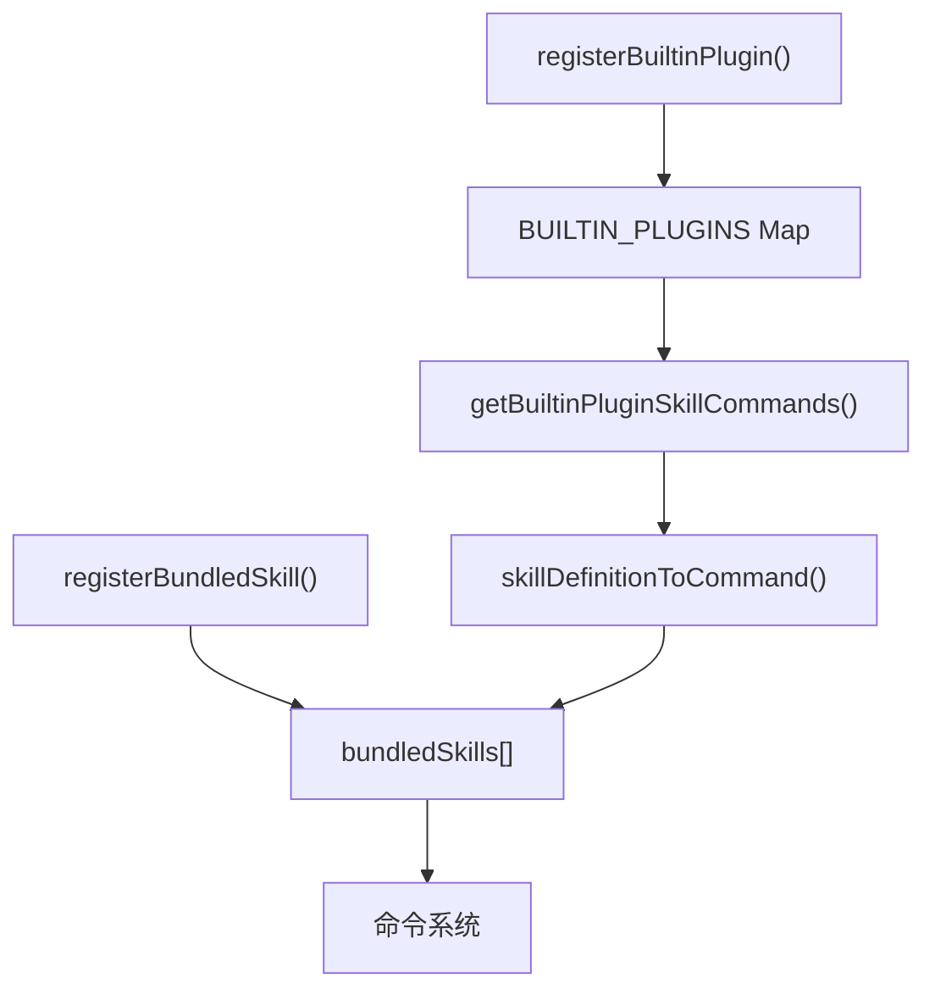

# 打包技能

## 概览

打包技能是随 Claude Code CLI 编译打包的技能，无需额外安装即可使用。与内置插件不同，打包技能没有启用/禁用控制，始终可用，且只提供技能功能。

## 技能定义

[bundledSkills.ts](/restored-src/src/skills/bundledSkills.ts) 定义了 `BundledSkillDefinition` 类型：

```typescript
type BundledSkillDefinition = {
  name: string                      // 技能名称（斜杠命令名）
  description: string              // 描述（/help 显示）
  aliases?: string[]               // 别名
  whenToUse?: string               // 使用场景
  argumentHint?: string            // 参数提示
  allowedTools?: string[]          // 允许的工具列表
  model?: string                   // 指定模型
  disableModelInvocation?: boolean
  userInvocable?: boolean          // 是否可由用户调用（默认 true）
  isEnabled?: () => boolean        // 动态启用检查
  hooks?: HooksSettings            // 钩子配置
  context?: 'inline' | 'fork'      // 执行上下文
  agent?: string                   // 关联的智能体类型

  /** 参考文件：在首次调用时提取到磁盘 */
  files?: Record<string, string>

  getPromptForCommand: (
    args: string,
    context: ToolUseContext,
  ) => Promise<ContentBlockParam[]>
}
```

## 注册机制

### 注册流程


```typescript
// 内部注册表
const bundledSkills: Command[] = []

export function registerBundledSkill(definition: BundledSkillDefinition): void {
  const command: Command = {
    type: 'prompt',
    name: definition.name,
    description: definition.description,
    source: 'bundled',
    loadedFrom: 'bundled',
    skillRoot: definition.skillRoot,
    hooks: definition.hooks,
    context: definition.context,
    agent: definition.agent,
    isEnabled: definition.isEnabled,
    progressMessage: 'running',
    getPromptForCommand,
  }
  bundledSkills.push(command)
}

export function getBundledSkills(): Command[] {
  return [...bundledSkills]  // 返回副本，防止外部修改
}
```

## 参考文件提取

打包技能可以包含参考文件，这些文件在首次调用时提取到磁盘供模型读取：

```typescript
export function registerBundledSkill(definition: BundledSkillDefinition): void {
  const { files } = definition

  let skillRoot: string | undefined
  let getPromptForCommand = definition.getPromptForCommand

  // 如果技能包含文件，在首次调用时提取
  if (files && Object.keys(files).length > 0) {
    skillRoot = getBundledSkillExtractDir(definition.name)

    // 闭包内 memoization：并发调用共享同一提取 Promise
    let extractionPromise: Promise<string | null> | undefined
    const inner = definition.getPromptForCommand

    getPromptForCommand = async (args, ctx) => {
      // 1. 确保文件已提取（只执行一次）
      extractionPromise ??= extractBundledSkillFiles(definition.name, files)
      const extractedDir = await extractionPromise

      // 2. 获取技能提示词
      const blocks = await inner(args, ctx)

      // 3. 如果提取成功，前缀添加基础目录信息
      if (extractedDir === null) return blocks
      return prependBaseDir(blocks, extractedDir)
    }
  }
}
```

### 提取目录

```typescript
export function getBundledSkillExtractDir(skillName: string): string {
  return join(getBundledSkillsRoot(), skillName)
}
```

默认位置：`~/.claude/bundled-skills/{nonce}/{skillName}/`

## 安全写入机制

参考文件提取使用多重安全措施防止符号链接攻击：

```typescript
const SAFE_WRITE_FLAGS =
  process.platform === 'win32'
    ? 'wx'  // Windows: 独占创建模式
    : O_WRONLY | O_CREAT | O_EXCL | O_NOFOLLOW
    // Unix: 独占创建 + 不跟随符号链接

async function safeWriteFile(p: string, content: string): Promise<void> {
  const fh = await open(p, SAFE_WRITE_FLAGS, 0o600)  // 文件权限 600
  try {
    await fh.writeFile(content, 'utf8')
  } finally {
    await fh.close()
  }
}
```

### 路径安全验证

```typescript
function resolveSkillFilePath(baseDir: string, relPath: string): string {
  const normalized = normalize(relPath)

  // 防止路径遍历攻击
  if (
    isAbsolute(normalized) ||          // 不允许绝对路径
    normalized.split(pathSep).includes('..') ||  // 不允许 ../
    normalized.split('/').includes('..')          // 不允许 ..\
  ) {
    throw new Error(`bundled skill file path escapes skill dir: ${relPath}`)
  }

  return join(baseDir, normalized)
}
```

### 目录树批量创建

```typescript
async function writeSkillFiles(
  dir: string,
  files: Record<string, string>,
): Promise<void> {
  // 按父目录分组，减少 mkdir 调用
  const byParent = new Map<string, [string, string][]>()

  for (const [relPath, content] of Object.entries(files)) {
    const target = resolveSkillFilePath(dir, relPath)
    const parent = dirname(target)
    // ... 分组逻辑
  }

  // 并行创建目录 + 写入文件
  await Promise.all(
    [...byParent].map(async ([parent, entries]) => {
      await mkdir(parent, { recursive: true, mode: 0o700 })  // 目录权限 700
      await Promise.all(entries.map(([p, c]) => safeWriteFile(p, c)))
    }),
  )
}
```

## 基础目录前缀

当参考文件提取成功时，技能提示词会被前缀添加基础目录信息：

```typescript
function prependBaseDir(
  blocks: ContentBlockParam[],
  baseDir: string,
): ContentBlockParam[] {
  const prefix = `Base directory for this skill: ${baseDir}\n\n`

  if (blocks.length > 0 && blocks[0]!.type === 'text') {
    return [
      { type: 'text', text: prefix + blocks[0]!.text },
      ...blocks.slice(1),
    ]
  }

  return [{ type: 'text', text: prefix }, ...blocks]
}
```

这使 AI 模型能够使用 Read/Grep 等工具操作提取的文件，就像操作普通磁盘文件一样。

## 与内置插件的关系



内置插件的技能最终也通过 `skillDefinitionToCommand()` 转换为 `Command` 对象，与打包技能共享同一注册表。

## 源码引用

- [bundledSkills.ts](/restored-src/src/skills/bundledSkills.ts)
- [filesystem.ts](/restored-src/src/utils/permissions/filesystem.js) — `getBundledSkillsRoot`
- [builtinPlugins.ts](/restored-src/src/plugins/builtinPlugins.ts) — `skillDefinitionToCommand`

## 相关文档

- [插件与技能系统](../plugins/_index.md)
- [内置插件](builtin.md)

---

*Generated by [Nium-Wiki v0.0.0](https://github.com/niuma996/nium-wiki) | 2026-03-31*
