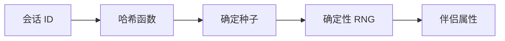
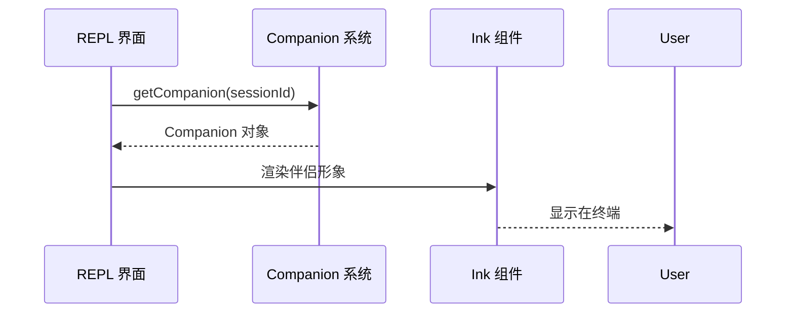

# 伴侣系统

## 概览

伴侣（Companion）系统是 Claude Code 的趣味性功能，通过确定性随机算法为每个用户/会话生成独特的"吉祥物"角色形象。这个角色显示在 CLI 界面中，为命令行体验增加个性化元素。

伴侣系统的核心特性是**确定性**：相同的输入（会话 ID）总是产生相同的伴侣，确保用户体验的一致性。

## 核心机制

[companion.ts](/restored-src/src/buddy/companion.ts) 提供了伴侣生成逻辑：

```typescript
export function roll(seed: string): Companion
```

### 确定性与随机数



系统使用会话 ID 作为种子，通过哈希函数生成确定性随机数，然后使用该随机数从预定义的角色池中选择伴侣。

### 伴侣池

伴侣角色池包含多种类型：

| 类型 | 示例 | 说明 |
|------|------|------|
| 动物系 | 鸭子、狐狸、仓鼠 | 随机动物角色 |
| 科技系 | 机器人、终端精灵 | 程序员风格 |
| 经典系 | 猫、狗、熊猫 | 受欢迎的选择 |

## Roll 机制

```typescript
export function roll(seed: string): Companion {
  // 1. 将种子哈希到 [0, 1) 范围
  const hash = hashString(seed)
  const normalized = hash / MAX_HASH

  // 2. 从角色池中确定性选择
  const index = Math.floor(normalized * companions.length)
  return companions[index]
}
```

## 缓存机制

伴侣生成后会被缓存，避免每次渲染都重新计算：

```typescript
// 模块级缓存
let cachedCompanion: Companion | null = null

export function getCompanion(sessionId: string): Companion {
  if (!cachedCompanion) {
    cachedCompanion = roll(sessionId)
  }
  return cachedCompanion
}
```

## 界面集成

伴侣在 CLI 的 REPL 界面中显示：



## 定制化

伴侣系统支持一定程度的定制化，通常通过环境变量控制：

```bash
# 禁用伴侣显示
CLAUDE_CODE_DISABLE_COMPANION=1

# 强制特定伴侣（用于测试）
CLAUDE_CODE_FORCE_COMPANION=duck
```

## 设计决策

### 为什么不每次都随机？

如果每次启动都随机生成伴侣，用户会感到体验不一致。同一个会话中出现不同的角色会破坏沉浸感。因此，伴侣使用会话 ID 作为种子，确保同一会话始终获得相同的伴侣。

### 轻量级设计

伴侣系统刻意保持轻量级：
- 角色定义存储在单个文件中
- 无需外部资源（角色描述为纯文本）
- 不影响 CLI 性能（仅在初始化时计算一次）

## 源码引用

- [companion.ts](/restored-src/src/buddy/companion.ts)
- [buddy/](/restored-src/src/buddy/) — 伴侣相关文件目录

## 相关文档

- [插件与技能系统](../plugins/_index.md)
- [内置插件](builtin.md)

---

*Generated by [Nium-Wiki v0.0.0](https://github.com/niuma996/nium-wiki) | 2026-03-31*
