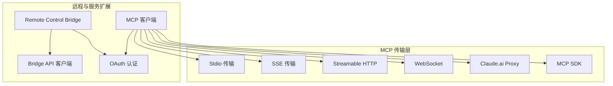
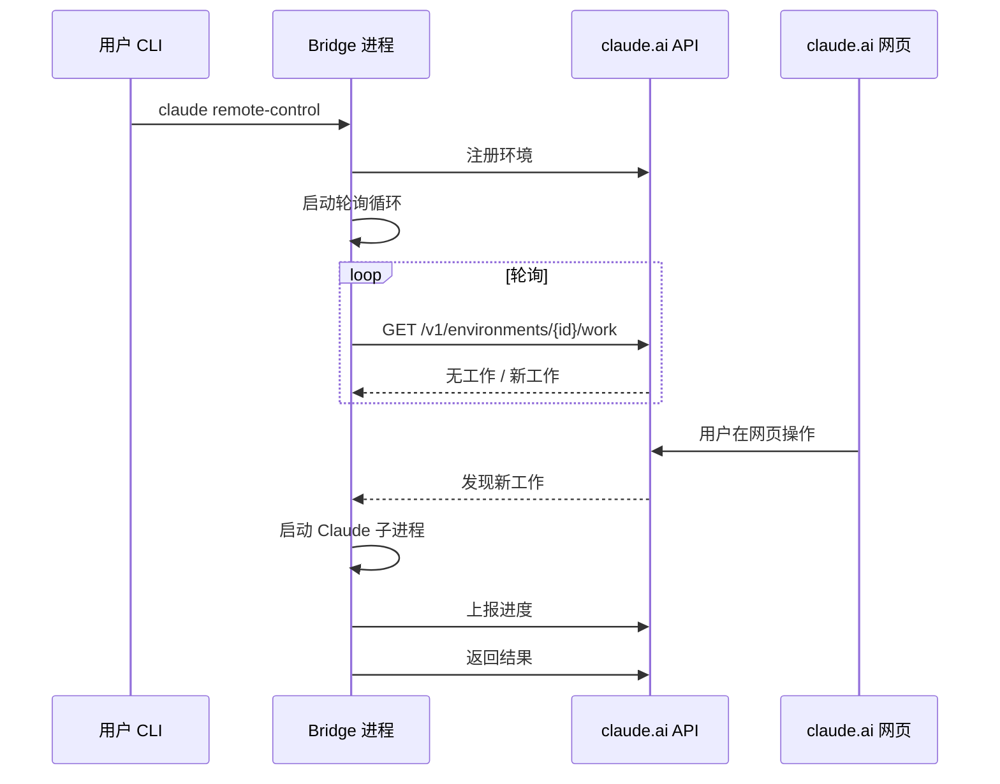

# 远程与服务扩展

## 概览

远程与服务扩展模块是 Claude Code 与外部系统交互的核心层，包含两个关键子系统：

1. **Remote Control Bridge**：将本地机器注册为远程工作环境，使 claude.ai 可以远程控制本地 Claude Code 实例
2. **MCP 客户端**：实现 Model Context Protocol 协议，连接和管理 MCP 服务器，为 AI 提供外部工具能力

这两个子系统共同支持 Claude Code 的远程协作和扩展能力。

## 子模块

| 模块 | 说明 | 文档 |
|------|------|------|
| [Remote Control Bridge](bridge.md) | 远程控制桥接系统 | [bridge.md](bridge.md) |
| [MCP 客户端](mcp.md) | Model Context Protocol 客户端 | [mcp.md](mcp.md) |

## 架构位置



## Remote Control Bridge 概述

Bridge 系统允许用户在服务器或远程机器上运行 `claude remote-control`，将其注册为 claude.ai 的工作环境。用户可以从 claude.ai 网页界面远程使用本地 Claude Code 实例。

核心流程：



## MCP 客户端概述

MCP 客户端实现了完整的 Model Context Protocol 协议，支持多种传输方式连接 MCP 服务器：

| 传输类型 | 说明 | 使用场景 |
|---------|------|---------|
| `stdio` | 标准输入输出 | 本地 MCP 服务器 |
| `sse` | Server-Sent Events | 远程 MCP 服务器 |
| `sse-ide` | SSE（IDE 集成） | IDE MCP 服务器 |
| `http` | Streamable HTTP | 通用 HTTP 服务器 |
| `ws` | WebSocket | 实时双向通信 |
| `claudeai-proxy` | Claude.ai 代理 | claude.ai 托管 MCP |
| `sdk` | MCP SDK | SDK 管理的服务器 |

## 关键设计决策

### 1. OAuth 认证处理

MCP 客户端和 Bridge 系统都依赖 OAuth 认证。客户端实现了 Token 自动刷新机制，确保长时间运行的连接不会因 Token 过期而中断。

### 2. 传输类型自动选择

```typescript
// 根据配置类型自动选择传输实现
if (serverRef.type === 'sse') {
  transport = new SSEClientTransport(...)
} else if (serverRef.type === 'http') {
  transport = new StreamableHTTPClientTransport(...)
} else if (serverRef.type === 'stdio') {
  transport = new StdioClientTransport(...)
}
```

### 3. 会话入口 JWT

Bridge 系统使用会话入口 JWT（Session Ingress Token）进行 WebSocket 认证，该 Token 通过 OAuth Token 交换获得，约 3 小时 55 分钟后需要刷新。

### 4. 多会话 Spawn 模式

Bridge 支持三种会话 Spawn 模式，通过 GrowthBook 特性开关 `tengu_ccr_bridge_multi_session` 控制：

| 模式 | 说明 | 工作树支持 |
|------|------|-----------|
| `single-session` | 单会话，每次只处理一个工作项 | ❌ |
| `same-dir` | 多会话，所有会话共享工作目录 | ❌ |
| `worktree` | 多会话，每个会话使用独立 Git Worktree | ✅ |

## 关键类型

| 类型 | 定义位置 | 说明 |
|------|---------|------|
| `BridgeConfig` | [types.ts](/restored-src/src/bridge/types.ts) | Bridge 配置 |
| `SessionHandle` | [types.ts](/restored-src/src/bridge/types.ts) | 会话句柄 |
| `MCPServerConnection` | [client.ts](/restored-src/src/services/mcp/client.ts) | MCP 服务器连接状态 |
| `ScopedMcpServerConfig` | [types.ts](/restored-src/src/services/mcp/types.ts) | 作用域 MCP 配置 |
| `WorkSecret` | [types.ts](/restored-src/src/bridge/types.ts) | 工作秘密（API 凭证） |

## 源码引用

- [bridgeMain.ts](/restored-src/src/bridge/bridgeMain.ts)
- [bridgeApi.ts](/restored-src/src/bridge/bridgeApi.ts)
- [bridgeConfig.ts](/restored-src/src/bridge/bridgeConfig.ts)
- [client.ts](/restored-src/src/services/mcp/client.ts)
- [types.ts](/restored-src/src/bridge/types.ts)
- [mcp/types.ts](/restored-src/src/services/mcp/types.ts)

## 相关文档

- [架构总览](../architecture.md)
- [主页](../index.md)
- [Remote Control Bridge](bridge.md)
- [MCP 客户端](mcp.md)

---

*Generated by [Nium-Wiki v0.0.0](https://github.com/niuma996/nium-wiki) | 2026-03-31*
