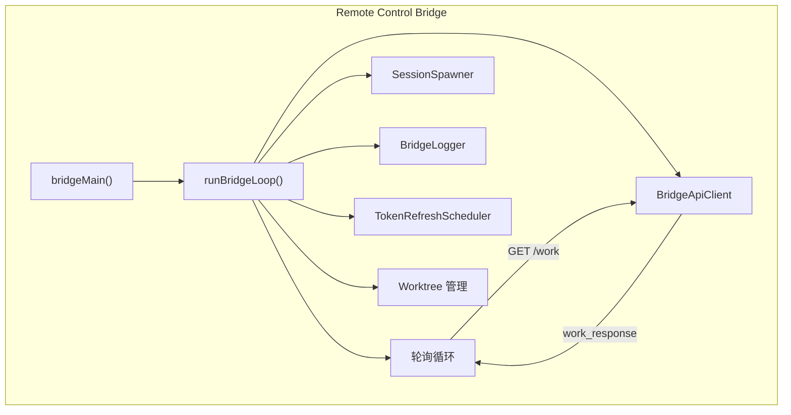
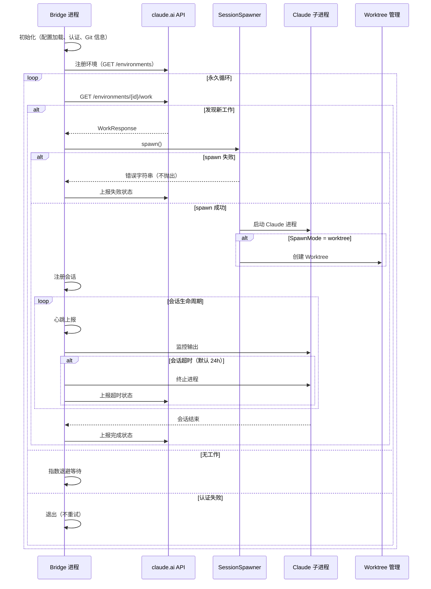

# Remote Control Bridge

## 概览

Remote Control Bridge（远程控制桥接系统）是 Claude Code 的远程工作环境注册与管理系统。通过 `claude remote-control` 命令，用户可以将本地机器注册为 claude.ai 的远程工作环境，从而在网页界面远程控制本地 Claude Code 实例。

## 核心入口

```bash
# 主命令（多个别名）
claude remote-control
claude rc          # 简短别名
claude remote      # 旧别名
claude sync        # 旧别名
claude bridge      # 旧别名
```

## 系统架构



## 核心数据结构

### BridgeConfig

```typescript
type BridgeConfig = {
  environmentId: string
  environmentSecret: string
  apiBaseUrl: string
  maxSessions: number       // 最大并发会话数
  spawnMode: SpawnMode     // single-session | worktree | same-dir
  permissionMode?: PermissionMode
  name?: string
  debugFile?: string
}
```

### SessionHandle

```typescript
type SessionHandle = {
  sessionId: string
  workId: string
  process: ChildProcess
  accessToken: string
  worktreePath?: string
  worktreeBranch?: string
  currentActivity?: SessionActivity
  activities: SessionActivity[]
  lastStderr: string[]
  status: 'connecting' | 'ready' | 'done'
}
```

### SpawnMode

```typescript
type SpawnMode = 'single-session' | 'worktree' | 'same-dir'

// single-session: 每次只处理一个工作项，完成后退出
// worktree: 每个会话使用独立 Git Worktree（推荐）
// same-dir: 所有会话共享工作目录（可能冲突）
```

## 主循环：`runBridgeLoop`

[bridgeMain.ts](/restored-src/src/bridge/bridgeMain.ts) 中的 `runBridgeLoop` 是 Bridge 的核心轮询循环：



### 状态管理

```typescript
const activeSessions = new Map<string, SessionHandle>()
const sessionStartTimes = new Map<string, number>()
const sessionWorkIds = new Map<string, string>()
const sessionIngressTokens = new Map<string, string>()  // 单独存储，刷新时不会被覆盖
const sessionTimers = new Map<string, ReturnType<typeof setTimeout>>()
const completedWorkIds = new Set<string>()
const sessionWorktrees = new Map<string, { worktreePath, worktreeBranch, gitRoot }>()
const timedOutSessions = new Set<string>()
const titledSessions = new Set<string>()
```

## 认证与 Token 管理

### 启动认证检查

```typescript
// Bridge 必须先验证用户已登录
if (!getClaudeAIOAuthTokens()?.accessToken) {
  exitWithError(BRIDGE_LOGIN_ERROR)
}

// 验证 Bridge 功能未被禁用
const disabledReason = await getBridgeDisabledReason()
if (disabledReason) {
  exitWithError(`Error: ${disabledReason}`)
}
```

### Token 刷新调度器

```typescript
// 会话入口 JWT 约 3h55m 过期，需要提前刷新
const tokenRefresh = createTokenRefreshScheduler({
  refreshIntervalMs: 3 * 60 * 60 * 1000,  // 3 小时
  getToken: () => getBridgeAccessToken(),
  onRefresh: (newToken) => {
    // 更新所有活跃会话的入口 JWT
    for (const [sessionId, token] of sessionIngressTokens) {
      sessionIngressTokens.set(sessionId, newToken)
    }
  }
})
```

## 会话生命周期

### 1. 启动会话

```typescript
function safeSpawn(
  spawner: SessionSpawner,
  opts: SessionSpawnOpts,
  dir: string,
): SessionHandle | string {
  try {
    return spawner.spawn(opts, dir)
  } catch (err) {
    logError(new Error(`Session spawn failed: ${errMsg}`))
    return errMsg  // 返回错误字符串而非抛出
  }
}
```

### 2. 会话结束处理

```typescript
function onSessionDone(sessionId, startTime, handle) {
  return (status) => {
    activeSessions.delete(sessionId)
    sessionStartTimes.delete(sessionId)
    sessionIngressTokens.delete(sessionId)
    capacityWake.wake()  // 唤醒容量等待
    // 清理 Worktree（如果无变更）
    if (sessionWorktrees.has(sessionId)) {
      removeAgentWorktree(worktreePath)
    }
  }
}
```

## 回退策略

Bridge 实现了指数回退机制处理各种错误：

```typescript
const DEFAULT_BACKOFF: BackoffConfig = {
  connInitialMs: 2_000,      // 初始：2 秒
  connCapMs: 120_000,       // 上限：2 分钟
  connGiveUpMs: 600_000,     // 放弃：10 分钟
  generalInitialMs: 500,      // 通用：500ms
  generalCapMs: 30_000,       // 上限：30 秒
  generalGiveUpMs: 600_000,   // 放弃：10 分钟
}
```

| 错误类型 | 策略 |
|---------|------|
| 连接失败 | 指数回退，从 2s 开始，最多 2 分钟 |
| API 错误 | 指数回退，最多 30 秒 |
| 认证失败 | 不重试，直接退出 |
| 超时 | 会话级超时监控（默认 24 小时） |

## 工作树（Worktree）管理

### 创建 Worktree

```typescript
const worktree = await createAgentWorktree({
  gitRoot,
  branchName: `claude-bridge-${sessionId.slice(0, 8)}`,
  baseDir: worktreesRoot,
})
```

### 清理 Worktree

```typescript
// 有变更：保留 Worktree，返回路径信息
// 无变更：自动删除
if (!hasWorktreeChanges(worktreePath)) {
  await removeAgentWorktree(worktreePath)
}
```

## 指针文件与会话恢复

Bridge 使用指针文件（Pointer File）跟踪最近的会话，支持 `--continue` 恢复：

```typescript
// 写入指针
await writeBridgePointer(sessionId, { dir, timestamp })

// 读取指针
const found = await readBridgePointerAcrossWorktrees(dir)
if (found) {
  // 恢复会话
  resumeSessionId = found.pointer.sessionId
}
```

## CCR v1 与 v2 兼容层

Bridge 支持两种 API 版本：

| 版本 | 会话 URL | 说明 |
|------|---------|------|
| CCR v1 | 会话入口 URL | 旧版兼容 |
| CCR v2 | SDK URL (`/v1/code_sessions/*`) | 新版 API |

通过 GrowthBook 开关 `tengu_bridge_repl_v2_cse_shim_enabled` 控制兼容层行为。

## CLI 参数

| 参数 | 说明 | 默认值 |
|------|------|--------|
| `--verbose` | 详细日志输出 | false |
| `--sandbox` | 沙箱模式 | false |
| `--session-timeout` | 会话超时（毫秒） | 86400000 (24h) |
| `--permission-mode` | 权限模式 | 继承用户设置 |
| `--name` | 会话名称 | 自动派生 |
| `--spawn` | Spawn 模式 | 交互选择 |
| `--capacity` | 最大并发数 | 32 |
| `--session-id` | 恢复指定会话 | - |
| `--continue` | 从指针文件恢复 | - |

## 源码引用

- [bridgeMain.ts](/restored-src/src/bridge/bridgeMain.ts)
- [bridgeApi.ts](/restored-src/src/bridge/bridgeApi.ts)
- [bridgeConfig.ts](/restored-src/src/bridge/bridgeConfig.ts)
- [sessionRunner.ts](/restored-src/src/bridge/sessionRunner.ts)
- [workSecret.ts](/restored-src/src/bridge/workSecret.ts)
- [types.ts](/restored-src/src/bridge/types.ts)

## 相关文档

- [远程与服务扩展](../remote/_index.md)
- [MCP 客户端](mcp.md)

---

*Generated by [Nium-Wiki v0.0.0](https://github.com/niuma996/nium-wiki) | 2026-03-31*
