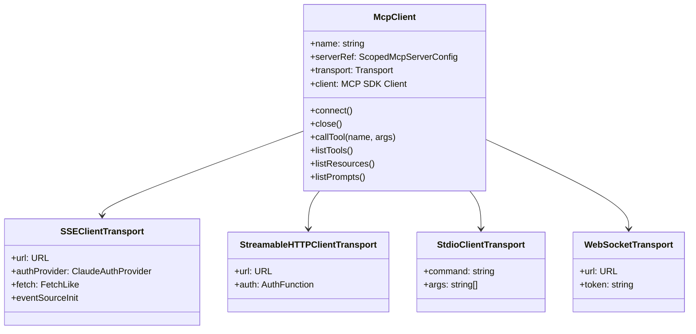

# MCP 客户端

## 概览

MCP 客户端（[client.ts](/restored-src/src/services/mcp/client.ts)）实现了完整的 Model Context Protocol 客户端，支持六种传输类型连接 MCP 服务器。该模块是 Claude Code 扩展能力的基础，使 AI 能够调用外部工具和访问外部资源。

## 传输类型支持

| 传输类型 | 协议 | 使用场景 | 认证支持 |
|---------|------|---------|---------|
| `stdio` | 标准 I/O | 本地 MCP 服务器进程 | 无 |
| `sse` | Server-Sent Events | 远程 MCP 服务器 | OAuth Bearer |
| `sse-ide` | SSE（IDE 集成） | IDE MCP 服务器 | 无 |
| `http` | Streamable HTTP | 通用 HTTP 服务器 | 自定义 Header |
| `ws` | WebSocket | 实时双向通信 | Token 参数 |
| `claudeai-proxy` | Claude.ai 代理 | claude.ai 托管 MCP | OAuth Bearer |
| `sdk` | MCP SDK | SDK 管理的服务器 | SDK 内置 |

## 架构设计



## 核心 API

### `connectToServer`

```typescript
export const connectToServer = memoize(
  async (
    name: string,
    serverRef: ScopedMcpServerConfig,
    serverStats?: { totalServers, stdioCount, sseCount, ... }
  ): Promise<MCPServerConnection>
)
```

连接到一个 MCP 服务器并返回连接状态。根据 `serverRef.type` 自动选择传输实现：

```typescript
// stdio：本地进程
if (serverRef.type === 'stdio' || !serverRef.type) {
  transport = new StdioClientTransport({ command, args, env })
}

// SSE：远程服务器（OAuth 认证）
if (serverRef.type === 'sse') {
  transport = new SSEClientTransport(new URL(serverRef.url), {
    authProvider: new ClaudeAuthProvider(name, serverRef),
    fetch: wrapFetchWithTimeout(...),
  })
}

// HTTP：Streamable HTTP
if (serverRef.type === 'http') {
  transport = new StreamableHTTPClientTransport(new URL(serverRef.url), {
    auth: async () => ({ Authorization: `Bearer ${token}` }),
  })
}

// WebSocket：双向通信
if (serverRef.type === 'ws') {
  transport = new WebSocketTransport(serverRef.url, { token })
}
```

### `fetchToolsForClient`

```typescript
export async function fetchToolsForClient(
  client: McpClient,
  options?: { filterTools?: (tool: Tool) => boolean }
): Promise<Tool[]>
```

获取 MCP 服务器暴露的工具列表。返回的每个工具都被包装为 Claude Code 的 `Tool` 接口。

### `callMCPTool`

```typescript
export async function callMCPTool(
  client: McpClient,
  toolName: string,
  toolArgs: Record<string, unknown>,
  options?: { timeout?: number }
): Promise<MCPToolResult>
```

调用 MCP 服务器上的工具，处理结果并返回标准化的 `MCPToolResult` 格式。

### `ensureConnectedClient`

```typescript
export async function ensureConnectedClient(
  name: string,
  serverRef: ScopedMcpServerConfig
): Promise<MCPServerConnection>
```

确保指定的 MCP 服务器已连接，如未连接则建立新连接。

## 连接状态

```typescript
type MCPServerConnection =
  | { type: 'connected'; name: string; client: Client }
  | { type: 'needs-auth'; name: string; config: ScopedMcpServerConfig }
  | { type: 'error'; name: string; error: Error }
```

## OAuth 认证处理

### ClaudeAuthProvider

SSE 传输使用 `ClaudeAuthProvider` 处理 OAuth 认证：

```typescript
class ClaudeAuthProvider {
  async tokens(): Promise<OAuthTokens | null>
  async auth(): Promise<string | null>  // 返回 Authorization header 值
  refreshToken(): Promise<void>        // 刷新过期 Token
}
```

### Token 自动刷新

```typescript
export function createClaudeAiProxyFetch(innerFetch: FetchLike): FetchLike {
  return async (url, init) => {
    // 1. 确保 Token 最新
    await checkAndRefreshOAuthTokenIfNeeded()
    const tokens = getClaudeAIOAuthTokens()

    // 2. 添加 Authorization header
    const headers = new Headers(init?.headers)
    headers.set('Authorization', `Bearer ${tokens.accessToken}`)

    // 3. 请求
    const response = await innerFetch(url, { ...init, headers })

    // 4. 401 处理：强制刷新后重试
    if (response.status === 401) {
      await handleOAuth401Error()
      // 重试逻辑...
    }

    return response
  }
}
```

## 认证缓存

MCP 客户端维护一个 15 分钟的认证缓存，避免重复的 401 处理：

```typescript
const MCP_AUTH_CACHE_TTL_MS = 15 * 60 * 1000  // 15 分钟

// 缓存结构
type McpAuthCacheData = Record<string, { timestamp: number }>

// 序列化写入，防止并发竞态
let writeChain = Promise.resolve()

function setMcpAuthCacheEntry(serverId: string): void {
  writeChain = writeChain.then(async () => {
    const cache = await getMcpAuthCache()
    cache[serverId] = { timestamp: Date.now() }
    await writeFile(cachePath, jsonStringify(cache))
    authCachePromise = null  // 使缓存读取失效
  })
}
```

## 工具描述长度限制

OpenAPI 生成的 MCP 服务器可能包含大量端点文档，该实现将工具描述截断到 2048 字符：

```typescript
const MAX_MCP_DESCRIPTION_LENGTH = 2048

function truncateMcpDescription(description: string): string {
  if (description.length <= MAX_MCP_DESCRIPTION_LENGTH) {
    return description
  }
  return description.slice(0, MAX_MCP_DESCRIPTION_LENGTH) + '...[truncated]'
}
```

## 请求超时处理

```typescript
const MCP_REQUEST_TIMEOUT_MS = 60_000  // 60 秒

// 使用 setTimeout 而非 AbortSignal.timeout() 以便及时释放
const timer = setTimeout(
  c => c.abort(new DOMException('The operation timed out.', 'TimeoutError')),
  MCP_REQUEST_TIMEOUT_MS,
  controller,
)
timer.unref?.()  // 允许进程自然退出
```

**为什么用 setTimeout 而非 AbortSignal.timeout()？** AbortSignal.timeout() 的内部定时器在 Bun 中延迟释放（~2.4KB 原生内存/请求 × 60s），使用 setTimeout 可以在完成时立即清理。

## 会话过期处理

MCP 服务器返回 `{"error":{"code":-32001,"message":"Session not found"}}` 时，触发会话重建：

```typescript
function isSessionNotFoundError(error: Error): boolean {
  return (
    error.message.includes('"code":-32001') ||
    error.message.includes('"code": -32001')
  )
}
```

## 代理支持

MCP 客户端自动支持 HTTP/HTTPS 代理：

```typescript
const proxyOptions = getProxyFetchOptions()
// fetch: 应用 HTTP_PROXY / HTTPS_PROXY
// dispatcher: WebSocket 的代理 Agent
```

## 批量连接优化

```typescript
export function getMcpServerConnectionBatchSize(): number {
  return parseInt(process.env.MCP_SERVER_CONNECTION_BATCH_SIZE || '', 10) || 3
}

function getRemoteMcpServerConnectionBatchSize(): number {
  return parseInt(process.env.MCP_REMOTE_SERVER_CONNECTION_BATCH_SIZE || '', 10) || 20
}
```

本地 MCP 服务器串行连接（批量大小 3），远程服务器并行连接（批量大小 20）。

## 源码引用

- [client.ts](/restored-src/src/services/mcp/client.ts)
- [types.ts](/restored-src/src/services/mcp/types.ts)
- [officialRegistry.ts](/restored-src/src/services/mcp/officialRegistry.ts)
- [mcpWebSocketTransport.ts](/restored-src/src/utils/mcpWebSocketTransport.js)
- [auth.ts](/restored-src/src/utils/auth.js)

## 相关文档

- [远程与服务扩展](../remote/_index.md)
- [Remote Control Bridge](bridge.md)

---

*Generated by [Nium-Wiki v0.0.0](https://github.com/niuma996/nium-wiki) | 2026-03-31*
