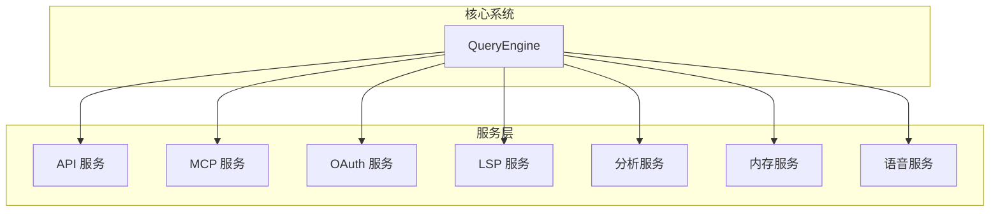
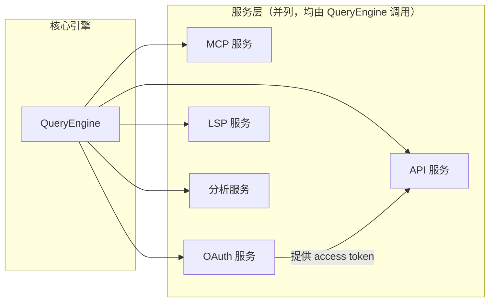

# 服务层

## 概述

服务层提供 Claude Code 的基础设施功能，包括 API 通信、MCP 协议、OAuth 认证、LSP 支持和分析服务。

## 架构位置

## 服务模块

| 服务 | 路径 | 描述 |
|------|------|------|
| API | [services/api/](/restored-src/src/services/api/) | Claude API 客户端和通信 |
| MCP | [services/mcp/](/restored-src/src/services/mcp/) | Model Context Protocol 支持 |
| OAuth | [services/oauth/](/restored-src/src/services/oauth/) | OAuth 认证流程 |
| LSP | [services/lsp/](/restored-src/src/services/lsp/) | Language Server Protocol |
| Analytics | [services/analytics/](/restored-src/src/services/analytics/) | 遥测和指标收集 |
| Memory | [services/memory/](/restored-src/src/services/memory/) | 内存管理 |
| Voice | [services/voice/](/restored-src/src/services/voice/) | 语音功能 |

## API 服务

API 服务负责与 Claude API 的所有通信。

### 主要功能

- **API 客户端**: 封装所有 API 调用
- **错误处理**: 重试逻辑和错误分类
- **用量追踪**: 记录和报告 API 使用量
- **日志记录**: 请求和响应日志

### 关键文件

- [client.ts](/restored-src/src/services/api/client.ts) - API 客户端
- [claude.ts](/restored-src/src/services/api/claude.ts) - Claude API 封装
- [errors.ts](/restored-src/src/services/api/errors.ts) - 错误处理
- [usage.ts](/restored-src/src/services/api/usage.ts) - 用量追踪

## MCP 服务

MCP (Model Context Protocol) 服务提供标准化工具接口。

### 主要功能

- **MCP 客户端**: 管理 MCP 服务器连接
- **工具调用**: 统一的工具调用接口
- **资源管理**: MCP 资源访问
- **认证**: MCP 认证支持

### 关键文件

- [client.ts](/restored-src/src/services/mcp/client.ts) - MCP 客户端
- [config.ts](/restored-src/src/services/mcp/config.ts) - MCP 配置
- [auth.ts](/restored-src/src/services/mcp/auth.ts) - MCP 认证

## OAuth 服务

OAuth 服务处理用户认证。

### 主要功能

- **授权码流程**: 标准 OAuth 2.0 授权码流程
- **令牌管理**: Access token 和 refresh token 管理
- **加密**: 安全令牌存储

### 关键文件

- [client.ts](/restored-src/src/services/oauth/client.ts) - OAuth 客户端
- [crypto.ts](/restored-src/src/services/oauth/crypto.ts) - 加密工具

## LSP 服务

LSP 服务集成 Language Server Protocol。

### 主要功能

- **诊断**: 代码诊断和错误提示
- **补全**: 代码补全建议
- **跳转到定义**: 导航支持

### 关键文件

- [manager.ts](/restored-src/src/services/lsp/manager.ts) - LSP 管理器
- [LSPClient.ts](/restored-src/src/services/lsp/LSPClient.ts) - LSP 客户端

## 分析服务

分析服务负责遥测和指标收集。

### 主要功能

- **事件日志**: 用户行为事件记录
- **指标收集**: 性能和使用指标
- **GrowthBook**: A/B 测试支持

### 关键文件

- [sink.ts](/restored-src/src/services/analytics/sink.ts) - 事件接收器
- [datadog.ts](/restored-src/src/services/analytics/datadog.ts) - DataDog 集成

## 服务依赖关系

## 相关文档

- [API 服务](api.md)
- [MCP 服务](mcp.md)
- [OAuth 服务](oauth.md)
- [LSP 服务](lsp.md)
- [分析服务](analytics.md)
- [架构文档](../architecture.md)

---

*Generated by [Nium-Wiki v0.0.0](https://github.com/niuma996/nium-wiki) | 2026-05-12*
