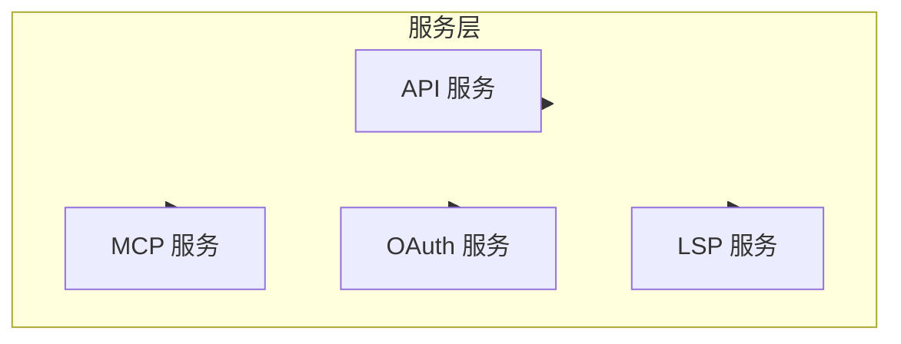

# 服务层

## 概览

服务层提供 Claude Code 的基础设施功能，包括 API 通信、MCP 协议、OAuth 认证等。

## 子模块

| 模块 | 说明 | 文档 |
|------|------|------|
| [API 服务](api.md) | Claude API 通信 | [api.md](api.md) |
| [MCP 服务](mcp.md) | Model Context Protocol | [mcp.md](mcp.md) |
| [OAuth 认证](oauth.md) | OAuth 认证流程 | [oauth.md](oauth.md) |

## 架构位置

## 相关文档

- [架构文档](../architecture.md)
- [主页](../index.md)

---

*Generated by [Nium-Wiki v0.0.0](https://github.com/niuma996/nium-wiki) | 2026-03-31*
