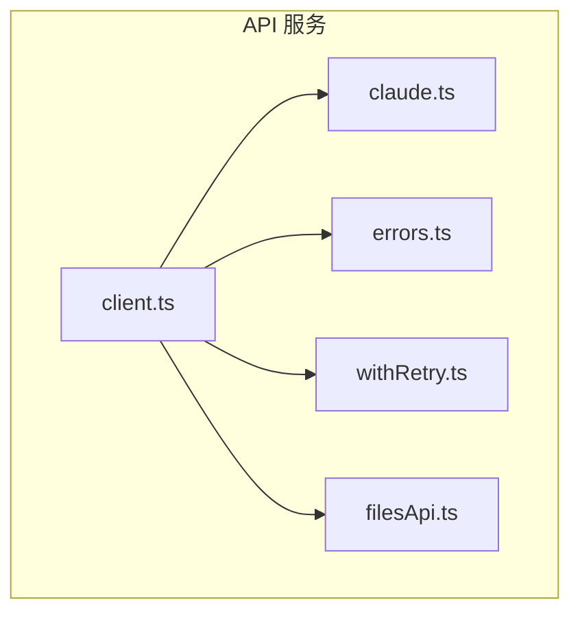
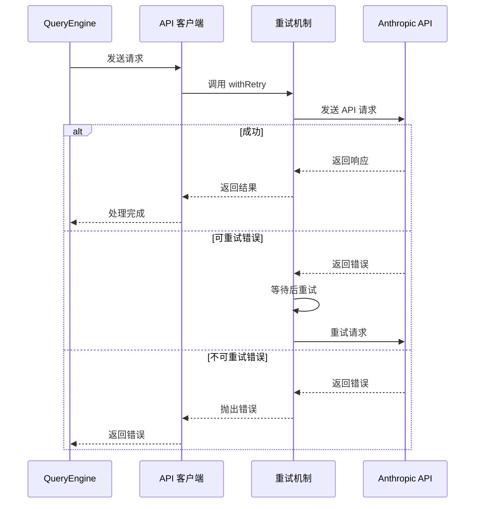
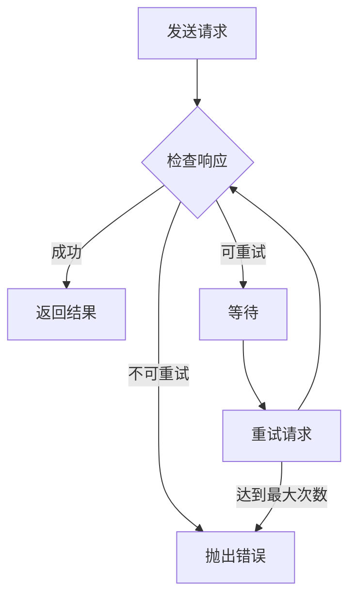

# API 服务

## 概述

API 服务是 Claude Code 与 Anthropic API 通信的桥梁，负责处理所有 API 请求、重试逻辑和错误处理。

核心实现在 [services/api/](/restored-src/src/services/api/) 目录中。

## 架构位置



## 功能特性

| 功能 | 说明 | 相关文件 |
|------|------|----------|
| API 客户端 | 统一的 API 请求处理 | [client.ts](/restored-src/src/services/api/client.ts) |
| Claude 集成 | Claude 模型调用封装 | [claude.ts](/restored-src/src/services/api/claude.ts) |
| 错误处理 | 统一的错误类型和处理 | [errors.ts](/restored-src/src/services/api/errors.ts) |
| 重试机制 | 指数退避重试逻辑 | [withRetry.ts](/restored-src/src/services/api/withRetry.ts) |
| 文件 API | 文件上传和处理 | [filesApi.ts](/restored-src/src/services/api/filesApi.ts) |

## 文件结构

```
restored-src/src/services/api/
├── client.ts              # 主 API 客户端
├── claude.ts             # Claude 模型 API
├── errors.ts             # 错误类型定义
├── withRetry.ts          # 重试逻辑
├── filesApi.ts          # 文件 API
├── bootstrap.ts         # 启动初始化
├── logging.ts           # 日志服务
├── usage.ts             # 使用量追踪
└── grove.ts             # Grove 集成
```

## 核心工作流



## API 客户端

### 请求配置

```typescript
interface ApiRequest {
  method: 'GET' | 'POST' | 'PUT' | 'DELETE'
  path: string
  body?: unknown
  headers?: Record<string, string>
  timeout?: number
}
```

### 响应处理

```typescript
interface ApiResponse<T> {
  data: T
  status: number
  headers: Headers
}
```

## 错误类型

| 错误类型 | HTTP 状态码 | 说明 |
|----------|-------------|------|
| `ApiError` | 4xx/5xx | 通用 API 错误 |
| `RateLimitError` | 429 | 速率限制 |
| `AuthenticationError` | 401 | 认证失败 |
| `AuthorizationError` | 403 | 权限不足 |
| `NotFoundError` | 404 | 资源不存在 |
| `ValidationError` | 422 | 请求验证失败 |
| `TimeoutError` | - | 请求超时 |

## 重试机制



重试配置：

```typescript
interface RetryConfig {
  maxRetries: number       // 最大重试次数
  initialDelay: number     // 初始延迟（毫秒）
  maxDelay: number        // 最大延迟（毫秒）
  backoffMultiplier: number  // 退避乘数
  retryableStatuses: number[]  // 可重试的状态码
}
```

## API 端点

| 端点 | 方法 | 说明 |
|------|------|------|
| `/v1/messages` | POST | 发送消息 |
| `/v1/models` | GET | 获取可用模型 |
| `/v1/files` | POST | 上传文件 |
| `/v1/files/{id}` | GET | 获取文件 |

## 认证

API 请求使用 Bearer Token 认证：

```typescript
headers: {
  'Authorization': `Bearer ${apiKey}`,
  'x-api-key': apiKey,
  'anthropic-version': '2023-06-01'
}
```

## 最佳实践

### 错误处理

| 最佳实践 | 说明 |
|----------|------|
| 总是检查响应状态 | 即使请求成功也检查 status |
| 适当处理重试 | 避免无限重试 |
| 日志记录 | 记录请求和响应以便调试 |
| 超时设置 | 为长时间操作设置合理超时 |

### 性能优化

| 优化 | 说明 |
|------|------|
| 连接复用 | 使用 keep-alive 复用连接 |
| 请求压缩 | 压缩大请求体 |
| 流式响应 | 使用流式 API 减少延迟 |

## 源码引用

- [client.ts](/restored-src/src/services/api/client.ts)
- [claude.ts](/restored-src/src/services/api/claude.ts)
- [errors.ts](/restored-src/src/services/api/errors.ts)
- [withRetry.ts](/restored-src/src/services/api/withRetry.ts)

## 相关文档

- [查询引擎](../core/query.md)
- [OAuth 认证](oauth.md)
- [MCP 服务](mcp.md)

---

*Generated by [Nium-Wiki v0.0.0](https://github.com/niuma996/nium-wiki) | 2026-03-31*
