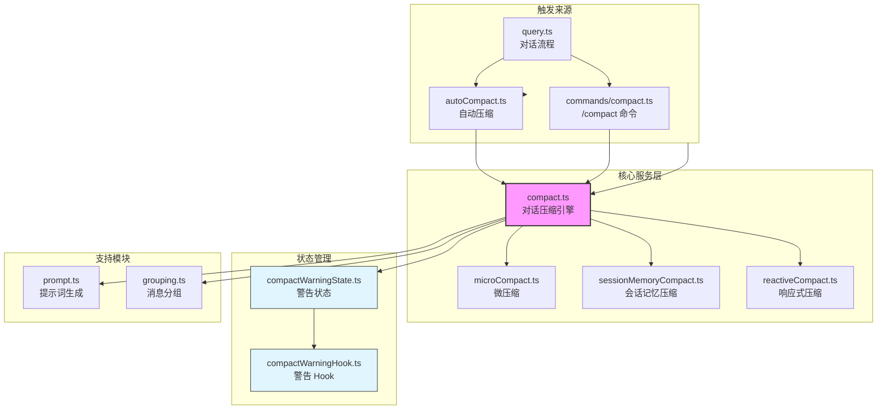
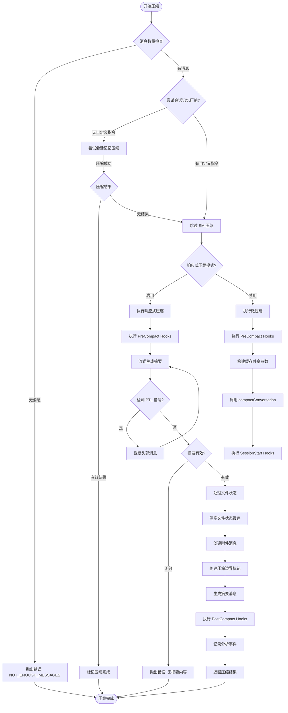
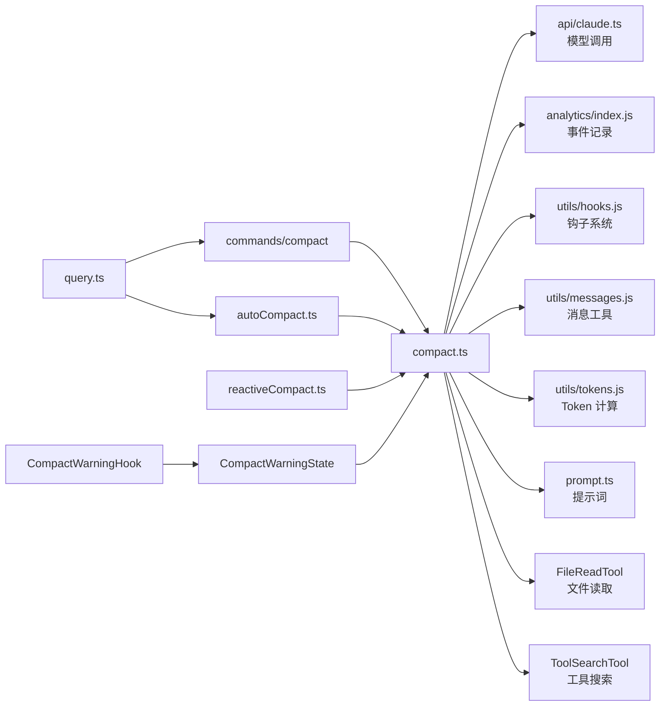

# Compact 模块

## 1. 模块概述

Compact（对话压缩）模块是 Claude Code 的核心上下文管理组件，负责在对话历史变得过长时通过 AI  summarization（智能摘要）来压缩对话上下文，从而保持模型响应的效率和准确性。当对话消耗的 token 数量接近模型的上下文窗口上限时，该模块会自动或手动触发压缩流程，将旧的对话消息压缩成一段简洁的摘要，同时保留最新的对话消息和关键信息。

该模块实现了三种压缩策略：**完整压缩（Full Compact）** 用于压缩整个对话历史；**部分压缩（Partial Compact）** 支持从特定消息位置向前或向后压缩，适用于选择性忘记早期上下文；**会话记忆压缩（Session Memory Compact）** 利用轻量级规则引擎对特定会话信息进行快速压缩，无需调用 AI API。这三种策略共同构成了一个多层次的上下文管理方案，既能在需要时进行深度压缩，也能在简单场景下快速处理。

在技术实现上，compact 模块采用了多项优化策略：使用 `FileReadTool` 限制 token 预算以防止摘要过大；通过 Prompt Cache 共享机制减少 API 调用开销；支持工具搜索集成以在压缩过程中提供更好的上下文；并在压缩后自动恢复最近访问的文件和技能信息，确保对话的连续性。

**Source references**
- [compact.ts](/restored-src/src/services/compact/compact.ts#L1-L1705)
- [compact.ts (command)](restored-src/src/commands/compact/compact.ts#L1-L287)
- [compactWarningState.ts](/restored-src/src/services/compact/compactWarningState.ts#L1-L18)
- [compactWarningHook.ts](/restored-src/src/services/compact/compactWarningHook.ts#L1-L16)

## 2. 架构位置图



**Diagram sources**
- [compact.ts](/restored-src/src/services/compact/compact.ts)

## 3. 功能表

| 功能 | 描述 | 相关 API |
|-----|------|---------|
| 完整压缩 | 使用 AI 生成对话摘要，压缩整个对话历史 | `compactConversation()` |
| 部分压缩 | 从指定位置选择性压缩消息（支持向前/向后方向） | `partialCompactConversation()` |
| 会话记忆压缩 | 基于规则的轻量级压缩，无需 API 调用 | `trySessionMemoryCompaction()` |
| 微压缩 | 在正式压缩前减少 token 数量的预处理 | `microcompactMessages()` |
| Prompt Cache 共享 | 复用主对话的缓存前缀，减少 API 开销 | `runForkedAgent()` |
| 工具搜索集成 | 压缩过程中启用工具搜索以获取更好上下文 | `isToolSearchEnabled()` |
| 文件恢复 | 压缩后恢复最近访问的文件内容 | `createPostCompactFileAttachments()` |
| 技能恢复 | 压缩后恢复已调用的技能内容 | `createSkillAttachmentIfNeeded()` |
| 异步 Agent 追踪 | 保留后台运行的异步 Agent 信息 | `createAsyncAgentAttachmentsIfNeeded()` |
| 计划模式保持 | 确保压缩后继续维持在计划模式 | `createPlanModeAttachmentIfNeeded()` |
| 警告状态管理 | 控制自动压缩警告的显示与隐藏 | `suppressCompactWarning()` |

## 4. 文件结构

```
restored-src/src/services/compact/
├── compact.ts                    # 核心压缩引擎，包含完整压缩和部分压缩逻辑
├── compactWarningState.ts        # 压缩警告状态管理（React 无关）
├── compactWarningHook.ts         # 压缩警告的 React Hook 订阅器
├── prompt.ts                     # 压缩提示词模板生成和格式化
├── grouping.ts                   # 消息按 API 轮次分组的逻辑
├── microCompact.ts               # 微压缩预处理模块
├── autoCompact.ts                # 自动压缩触发逻辑
├── reactiveCompact.ts            # 响应式压缩实现
├── sessionMemoryCompact.ts       # 会话记忆轻量压缩
├── postCompactCleanup.ts         # 压缩后清理任务
└── timeBasedMCConfig.ts          # 基于时间的压缩配置

restored-src/src/commands/compact/
└── compact.ts                    # /compact CLI 命令入口
```

## 5. 核心工作流图



**Diagram sources**
- [compact.ts](/restored-src/src/services/compact/compact.ts#L387-L763)
- [compact.ts (command)](restored-src/src/commands/compact/compact.ts#L40-L137)

## 6. API 概览

| API | 类型 | 描述 |
|-----|------|------|
| `compactConversation()` | `async function` | 执行完整对话压缩，生成摘要并返回压缩结果 |
| `partialCompactConversation()` | `async function` | 执行部分压缩，从指定位置选择性压缩消息 |
| `stripImagesFromMessages()` | `function` | 从消息中移除图片和文档块，防止摘要过大 |
| `stripReinjectedAttachments()` | `function` | 移除重新注入的技能发现/列表附件 |
| `truncateHeadForPTLRetry()` | `function` | PTL 错误时截断最旧的 API 轮次组 |
| `buildPostCompactMessages()` | `function` | 从 CompactionResult 构建压缩后的消息数组 |
| `annotateBoundaryWithPreservedSegment()` | `function` | 为边界标记添加保留消息段的元数据 |
| `mergeHookInstructions()` | `function` | 合并用户指令和 Hook 指令 |
| `createCompactCanUseTool()` | `function` | 创建压缩期间的工具使用权限函数（拒绝所有工具） |
| `createPostCompactFileAttachments()` | `async function` | 创建压缩后恢复的文件附件 |
| `createPlanAttachmentIfNeeded()` | `function` | 创建计划文件附件（如果存在） |
| `createSkillAttachmentIfNeeded()` | `function` | 创建已调用技能的附件 |
| `createPlanModeAttachmentIfNeeded()` | `async function` | 创建计划模式附件 |
| `createAsyncAgentAttachmentsIfNeeded()` | `async function` | 创建异步 Agent 状态附件 |
| `suppressCompactWarning()` | `function` | 抑制压缩警告 |
| `clearCompactWarningSuppression()` | `function` | 清除压缩警告抑制状态 |
| `useCompactWarningSuppression()` | `function` | React Hook 订阅压缩警告状态 |

## 7. 使用示例

### 快速开始：执行完整压缩

```typescript
import {
  compactConversation,
  CompactionResult,
} from '../services/compact/compact.js'
import type { ToolUseContext } from '../Tool.js'
import type { Message } from '../types/message.js'

async function performFullCompact(
  messages: Message[],
  context: ToolUseContext,
): Promise<CompactionResult> {
  const result = await compactConversation(
    messages,
    context,
    {
      systemPrompt: context.systemPrompt,
      userContext: context.userContext,
      systemContext: context.systemContext,
      toolUseContext: context,
      forkContextMessages: messages,
    },
    false, // suppressFollowUpQuestions
    undefined, // customInstructions
    false, // isAutoCompact
  )

  console.log('Compression completed')
  console.log('Pre-compact tokens:', result.preCompactTokenCount)
  console.log('Post-compact tokens:', result.truePostCompactTokenCount)
  return result
}
```

### 示例：执行部分压缩（保留后续消息）

```typescript
import { partialCompactConversation } from '../services/compact/compact.js'

async function compactUpToMessage(
  allMessages: Message[],
  pivotIndex: number,
  context: ToolUseContext,
): Promise<void> {
  const result = await partialCompactConversation(
    allMessages,
    pivotIndex,
    context,
    {
      systemPrompt: context.systemPrompt,
      userContext: context.userContext,
      systemContext: context.systemContext,
      toolUseContext: context,
      forkContextMessages: allMessages.slice(0, pivotIndex),
    },
    'Optional user feedback here', // userFeedback
    'up_to', // direction: compress messages before pivot
  )

  console.log(`Compressed ${result.summaryMessages.length} summary messages`)
  console.log(`Kept ${result.messagesToKeep?.length ?? 0} messages`)
}
```

### 示例：压缩警告状态管理

```typescript
import {
  suppressCompactWarning,
  clearCompactWarningSuppression,
  useCompactWarningSuppression,
} from '../services/compact/compactWarningState.js'

// 在压缩开始前清除警告抑制
clearCompactWarningSuppression()

// 执行压缩...

// 压缩成功后抑制警告
suppressCompactWarning()

// 在 React 组件中使用
function CompactWarningBanner() {
  const isSuppressed = useCompactWarningSuppression()

  if (isSuppressed) {
    return null
  }

  return <div className="warning-banner">Context running low</div>
}
```

### 示例：自定义压缩指令

```typescript
async function compactWithInstructions(
  messages: Message[],
  context: ToolUseContext,
): Promise<void> {
  const customInstructions = `
    Focus on:
    - All file modifications and their purposes
    - Any errors encountered and solutions
    - User preferences and feedback mentioned
    - Current work in progress
  `

  await compactConversation(
    messages,
    context,
    cacheSafeParams,
    false, // suppressFollowUpQuestions
    customInstructions,
    false, // isAutoCompact
  )
}
```

## 8. 最佳实践

### 推荐

- **使用会话记忆压缩处理简单场景**：当没有自定义指令时，系统会首先尝试使用轻量级的会话记忆压缩，这比完整的 AI 摘要更快速且成本更低
- **在手动压缩时提供上下文反馈**：通过 `customInstructions` 参数提供当前工作的上下文，可以生成更准确的摘要
- **利用文件恢复功能**：压缩后系统会自动恢复最近访问的文件，无需重新读取即可继续工作
- **使用部分压缩处理长任务**：对于跨多个阶段的工作，使用 `partialCompactConversation` 选择性压缩早期阶段，保留近期工作上下文
- **监控 token 预算**：使用 `POST_COMPACT_TOKEN_BUDGET`、`POST_COMPACT_MAX_TOKENS_PER_FILE` 等常量监控和管理压缩后的 token 消耗

### 避免

- **频繁触发压缩**：每次压缩都会消耗 API tokens 和时间，合理设置 `autoCompactThreshold` 避免过度压缩
- **在压缩过程中中断**：用户按 ESC 会中止压缩，可能导致部分消息丢失或状态不一致
- **压缩过少的对话**：对只有几条消息的对话进行压缩，收效甚微且浪费资源
- **忽略压缩后的错误通知**：压缩失败时系统会显示错误，应根据错误类型采取相应措施

## 9. 设计决策与权衡

| 决策 | 考虑的替代方案 | 理由 |
|------|--------------|------|
| 使用 Forked Agent 而非直接 API 调用 | 直接调用 `queryModelWithStreaming` | Forked Agent 可以复用主对话的 Prompt Cache（前缀共享），显著降低 API 成本和延迟。实验数据表明启用后缓存命中率达 98% |
| 按 API 轮次分组而非用户轮次 | 按用户消息分组 | API 轮次分组粒度更细，允许响应式压缩在单轮对话中工作，这对 SDK/CCR/eval 等场景至关重要 |
| 保留文件状态而非只保留元数据 | 丢弃文件状态 | 在压缩后立即恢复最近访问的文件内容，避免模型需要重新读取文件，保持工作连续性 |
| 每个技能单独 token 预算 | 统一技能预算或完全丢弃 | 每个技能在文件头部通常有最重要的设置/使用说明，单独预算确保关键信息被保留 |
| 使用 `useSyncExternalStore` 而非 React 状态 | 直接使用 React Context | `compactWarningState.ts` 保持 React 无关，确保在 Print Mode 等非 React 环境中正常工作 |
| 微压缩优先于 AI 摘要 | 直接进行 AI 摘要 | 微压缩使用轻量级规则减少 token，避免不必要的 API 调用，只有微压缩无法满足需求时才调用 AI |

## 10. 依赖与相关文档



**Diagram sources**
- [compact.ts](/restored-src/src/services/compact/compact.ts)
- [compact.ts (command)](restored-src/src/commands/compact/compact.ts)

| 文档 | 关系 |
|------|------|
| [Architecture](/.nium-wiki/wiki/architecture.md) | 系统架构概述 |
| [Context](/.nium-wiki/wiki/core/context.md) | 上下文管理核心 |
| [Query Flow](/.nium-wiki/wiki/core/query.md) | 对话查询流程 |
| [Hooks](/.nium-wiki/wiki/core/hooks.md) | 钩子系统 |

---

*Generated by [Nium-Wiki v0.0.5](https://github.com/niuma996/nium-wiki) | 2026-04-02*
