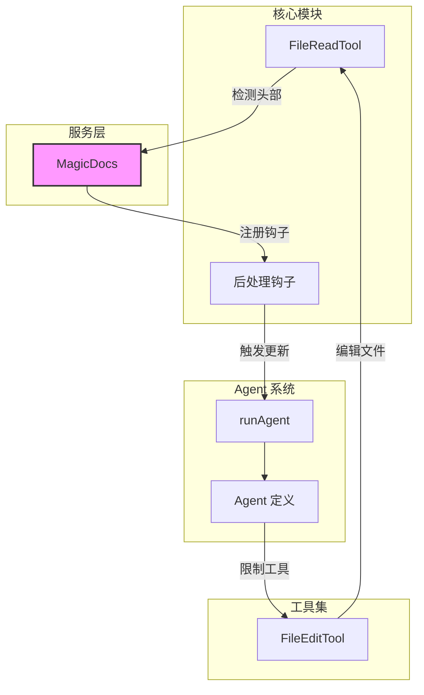
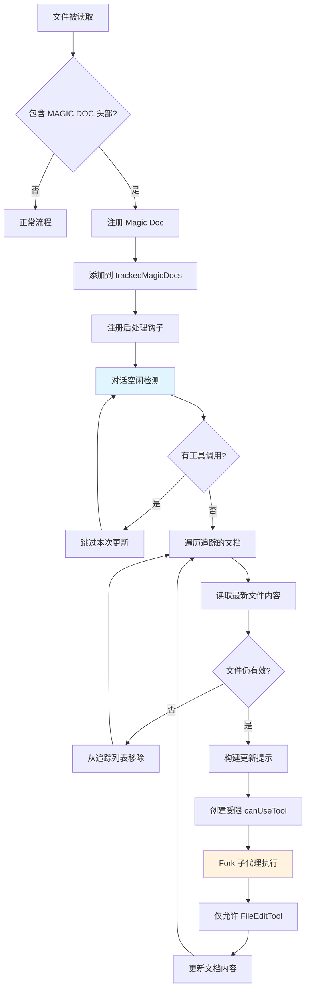
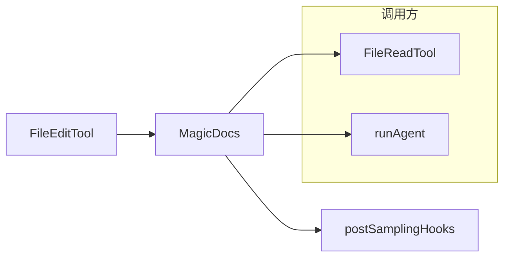

# MagicDocs 自动文档维护

## 1. 模块概述

MagicDocs 是一个自动文档维护系统，通过特殊标记的 Markdown 文件实现智能化文档更新。当文件包含 `# MAGIC DOC: [标题]` 头部时，系统会在后台自动追踪并更新文档内容。

该模块解决了文档随代码演进而过时的问题。它通过后处理钩子机制，在对话空闲时自动分析对话内容，将新的学习、洞察和重要信息沉淀到对应的 Magic Doc 文件中。MagicDocs 使用独立的子代理来执行更新操作，并严格限制其只能使用编辑工具，确保文档修改的安全性和可控性。

整个系统基于事件驱动架构：文件读取时检测 Magic Doc 头部 → 注册追踪 → 后处理钩子触发 → Fork 子代理执行更新。

## 2. 架构位置图



## 3. 功能表

| 功能 | 描述 | 相关 API |
|------|------|----------|
| 头部检测 | 检测文件中的 Magic Doc 头部标记 | `detectMagicDocHeader()` |
| 文件注册 | 将 Magic Doc 文件加入追踪列表 | `registerMagicDoc()` |
| 后处理更新 | 在对话空闲时自动更新追踪的文档 | `updateMagicDocs` 钩子 |
| 子代理执行 | 使用 Fork 子代理执行文档更新 | `runAgent()` |
| 工具限制 | 限制子代理只能编辑指定文件 | `canUseTool()` |
| 自定义提示 | 支持从配置文件加载自定义更新提示 | `loadMagicDocsPrompt()` |

## 4. 文件结构

```
restored-src/src/services/MagicDocs/
├── magicDocs.ts        # 主实现：检测、注册、更新逻辑
└── prompts.ts         # 提示词模板与变量替换
```

## 5. 核心工作流图



## 6. API 概览

| API | 类型 | 描述 |
|-----|------|------|
| `initMagicDocs()` | `function` | 初始化 MagicDocs 系统，注册文件监听和后处理钩子 |
| `detectMagicDocHeader(content)` | `function` | 检测给定内容是否包含 Magic Doc 头部 |
| `registerMagicDoc(filePath)` | `function` | 将文件注册为 Magic Doc 追踪对象 |
| `clearTrackedMagicDocs()` | `function` | 清空所有追踪的 Magic Doc |
| `buildMagicDocsUpdatePrompt()` | `function` | 构建文档更新提示词，支持变量替换 |
| `trackedMagicDocs` | `Map` | 存储追踪中的 Magic Doc 路径 |

> Full API reference: [MagicDocs API](./api/magicdocs.md)

## 7. 使用示例

### 快速开始：创建 Magic Doc 文件

```typescript
// 在任意 .md 文件中添加 Magic Doc 头部
// # MAGIC DOC: 项目架构
// *记录项目的核心架构决策和设计模式*

// 文件内容会被 MagicDocs 自动追踪
// 当 Claude Code 读取此文件时，会注册到追踪列表
```

### 示例：添加自定义更新指令

```typescript
// Magic Doc 支持在标题后添加斜体指令
// # MAGIC DOC: API 使用指南
// *仅更新端点列表和参数说明，跳过示例代码*

// MagicDocs 会解析指令并在更新时优先遵循
```

### 示例：自定义提示词配置

```typescript
// 在 ~/.claude/magic-docs/prompt.md 创建自定义提示
// 支持变量: {{docContents}}, {{docPath}}, {{docTitle}}

// 自定义提示会覆盖默认提示词模板
```

## 8. 最佳实践

### 推荐

- 使用描述性标题，如 `# MAGIC DOC: [模块名] 设计决策`
- 在斜体行中提供清晰的更新指令，指明文档的关注重点
- 将 Magic Doc 放置在项目关键位置，如架构文档、API 文档
- 定期检查自动生成的文档内容，确保符合预期

### 避免

- 在 Magic Doc 中包含对话历史或变更记录 — 系统会原地更新而非追加
- 创建过于细粒度的 Magic Doc — 关注高层架构而非每个函数
- 依赖 Magic Doc 作为唯一文档源 — 它是补充而非替代

## 9. 设计决策与权衡

| 决策 | 考虑替代方案 | 理由 |
|------|-------------|------|
| 仅允许 FileEditTool | 允许更多工具 | 限制工具范围可防止子代理执行意外操作，确保更新安全 |
| 使用 Fork 子代理 | 直接执行更新 | Fork 隔离执行上下文，避免污染主对话状态 |
| 文件读取时注册 | 启动时扫描 | 懒加载模式减少启动开销，只追踪实际使用的文档 |
| 对话空闲时更新 | 实时更新 | 避免干扰用户当前工作流程 |
| 支持自定义提示 | 固定提示模板 | 允许用户根据项目需求定制更新行为 |

## 10. 依赖与相关文档



| 文档 | 关系 |
|------|------|
| [架构文档](../architecture.md) | 系统架构总览 |
| [FileReadTool](../core/tools.md) | 文件读取依赖 |
| [Agent 系统](../agent/agent-tool.md) | 子代理执行机制 |
| [Hook 系统](../core/hooks.md) | 后处理钩子机制 |
| [MagicDocs API](./api/magicdocs.md) | API 参考文档 |

---

## API 参考

### 模块概述

MagicDocs 模块提供自动文档维护的核心 API。文件头部检测、追踪管理和更新提示构建等功能均通过本模块导出。

```typescript
import {
  initMagicDocs,
  detectMagicDocHeader,
  registerMagicDoc,
  clearTrackedMagicDocs,
  buildMagicDocsUpdatePrompt,
} from '../../services/MagicDocs/magicDocs'
```

### API 概览

| API | 类型 | 描述 |
|-----|------|------|
| `initMagicDocs()` | `async function` | 初始化 MagicDocs 系统 |
| `detectMagicDocHeader()` | `function` | 检测 Magic Doc 头部 |
| `registerMagicDoc()` | `function` | 注册 Magic Doc 文件 |
| `clearTrackedMagicDocs()` | `function` | 清空追踪列表 |
| `buildMagicDocsUpdatePrompt()` | `async function` | 构建更新提示词 |

### 类型定义

#### `MagicDocInfo`

```typescript
type MagicDocInfo = {
  path: string
}
```

| Property | Type | Required | Default | Description |
|----------|------|----------|---------|-------------|
| `path` | `string` | Yes | - | Magic Doc 文件的绝对路径 |

#### `MagicDocHeader`

```typescript
type MagicDocHeader = {
  title: string
  instructions?: string
}
```

| Property | Type | Required | Default | Description |
|----------|------|----------|---------|-------------|
| `title` | `string` | Yes | - | 从 `# MAGIC DOC: [title]` 提取的标题 |
| `instructions` | `string` | No | - | 标题后斜体行中的自定义指令 |

### 函数

#### `initMagicDocs`

```typescript
function initMagicDocs(): Promise<void>
```

初始化 MagicDocs 系统，注册文件读取监听器和后处理钩子。仅在 `USER_TYPE === 'ant'` 时启用。

**无参数**

**Returns:** `Promise<void>`

---

#### `detectMagicDocHeader`

```typescript
function detectMagicDocHeader(
  content: string,
): { title: string; instructions?: string } | null
```

检测给定内容是否包含 Magic Doc 头部。头部格式为 `# MAGIC DOC: [title]`，标题后允许可选的斜体指令行。

| Parameter | Type | Required | Description |
|-----------|------|----------|-------------|
| `content` | `string` | Yes | 文件内容字符串 |

**Returns:** 标题和可选指令，或 `null`

---

#### `registerMagicDoc`

```typescript
function registerMagicDoc(filePath: string): void
```

将文件注册为 Magic Doc 追踪对象。每个文件路径只会注册一次。

| Parameter | Type | Required | Description |
|-----------|------|----------|-------------|
| `filePath` | `string` | Yes | Magic Doc 文件的绝对路径 |

---

#### `clearTrackedMagicDocs`

```typescript
function clearTrackedMagicDocs(): void
```

清空所有追踪中的 Magic Doc 文件。用于测试或重置场景。

---

#### `buildMagicDocsUpdatePrompt`

```typescript
async function buildMagicDocsUpdatePrompt(
  docContents: string,
  docPath: string,
  docTitle: string,
  instructions?: string,
): Promise<string>
```

构建 Magic Doc 更新提示词。支持从 `~/.claude/magic-docs/prompt.md` 加载自定义提示模板，并使用 `{{variable}}` 语法进行变量替换。

| Parameter | Type | Required | Description |
|-----------|------|----------|-------------|
| `docContents` | `string` | Yes | 文件当前内容 |
| `docPath` | `string` | Yes | 文件路径 |
| `docTitle` | `string` | Yes | 文档标题 |
| `instructions` | `string` | No | 自定义指令 |

---

### 常量

| 常量 | 说明 |
|------|------|
| `MAGIC_DOC_HEADER_PATTERN` | `/^#\s*MAGIC\s+DOC:\s*(.+)$/im` — 匹配 Magic Doc 头部正则 |
| `ITALICS_PATTERN` | `/^[_*](.+?)[_*]\s*$/m` — 匹配斜体指令行正则 |
| `trackedMagicDocs` | `Map<string, MagicDocInfo>` — 全局追踪列表 |

---

*Generated by [Nium-Wiki v0.0.0](https://github.com/niuma996/nium-wiki) | 2026-04-02*
