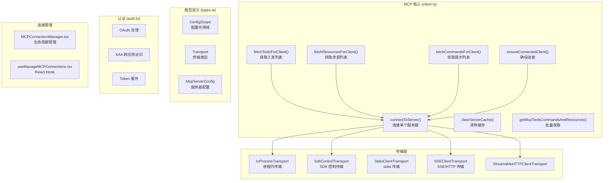
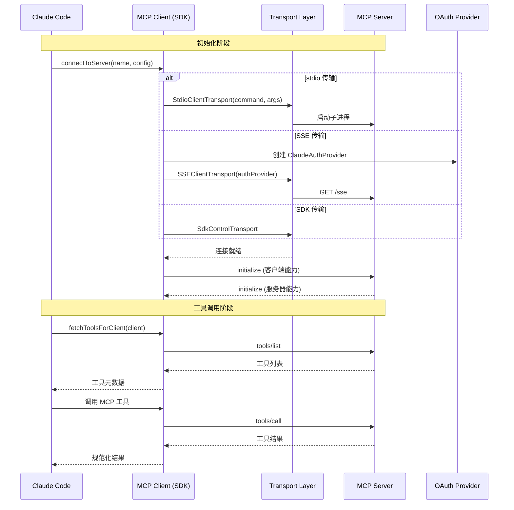

# MCP 服务

## 概览

MCP（Model Context Protocol）服务是 Claude Code 与外部 MCP 服务器交互的核心模块。MCP 是 Anthropic 制定的标准化协议，用于让 AI 模型通过统一的接口调用外部工具、访问资源和使用提示模板。

该服务基于 `@modelcontextprotocol/sdk` 实现，提供：
- 调用远程 MCP 服务器提供的工具
- 读取 MCP 服务器暴露的资源
- 获取 MCP 服务器的提示模板
- 处理 MCP OAuth 认证和会话管理

## 架构位置



## 核心类型

### ConfigScope — 配置作用域

```typescript
export const ConfigScopeSchema = z.enum([
  'local',      // 本地项目 .mcp.json
  'user',       // 用户级 ~/.claude/settings.json
  'project',    // 项目级 .claude/settings.json
  'dynamic',    // 动态配置
  'enterprise', // 企业托管
  'claudeai',  // Claude.ai 托管
  'managed',   // 受管 MCP
])
```

### Transport — 传输类型

```typescript
export const TransportSchema = z.enum([
  'stdio',    // 标准 I/O（本地进程）
  'sse',      // Server-Sent Events
  'sse-ide',  // IDE 内 SSE
  'http',     // HTTP
  'ws',       // WebSocket
  'sdk',      // SDK 控制传输
])
```

### McpStdioServerConfig — stdio 服务器配置

```typescript
export const McpStdioServerConfigSchema = z.object({
  type: z.literal('stdio').optional(),
  command: z.string().min(1),
  args: z.array(z.string()).default([]),
  env: z.record(z.string(), z.string()).optional(),
})
```

## 核心 API

### 连接管理

| 函数 | 说明 | 签名 |
|------|------|------|
| `connectToServer` | 连接单个 MCP 服务器（带缓存） | `(name, serverRef, stats?) => Promise<MCPServerConnection>` |
| `ensureConnectedClient` | 确保服务器已连接 | `(name, serverRef) => Promise<MCPServerConnection>` |
| `clearServerCache` | 清除服务器连接缓存 | `(name?) => Promise<void>` |
| `getServerCacheKey` | 生成缓存键 | `(name, serverRef) => string` |
| `areMcpConfigsEqual` | 比较两个配置是否相等 | `(a, b) => boolean` |
| `reconnectMcpServerImpl` | 重新连接服务器 | `(name, serverRef) => Promise<MCPServerConnection>` |

### 工具/资源/提示获取

| 函数 | 说明 | 签名 |
|------|------|------|
| `fetchToolsForClient` | 获取服务器工具列表（LRU 缓存） | `(client) => Promise<ListToolsResult>` |
| `fetchResourcesForClient` | 获取服务器资源列表（LRU 缓存） | `(client) => Promise<ListResourcesResult>` |
| `fetchCommandsForClient` | 获取服务器提示列表（LRU 缓存） | `(client) => Promise<ListPromptsResult>` |
| `getMcpToolsCommandsAndResources` | 批量获取多个服务器的工具和资源 | `(servers) => Promise<{commands, resources}[]>` |

### 工具调用

| 函数 | 说明 | 签名 |
|------|------|------|
| `callMCPToolWithUrlElicitationRetry` | 调用 MCP 工具（含 Elicitation 重试） | `(params) => Promise<TransformedMCPResult>` |
| `processMCPResult` | 处理 MCP 结果 | `(result) => Promise<TransformedMCPResult>` |
| `transformMCPResult` | 转换 MCP 结果格式 | `(result, compactSchema) => Promise<TransformedMCPResult>` |
| `inferCompactSchema` | 推断紧凑 schema | `(value, depth?) => string` |
| `mcpToolInputToAutoClassifierInput` | 为安全分类器编码工具输入 | `(toolName, args) => unknown` |

### 认证管理

| 函数 | 说明 | 签名 |
|------|------|------|
| `clearMcpAuthCache` | 清除 MCP 认证缓存 | `() => void` |
| `isMcpSessionExpiredError` | 判断是否为会话过期错误 | `(error) => boolean` |

### IDE 集成

| 函数 | 说明 | 签名 |
|------|------|------|
| `callIdeRpc` | 调用 IDE RPC | `(method, params) => Promise<unknown>` |

## 文件结构

```
restored-src/src/services/mcp/
├── client.ts                 # 核心实现：connectToServer, fetchTools/Resources/Commands
├── types.ts                 # Zod Schema 类型定义（ConfigScope, Transport, McpServerConfig）
├── config.ts                # MCP 配置处理
├── auth.ts                  # OAuth/XAA 认证处理
├── headersHelper.ts          # HTTP 头部辅助函数
├── utils.ts                 # 通用工具函数
├── xaa.ts                   # Cross-App Access (SEP-990)
├── xaaIdpLogin.ts           # XAA IdP 登录
├── oauthPort.ts             # OAuth 端口处理
├── officialRegistry.ts       # 官方 MCP 服务器注册表
├── normalization.ts          # MCP 结果规范化
├── mcpStringUtils.ts        # 字符串工具
├── channelAllowlist.ts      # 通道白名单
├── channelNotification.ts   # 通道通知
├── channelPermissions.ts   # 通道权限
├── elicitationHandler.ts    # Elicitation 处理
├── envExpansion.ts          # 环境变量展开
├── vscodeSdkMcp.ts          # VSCode SDK MCP
├── claudeai.ts             # Claude.ai 集成
├── InProcessTransport.ts    # 进程内传输
├── SdkControlTransport.ts  # SDK 控制传输
├── MCPConnectionManager.tsx # 连接管理器组件
└── useManageMCPConnections.tsx # React Hook
```

### 职责说明

| 文件 | 职责 |
|------|------|
| client.ts | 核心：连接管理、工具/资源/提示获取、缓存、批量处理 |
| types.ts | 所有 Zod Schema 类型定义 |
| auth.ts | OAuth token 管理、XAA 跨应用访问 |
| config.ts | 服务器配置处理和加载 |
| normalization.ts | MCP 响应结果的规范化处理 |
| MCPConnectionManager.tsx | MCP 服务器生命周期管理的 React 组件 |
| useManageMCPConnections.tsx | React Hook for MCP 连接管理 |

## 协议流程



## 缓存机制

```mermaid
flowchart LR
    A[首次调用] --> B["connectToServer memoize"]
    B --> C["fetchToolsForClient LRU(100)"]
    C --> D["fetchResourcesForClient LRU(100)"]
    D --> E["fetchCommandsForClient LRU(100)"]
    E --> F[返回结果]
    F --> G[缓存键: name + jsonStringify(config)]
    G --> H[后续调用]
    H --> I[直接返回缓存]
```

**批量连接**：默认每批 3 个 stdio 服务器并发连接，远程服务器每批 20 个。

## 错误处理

| 错误类型 | 说明 |
|----------|------|
| `McpAuthError` | MCP 认证失败 |
| `McpToolCallError` | MCP 工具调用失败 |
| `McpSessionExpiredError` | MCP 会话过期 |
| `ErrorCode.RPC_ERROR` | JSON-RPC 错误 |
| `ErrorCode.InvalidParams` | 无效参数 |

## 源码引用

- [services/mcp/client.ts](/restored-src/src/services/mcp/client.ts) — 核心实现
- [services/mcp/types.ts](/restored-src/src/services/mcp/types.ts) — 类型定义
- [services/mcp/auth.ts](/restored-src/src/services/mcp/auth.ts) — 认证处理

## 相关文档

- [助手服务索引](_index.md)
- [Agent 工具](../agent/agent-tool.md) - 工具调用框架
- [主页](../index.md)

---

*Generated by [Nium-Wiki v0.0.0](https://github.com/niuma996/nium-wiki) | 2026-04-08*
