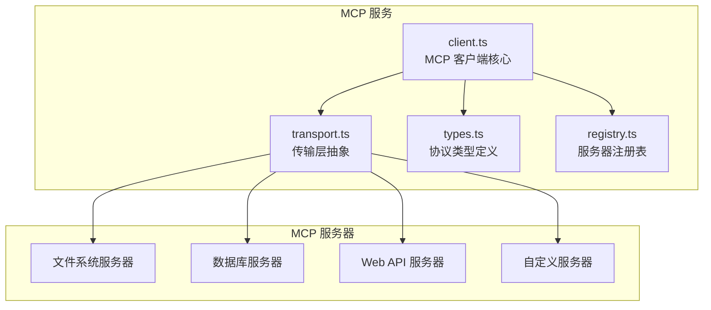
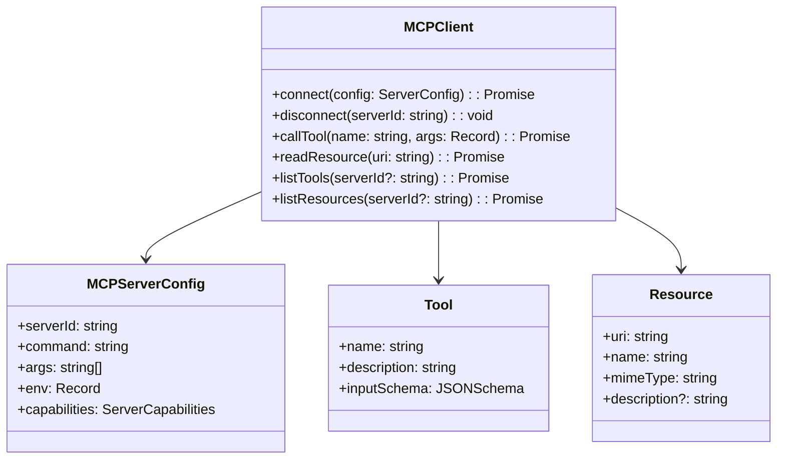
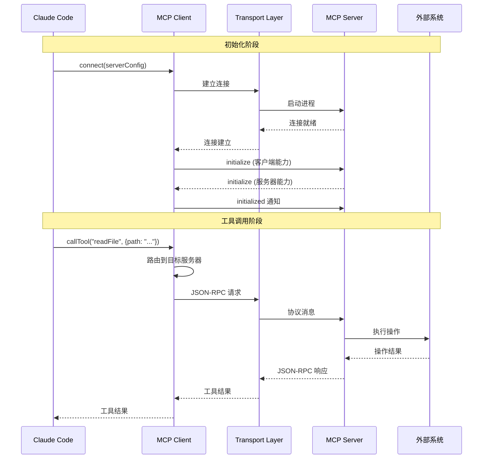

# MCP 服务

## 概览

MCP（Model Context Protocol）服务是 Claude Code 与外部工具和资源交互的核心模块。MCP 是一种新兴的协议，专门设计用于为 AI 模型提供标准化的工具调用和资源访问能力。

该服务实现了 MCP 客户端功能，使 Claude Code 能够：
- 调用远程工具（Tools）
- 访问外部资源（Resources）
- 使用提示模板（Prompts）
- 与文件系统、数据库、API 等外部系统安全交互

## 架构位置



## 核心功能

| 功能 | 说明 | 相关 API |
|------|------|---------|
| 工具调用 | 执行远程工具并获取结果 | `callTool`, `listTools` |
| 资源访问 | 读取外部资源内容 | `readResource`, `listResources` |
| 提示模板 | 使用预定义提示生成内容 | `getPrompt`, `listPrompts` |
| 连接管理 | 管理 MCP 服务器生命周期 | `connect`, `disconnect` |
| 服务器发现 | 自动发现可用 MCP 服务器 | `discoverServers` |

## 文件结构

```
services/mcp/
├── client.ts        # MCP 客户端核心实现
├── transport.ts     # 传输层（stdio、HTTP、SSE）
├── types.ts         # MCP 协议类型定义
└── registry.ts      # MCP 服务器注册表
```

### 职责说明

| 文件 | 职责 |
|------|------|
| client.ts | 实现 MCP 客户端逻辑，处理协议通信、请求路由、响应解析 |
| transport.ts | 抽象底层传输机制，支持多种传输方式（stdio、HTTP SSE） |
| types.ts | 定义 MCP 协议的所有类型和接口 |
| registry.ts | 管理已连接的 MCP 服务器实例，支持动态注册和卸载 |

## 核心类型



## MCP 协议流程



## API 摘要

### MCPClient

| 方法 | 说明 | 返回类型 |
|------|------|---------|
| `connect` | 连接到 MCP 服务器 | `Promise<void>` |
| `disconnect` | 断开指定服务器 | `void` |
| `callTool` | 调用远程工具 | `Promise<ToolResult>` |
| `readResource` | 读取资源内容 | `Promise<ResourceContent>` |
| `listTools` | 列出可用工具 | `Promise<Tool[]>` |
| `listResources` | 列出可用资源 | `Promise<Resource[]>` |
| `getPrompt` | 获取提示模板 | `Promise<PromptResult>` |

### ServerConfig

```typescript
interface MCPServerConfig {
  serverId: string                      // 服务器唯一标识
  command: string                        // 启动命令
  args?: string[]                        // 命令行参数
  env?: Record<string, string>           // 环境变量
  transport?: 'stdio' | 'http' | 'sse'  // 传输类型
  timeout?: number                        // 请求超时时间
}
```

### ToolResult

```typescript
interface ToolResult {
  content: Array<{
    type: 'text' | 'image' | 'resource'
    text?: string
    data?: string
    mimeType?: string
  }>
  isError?: boolean
}
```

## 使用示例

### 基本连接与工具调用

```typescript
import { MCPClient } from './services/mcp/client'

const client = new MCPClient()

// 连接到文件系统 MCP 服务器
await client.connect({
  serverId: 'filesystem',
  command: 'npx',
  args: ['-y', '@modelcontextprotocol/server-filesystem', '/path/to/project']
})

// 列出可用工具
const tools = await client.listTools()
console.log('Available tools:', tools.map(t => t.name))

// 调用工具
const result = await client.callTool('read_file', {
  path: '/path/to/project/package.json'
})
console.log('File content:', result.content)
```

### 资源访问

```typescript
// 列出所有资源
const resources = await client.listResources()
resources.forEach(resource => {
  console.log(`${resource.name}: ${resource.uri}`)
})

// 读取特定资源
const content = await client.readResource('file:///path/to/config.json')
console.log('Resource content:', content)
```

### 提示模板

```typescript
// 获取预定义提示
const prompt = await client.getPrompt('code-review', {
  files: ['src/index.ts', 'src/utils.ts'],
  context: 'Review for security issues'
})
console.log('Generated prompt:', prompt.messages)
```

## 最佳实践

### 推荐模式

| 场景 | 推荐做法 |
|------|---------|
| 服务器配置 | 使用配置文件外部化服务器定义 |
| 错误处理 | 实现重试逻辑处理临时网络故障 |
| 资源清理 | 在应用退出时调用 `disconnect()` |
| 工具选择 | 动态发现可用工具而非硬编码 |

### 避免事项

| 做法 | 问题 | 替代方案 |
|------|------|---------|
| 同步阻塞调用 | 影响响应性能 | 使用 Promise + async/await |
| 硬编码工具名称 | 缺乏灵活性 | 使用 `listTools()` 动态发现 |
| 未处理超时 | 请求永久挂起 | 配置合理的超时时间 |

## 设计决策

### 1. 传输层抽象

通过抽象传输层，支持 stdio（本地进程）和 HTTP/SSE（远程服务）等多种连接方式。

### 2. 服务器注册表

使用注册表模式管理多个 MCP 服务器，支持按需加载和动态扩展。

### 3. 工具沙箱

每个工具调用在隔离环境中执行，防止恶意工具影响主进程安全。

## 源码引用

- [services/mcp/client.ts](/restored-src/src/services/mcp/client.ts)
- [services/mcp/transport.ts](/restored-src/src/services/mcp/transport.ts)
- [services/mcp/types.ts](/restored-src/src/services/mcp/types.ts)
- [services/mcp/registry.ts](/restored-src/src/services/mcp/registry.ts)

## 相关文档

- [助手服务索引](_index.md)
- [Agent 工具](../agent/agent-tool.md) - 工具调用框架
- [主页](../index.md)

---

*Generated by [Nium-Wiki v0.0.0](https://github.com/niuma996/nium-wiki) | 2026-04-02*
