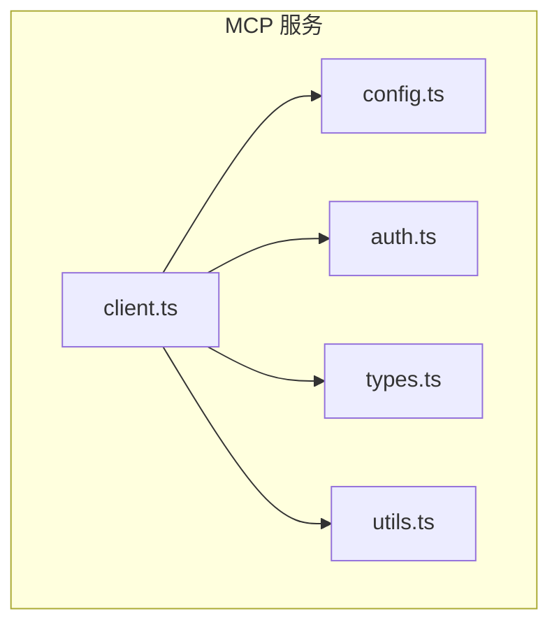
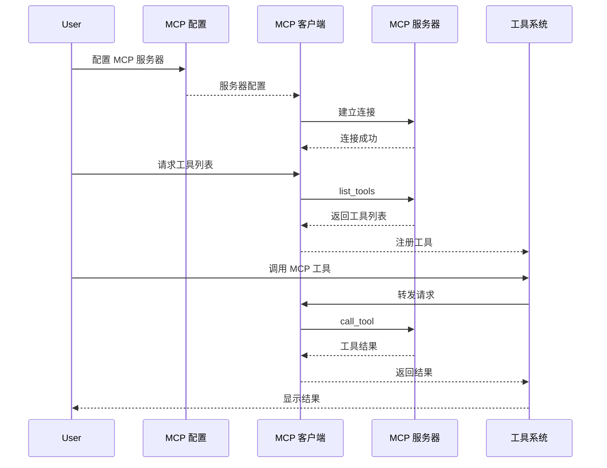
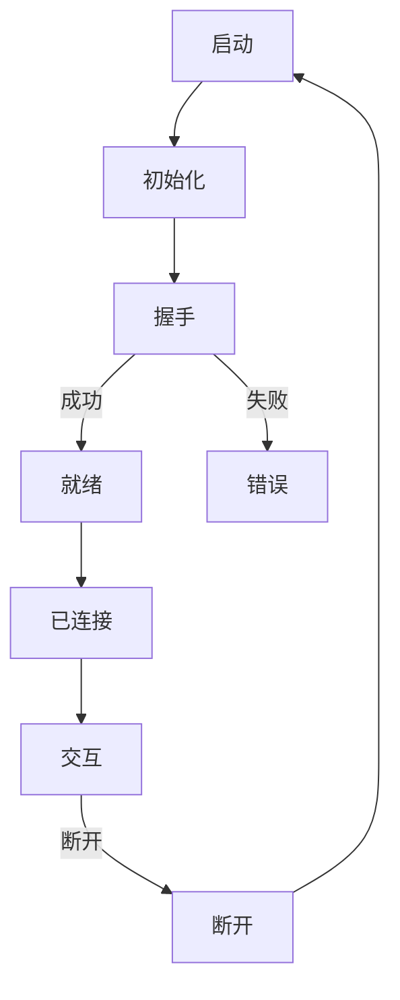
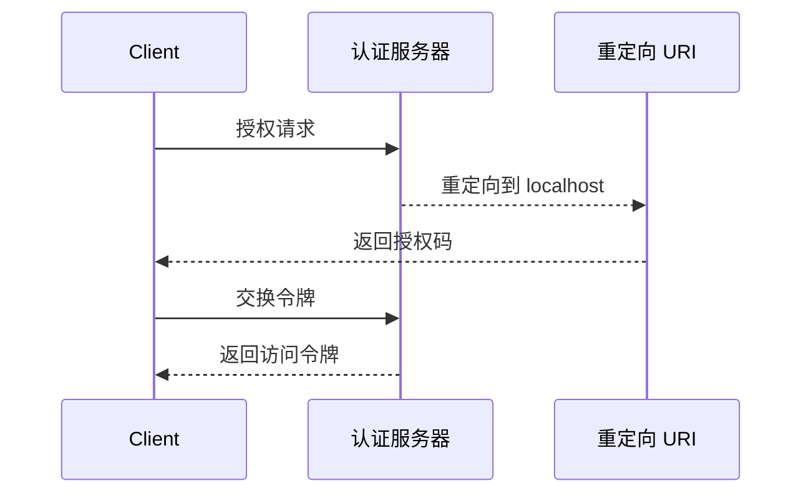

# MCP 服务

## 概述

MCP（Model Context Protocol）服务是 Claude Code 与 MCP 服务器通信的桥梁，允许 Claude 通过标准化的协议访问外部工具和数据源。

核心实现在 [services/mcp/](/restored-src/src/services/mcp/) 目录中。

## 架构位置



## 功能特性

| 功能 | 说明 | 相关文件 |
|------|------|----------|
| MCP 客户端 | 与 MCP 服务器通信 | [client.ts](/restored-src/src/services/mcp/client.ts) |
| 配置管理 | MCP 服务器配置 | [config.ts](/restored-src/src/services/mcp/config.ts) |
| 认证支持 | MCP 认证处理 | [auth.ts](/restored-src/src/services/mcp/auth.ts) |
| 类型定义 | 请求/响应类型 | [types.ts](/restored-src/src/services/mcp/types.ts) |
| OAuth 端口 | OAuth 重定向处理 | [oauthPort.ts](/restored-src/src/services/mcp/oauthPort.ts) |

## 文件结构

```
restored-src/src/services/mcp/
├── client.ts              # MCP 客户端
├── config.ts             # 配置管理
├── auth.ts               # 认证处理
├── types.ts              # 类型定义
├── utils.ts              # 工具函数
├── oauthPort.ts          # OAuth 端口处理
├── claudeai.ts           # Claude.ai MCP
└── xaa.ts                # XAA 集成
```

## 核心工作流



## MCP 协议

### 连接流程



### 消息类型

| 类型 | 方向 | 说明 |
|------|------|------|
| `initialize` | 客户端→服务器 | 初始化连接 |
| `initialized` | 服务器→客户端 | 初始化确认 |
| `tools/list` | 客户端→服务器 | 请求工具列表 |
| `tools/list/result` | 服务器→客户端 | 返回工具列表 |
| `tools/call` | 客户端→服务器 | 调用工具 |
| `tools/call/result` | 服务器→客户端 | 返回工具结果 |
| `ping` | 双向 | 心跳检测 |
| `disconnect` | 双向 | 断开连接 |

## 配置格式

```typescript
interface MCPServerConfig {
  name: string                    // 服务器名称
  command: string                 // 启动命令
  args?: string[]                 // 命令参数
  env?: Record<string, string>    // 环境变量
  url?: string                    // 服务器 URL（用于 HTTP）
  auth?: MCPAuthConfig            // 认证配置
}
```

### 本地服务器配置

```json
{
  "mcpServers": {
    "filesystem": {
      "command": "npx",
      "args": ["-y", "@anthropic/mcp-server-filesystem"],
      "args": ["/home/user/projects"]
    }
  }
}
```

### HTTP 服务器配置

```json
{
  "mcpServers": {
    "remote": {
      "url": "https://api.example.com/mcp",
      "auth": {
        "type": "bearer",
        "token": "<token>"
      }
    }
  }
}
```

## 认证

### OAuth 2.0 流程



### 认证类型

| 类型 | 说明 | 配置字段 |
|------|------|----------|
| `none` | 无认证 | - |
| `bearer` | Bearer Token | `token` |
| `apiKey` | API Key | `apiKey` |
| `oauth2` | OAuth 2.0 | `clientId`, `clientSecret`, `scopes` |

## 工具集成

MCP 服务器提供的工具通过 [MCPTool](/restored-src/src/tools/MCPTool/) 集成到工具系统：

```typescript
interface MCPToolInput {
  server: string                      // 服务器名称
  tool: string                        // 工具名称
  arguments: Record<string, unknown>  // 工具参数
}
```

## 错误处理

| 错误类型 | 说明 | 处理策略 |
|----------|------|----------|
| `ConnectionError` | 连接失败 | 重试或通知用户 |
| `TimeoutError` | 请求超时 | 重试或超时提示 |
| `AuthError` | 认证失败 | 重新认证 |
| `ToolNotFoundError` | 工具不存在 | 提示工具不可用 |
| `ToolExecutionError` | 工具执行失败 | 返回错误信息 |

## 最佳实践

### 服务器配置

| 实践 | 说明 |
|------|------|
| 使用本地服务器 | 减少网络延迟 |
| 配置超时 | 避免长时间等待 |
| 错误重试 | 处理临时连接问题 |
| 安全认证 | 使用 OAuth 或 API Key |

### 工具使用

| 实践 | 说明 |
|------|------|
| 参数验证 | 在调用前验证参数 |
| 错误处理 | 适当处理工具执行错误 |
| 资源清理 | 确保资源正确释放 |

## 源码引用

- [client.ts](/restored-src/src/services/mcp/client.ts)
- [config.ts](/restored-src/src/services/mcp/config.ts)
- [types.ts](/restored-src/src/services/mcp/types.ts)
- [auth.ts](/restored-src/src/services/mcp/auth.ts)

## 相关文档

- [工具系统](../core/tools.md)
- [API 服务](api.md)
- [OAuth 认证](oauth.md)

---

*Generated by [Nium-Wiki v0.0.0](https://github.com/niuma996/nium-wiki) | 2026-03-31*
