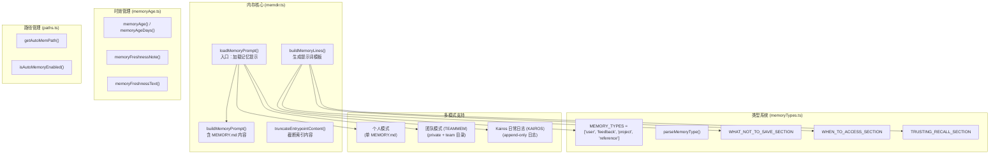
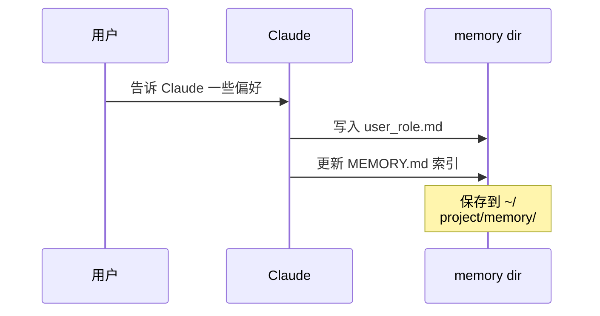

# 内存服务

## 概览

内存服务（Memory Service）是 Claude Code 的文件型持久化记忆系统，通过 `MEMORY.md` 索引 + 主题文件的方式管理 AI 的长期记忆。该服务使 Claude Code 能够跨会话保留用户偏好、项目背景和外部系统指针，从而提供更加个性化的交互体验。

**⚠️ 重要澄清**：内存服务**不是**向量数据库或语义搜索系统。它是基于文件系统的事实性记忆存储，通过文件读写和 grep 搜索实现，没有 SQLite/向量存储/嵌入生成等机制。

## 架构位置



## 核心概念

### 记忆文件结构

```
memory/                          # 记忆目录 (~/.claude/projects/<slug>/memory/)
├── MEMORY.md                   # 索引文件（每行一个引用链接）
├── user/                       # 用户偏好记忆
│   ├── user_role.md
│   └── user_preferences.md
├── feedback/                   # 用户反馈记忆
│   └── feedback_testing.md
├── project/                    # 项目背景记忆
│   └── project_memory.md
└── reference/                 # 外部系统指针
    └── external_refs.md
```

### MEMORY.md 索引格式

```markdown
# auto memory

...

## MEMORY.md

- [Title](file.md) — one-line hook
- [User role](user_role.md) — data scientist focused on logging
- [Feedback: no summaries](feedback_testing.md) — user不喜欢结尾总结
```

### 记忆类型（MEMORY_TYPES）

```typescript
export const MEMORY_TYPES = ['user', 'feedback', 'project', 'reference'] as const
export type MemoryType = (typeof MEMORY_TYPES)[number]
```

| 类型 | 说明 | 示例 |
|------|------|------|
| `user` | 用户角色、目标、知识背景 | 用户是数据科学家，专注于可观测性 |
| `feedback` | 用户对工作方式的指导（避免/保持） | 不要在测试中 mock 数据库；用户喜欢简洁回复 |
| `project` | 进行中工作的上下文、目标、截止日期 | 移动团队 3-5 日冻结非关键合并 |
| `reference` | 外部系统指针 | Linear "INGEST" 项目跟踪 pipeline bug |

### Frontmatter 格式

```markdown
---
name: {{memory name}}
description: {{one-line description — used to decide relevance in future conversations, so be specific}}
type: {{user, feedback, project, reference}}
---

{{memory content — for feedback/project types, structure as: rule/fact, then **Why:** and **How to apply:** lines}}
```

## 文件结构

```
restored-src/src/memdir/
├── memdir.ts          # 核心实现：buildMemoryPrompt, loadMemoryPrompt, truncateEntrypointContent
├── memoryTypes.ts    # 类型定义、TYPES_SECTION、frontmatter 示例
├── memoryAge.ts      # 记忆时效计算函数
├── memoryScan.ts     # 扫描记忆文件
├── paths.ts          # 路径管理（getAutoMemPath, isAutoMemoryEnabled）
├── teamMemPaths.ts   # 团队记忆路径（TEAMMEM 特性）
└── teamMemPrompts.ts # 团队记忆提示词构建
```

### 职责说明

| 文件 | 职责 |
|------|------|
| memdir.ts | 核心：生成记忆提示词、管理 `MEMORY.md` 截断、加载入口 |
| memoryTypes.ts | 定义四类记忆类型、frontmatter 格式示例、各 section 文本 |
| memoryAge.ts | 计算记忆时效、生成过期提示文本 |
| paths.ts | 获取记忆目录路径、判断是否启用自动记忆 |
| teamMemPaths.ts | 团队记忆路径（TEAMMEM 特性开启时） |
| teamMemPrompts.ts | 团队记忆 + 个人记忆合并提示词构建 |

## 核心 API

### memdir.ts 导出

| 函数 | 说明 | 签名 |
|------|------|------|
| `loadMemoryPrompt` | 主入口：根据特性开关加载对应记忆提示 | `() => Promise<string \| null>` |
| `buildMemoryPrompt` | 构建含 MEMORY.md 内容的完整提示 | `(params) => string` |
| `buildMemoryLines` | 生成提示词骨架（不含内容） | `(displayName, memoryDir, extraGuidelines?) => string[]` |
| `truncateEntrypointContent` | 截断 MEMORY.md 内容 | `(raw: string) => EntrypointTruncation` |
| `ensureMemoryDirExists` | 确保记忆目录存在 | `(memoryDir: string) => Promise<void>` |

### memoryTypes.ts 导出

| 导出 | 说明 |
|------|------|
| `MEMORY_TYPES` | 记忆类型常量数组 `['user', 'feedback', 'project', 'reference']` |
| `parseMemoryType(raw)` | 解析 frontmatter 值为 `MemoryType` |
| `TYPES_SECTION_INDIVIDUAL` | 个人模式下的类型说明文本 |
| `TYPES_SECTION_COMBINED` | 团队模式下的类型说明文本（含 scope 标签） |
| `WHAT_NOT_TO_SAVE_SECTION` | 明确禁止保存的内容类型 |
| `WHEN_TO_ACCESS_SECTION` | 何时访问记忆的指导 |
| `TRUSTING_RECALL_SECTION` | 如何信任记忆内容的指导 |
| `MEMORY_FRONTMATTER_EXAMPLE` | frontmatter 示例 |

### memoryAge.ts 导出

| 函数 | 说明 |
|------|------|
| `memoryAgeDays(mtimeMs)` | 距今天数（地板取整） |
| `memoryAge(mtimeMs)` | 人类可读时效字符串（"today", "yesterday", "N days ago"） |
| `memoryFreshnessText(mtimeMs)` | 过时警告文本（>1 天时返回，否则空字符串） |
| `memoryFreshnessNote(mtimeMs)` | 包装在 `<system-reminder>` 中的过时警告 |

## 三种运行模式

### 1. 个人模式（默认）

普通会话使用单目录结构，记忆通过 `MEMORY.md` 索引 + 主题文件管理：



### 2. 团队模式（TEAMMEM）

共享 private 和 team 两个目录，支持团队协作：

```
memory/
├── MEMORY.md              # 合并索引
├── user/                  # 个人记忆（不共享）
├── feedback/              # 个人反馈
├── project/               # 个人项目背景
├── reference/             # 个人外部指针
└── team/                  # 团队共享目录
    ├── team_feedback.md
    ├── team_project.md
    └── team_reference.md
```

### 3. Kairos 日志模式（KAIROS）

长时间会话使用 append-only 日志，避免频繁重写 MEMORY.md：

```
memory/
└── logs/
    └── YYYY/
        └── MM/
            └── YYYY-MM-DD.md   # 每日追加日志
```

夜间运行 `/dream` skill 将日志蒸馏为 `MEMORY.md` 和主题文件。

## 截断机制

`MEMORY.md` 有两层截断保护：

| 限制 | 值 | 说明 |
|------|------|------|
| 行数限制 | `MAX_ENTRYPOINT_LINES = 200` | 超出后截断最后一行 |
| 字节限制 | `MAX_ENTRYPOINT_BYTES = 25_000` | 超出后在最后一个换行处截断 |

```typescript
export function truncateEntrypointContent(raw: string): EntrypointTruncation {
  // 1. 行数截断（优先）
  // 2. 字节截断（在最后换行处截断）
  // 返回 { content, lineCount, byteCount, wasLineTruncated, wasByteTruncated }
}
```

## 时效性处理

记忆时效超过 1 天时，系统自动注入警告：

```typescript
// memoryFreshnessNote() 返回：
// <system-reminder>记忆已过时：claims about code behavior or file:line citations
// may be outdated. Verify against current code before asserting as fact.</system-reminder>
```

这解决了用户报告的"过时代码状态记忆被当作事实断言"的问题。

## 源码引用

- [memdir/memdir.ts](/restored-src/src/memdir/memdir.ts) — 核心实现
- [memdir/memoryTypes.ts](/restored-src/src/memdir/memoryTypes.ts) — 类型定义
- [memdir/memoryAge.ts](/restored-src/src/memdir/memoryAge.ts) — 时效计算
- [memdir/paths.ts](/restored-src/src/memdir/paths.ts) — 路径管理

## 相关文档

- [助手服务索引](_index.md)
- [团队内存同步](team-memory-sync.md) - 多用户记忆共享
- [Agent 工具](../agent/agent-tool.md) - 智能体工具调用
- [主页](../index.md)

---

*Generated by [Nium-Wiki v0.0.0](https://github.com/niuma996/nium-wiki) | 2026-04-08*
