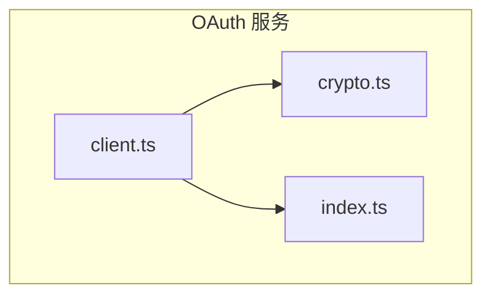
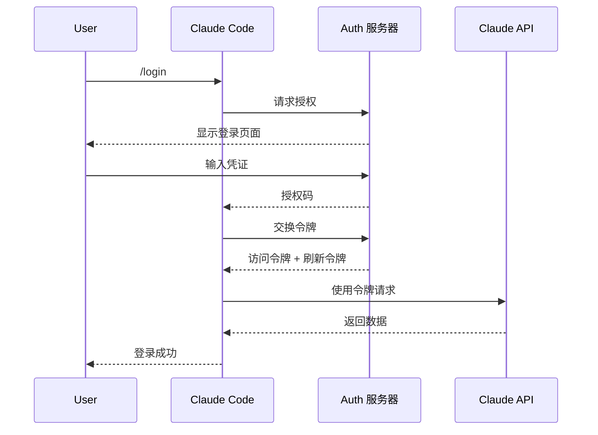
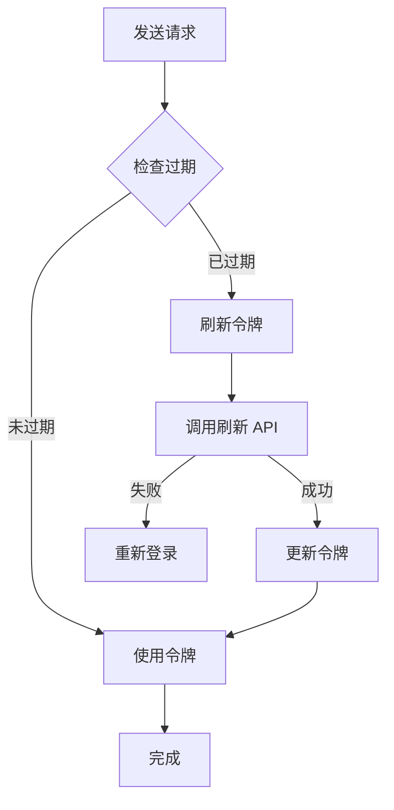
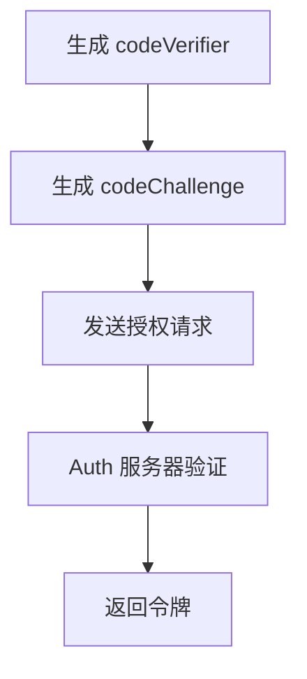

# OAuth 认证

## 概述

OAuth 服务处理 Claude Code 的用户认证流程，支持 OAuth 2.0 标准认证方式。服务管理令牌存储、令牌刷新和会话管理。

核心实现在 [services/oauth/](/restored-src/src/services/oauth/) 目录中。

## 架构位置



## 功能特性

| 功能 | 说明 | 相关文件 |
|------|------|----------|
| OAuth 客户端 | 标准 OAuth 2.0 流程 | [client.ts](/restored-src/src/services/oauth/client.ts) |
| 加密工具 | 令牌加密存储 | [crypto.ts](/restored-src/src/services/oauth/crypto.ts) |
| 令牌管理 | 访问令牌和刷新令牌 | [index.ts](/restored-src/src/services/oauth/index.ts) |

## 文件结构

```
restored-src/src/services/oauth/
├── client.ts              # OAuth 客户端
├── crypto.ts             # 加密工具
└── index.ts             # 导出入口
```

## OAuth 2.0 流程



## 令牌管理

### 令牌类型

| 类型 | 用途 | 过期时间 |
|------|------|----------|
| `accessToken` | API 请求认证 | 1 小时 |
| `refreshToken` | 刷新访问令牌 | 30 天 |
| `idToken` | 用户身份信息 | 1 小时 |

### 令牌存储

```typescript
interface TokenStore {
  accessToken: string      // 加密存储
  refreshToken: string      // 加密存储
  expiresAt: number         // 过期时间戳
  tokenType: string         // 令牌类型
}
```

### 令牌刷新流程



## 认证配置

### OAuth 参数

```typescript
interface OAuthConfig {
  clientId: string                 // OAuth 客户端 ID
  clientSecret?: string             // 客户端密钥
  authorizationUrl: string          // 授权端点
  tokenUrl: string                  // 令牌端点
  redirectUri: string               // 重定向 URI
  scopes: string[]                  // 请求权限
}
```

### 默认配置

```typescript
const DEFAULT_OAUTH_CONFIG: OAuthConfig = {
  authorizationUrl: 'https://auth.anthropic.com/oauth/authorize',
  tokenUrl: 'https://auth.anthropic.com/oauth/token',
  redirectUri: 'http://localhost:8080/callback',
  scopes: ['api:read', 'api:write']
}
```

## PKCE 扩展

使用 PKCE（Proof Key for Code Exchange）增强安全性：



## 安全考虑

### 令牌加密

| 措施 | 说明 |
|------|------|
| 静态加密 | 使用系统密钥加密令牌 |
| 内存安全 | 及时清理内存中的敏感数据 |
| 安全存储 | 使用系统密钥链存储 |

### PKCE

| 措施 | 说明 |
|------|------|
| codeVerifier | 随机 43-128 字符字符串 |
| codeChallenge | S256 方法的 SHA256 哈希 |
| 一次性使用 | 授权码只能使用一次 |

## 错误处理

| 错误类型 | 说明 | 处理 |
|----------|------|------|
| `AuthCodeError` | 授权码错误 | 重新获取 |
| `TokenError` | 令牌请求失败 | 检查配置或重新认证 |
| `RefreshError` | 刷新令牌失败 | 重新登录 |
| `InvalidScopeError` | 无效权限范围 | 调整权限 |

## API 摘要

| 函数 | 说明 | 返回类型 |
|------|------|----------|
| `getAccessToken()` | 获取当前访问令牌 | `string \| null` |
| `refreshTokens()` | 刷新访问令牌 | `Promise<TokenStore>` |
| `revokeTokens()` | 撤销令牌 | `Promise<void>` |
| `isAuthenticated()` | 检查认证状态 | `boolean` |

## 使用示例

### 登录流程

```typescript
import { startLogin } from '@/services/oauth/client'

// 启动 OAuth 登录流程
await startLogin()
```

### 检查认证状态

```typescript
import { isAuthenticated, getAccessToken } from '@/services/oauth/client'

if (isAuthenticated()) {
  const token = getAccessToken()
  // 使用令牌
}
```

### 登出

```typescript
import { logout } from '@/services/oauth/client'

await logout()
```

## 源码引用

- [client.ts](/restored-src/src/services/oauth/client.ts)
- [crypto.ts](/restored-src/src/services/oauth/crypto.ts)
- [index.ts](/restored-src/src/services/oauth/index.ts)

## 相关文档

- [API 服务](api.md)
- [MCP 服务](mcp.md)
- [快速开始](../getting-started.md)

---

*Generated by [Nium-Wiki v0.0.0](https://github.com/niuma996/nium-wiki) | 2026-03-31*
