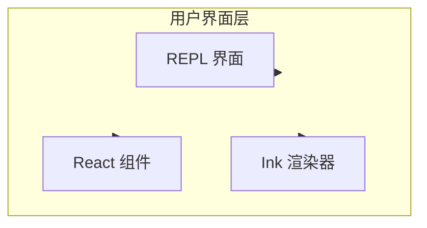

# 用户界面层

## 概览

用户界面层使用 Ink 渲染交互式终端 UI，提供 REPL 界面和组件化用户界面。

## 子模块

| 模块 | 说明 | 文档 |
|------|------|------|
| [REPL 界面](repl.md) | 交互式命令行界面 | [repl.md](repl.md) |
| [Ink 引擎](ink.md) | Ink 渲染引擎 | [ink.md](ink.md) |

## 架构位置

## 相关文档

- [架构文档](../architecture.md)
- [主页](../index.md)

---

*Generated by [Nium-Wiki v0.0.0](https://github.com/niuma996/nium-wiki) | 2026-03-31*
