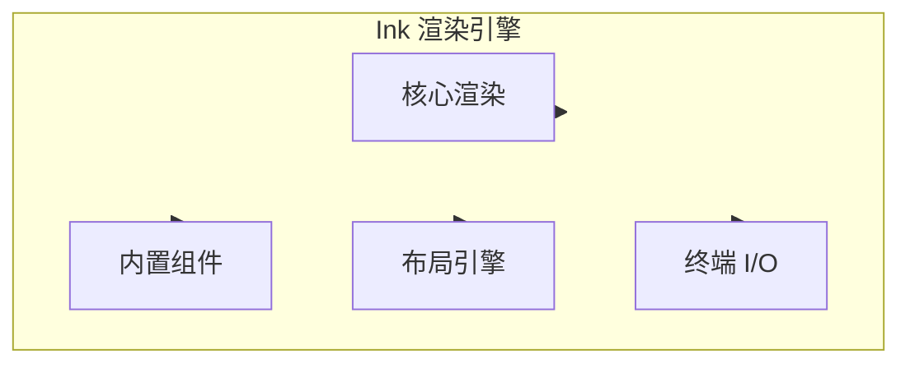
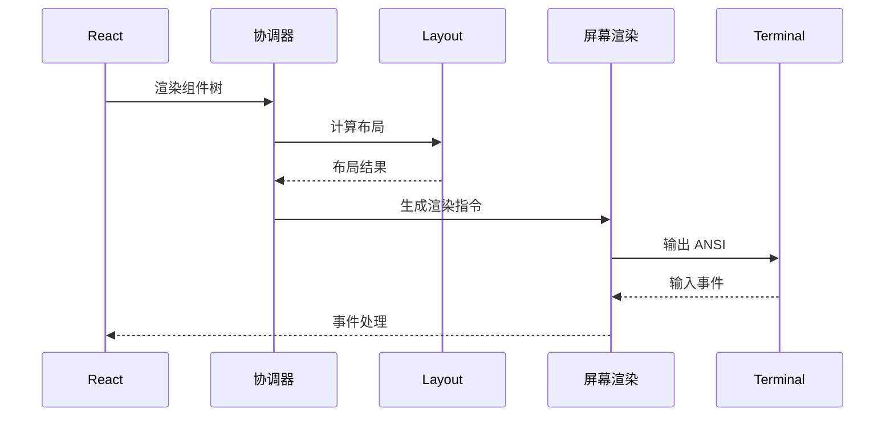
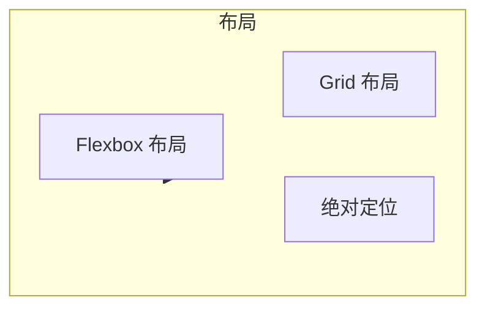

# Ink 渲染引擎

## 概述

Ink 是一个类 React 的终端 UI 库，Claude Code 使用它来渲染交互式命令行界面。Ink 提供组件化、声明式的 UI 开发体验，同时支持 ANSI 转义序列渲染。

核心实现在 [ink/](/restored-src/src/ink/) 目录中。

## 架构位置



## 功能特性

| 功能 | 说明 | 相关文件 |
|------|------|----------|
| 核心渲染 | React 渲染器 | [render-to-screen.ts](/restored-src/src/ink/render-to-screen.ts) |
| 布局引擎 | Yoga 布局 | [layout/yoga.ts](/restored-src/src/ink/layout/yoga.ts) |
| 终端解析 | ANSI 解析 | [termio/](/restored-src/src/ink/termio/) |
| 内置组件 | Box, Text, 等 | [components/](/restored-src/src/ink/components/) |

## 文件结构

```
restored-src/src/ink/
├── ink.tsx                # 主入口
├── render-to-screen.ts   # 屏幕渲染
├── renderer.ts           # React 渲染器
├── reconciler.ts         # React 协调器
├── screen.ts            # 屏幕管理
├── styles.ts            # 样式系统
├── instances.ts         # 实例管理
├── components/          # 内置组件
│   ├── Box.tsx
│   ├── Text.tsx
│   ├── Button.tsx
│   ├── Link.tsx
│   ├── Spacer.tsx
│   └── App.tsx
├── hooks/               # Hooks
│   ├── use-input.ts
│   ├── use-stdin.ts
│   └── use-app.ts
├── layout/              # 布局
│   ├── engine.ts
│   ├── geometry.ts
│   ├── node.ts
│   └── yoga.ts
├── termio/              # 终端 I/O
│   ├── ansi.ts
│   ├── parser.ts
│   ├── types.ts
│   └── ...
└── events/              # 事件系统
    ├── input-event.ts
    ├── click-event.ts
    └── ...
```

## 渲染流程



## 内置组件

### Box 组件

Box 是基础容器组件：

```tsx
import { Box, Text } from 'ink'

<Box>
  <Text>Hello World</Text>
</Box>
```

### Text 组件

Text 组件用于显示文本：

```tsx
<Text color="green" bold>
  Success!
</Text>
```

### Button 组件

按钮组件支持交互：

```tsx
<Button onPress={() => console.log('clicked')}>
  Click me
</Button>
```

## 样式系统

| 样式属性 | 类型 | 说明 |
|----------|------|------|
| `color` | string | 文本颜色 |
| `backgroundColor` | string | 背景颜色 |
| `bold` | boolean | 粗体 |
| `italic` | boolean | 斜体 |
| `dim` | boolean | 暗淡 |
| `underline` | boolean | 下划线 |
| `margin` | number | 外边距 |
| `padding` | number | 内边距 |
| `flexDirection` | string | 方向 |
| `alignItems` | string | 对齐 |

## 布局引擎

Ink 使用 Yoga 布局引擎：



## 事件系统

| 事件 | 说明 | 处理 |
|------|------|------|
| `keypress` | 键盘按键 | `useInput` hook |
| `mouse` | 鼠标事件 | `click-event.ts` |
| `focus` | 焦点事件 | `focus-event.ts` |
| `resize` | 终端大小 | `terminal-querier.ts` |

## ANSI 支持

### 颜色

```typescript
// 标准颜色
<Text color="red">红色</Text>
<Text color="#ff0000">十六进制</Text>

// 256 色
<Text color="ansi256">256 色</Text>

// True color
<Text color="rgb(255, 0, 0)">RGB</Text>
```

### 转义序列

```typescript
// 光标控制
'\x1b[?25l'  // 隐藏光标
'\x1b[?25h'  // 显示光标
'\x1b[2J'    // 清屏

// 移动
'\x1b[{n}A'  // 上移 n 行
'\x1b[{n}B'  // 下移 n 行
```

## Hooks

### useInput

处理用户输入：

```typescript
import { useInput } from 'ink'

useInput((input, key) => {
  if (key.return) {
    console.log('Enter pressed')
  }
})
```

### useApp

获取 App 实例：

```typescript
import { useApp } from 'ink'

const { exit } = useApp()
```

## 性能优化

| 优化 | 说明 |
|------|------|
| 选择性渲染 | 只更新变化的节点 |
| 批量更新 | 合并多个状态更新 |
| 布局缓存 | 缓存布局计算结果 |
| 最小化输出 | 减少终端刷新 |

## 源码引用

- [ink.tsx](/restored-src/src/ink/ink.tsx)
- [render-to-screen.ts](/restored-src/src/ink/render-to-screen.ts)
- [renderer.ts](/restored-src/src/ink/renderer.ts)
- [components/Box.tsx](/restored-src/src/ink/components/Box.tsx)
- [layout/yoga.ts](/restored-src/src/ink/layout/yoga.ts)

## 相关文档

- [REPL 界面](repl.md)
- [架构文档](../architecture.md)

---

*Generated by [Nium-Wiki v0.0.0](https://github.com/niuma996/nium-wiki) | 2026-03-31*
