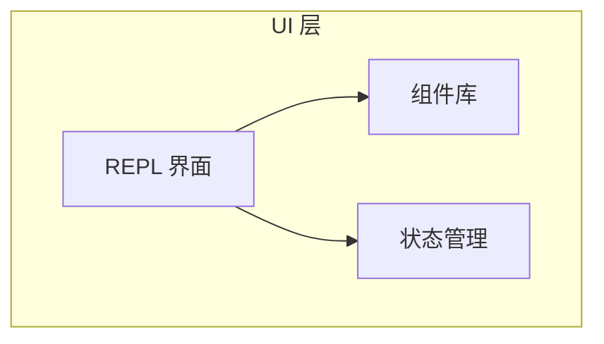
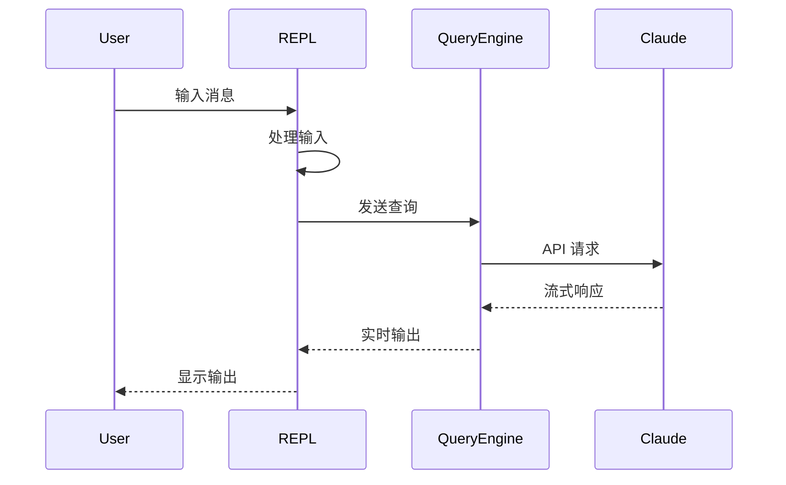
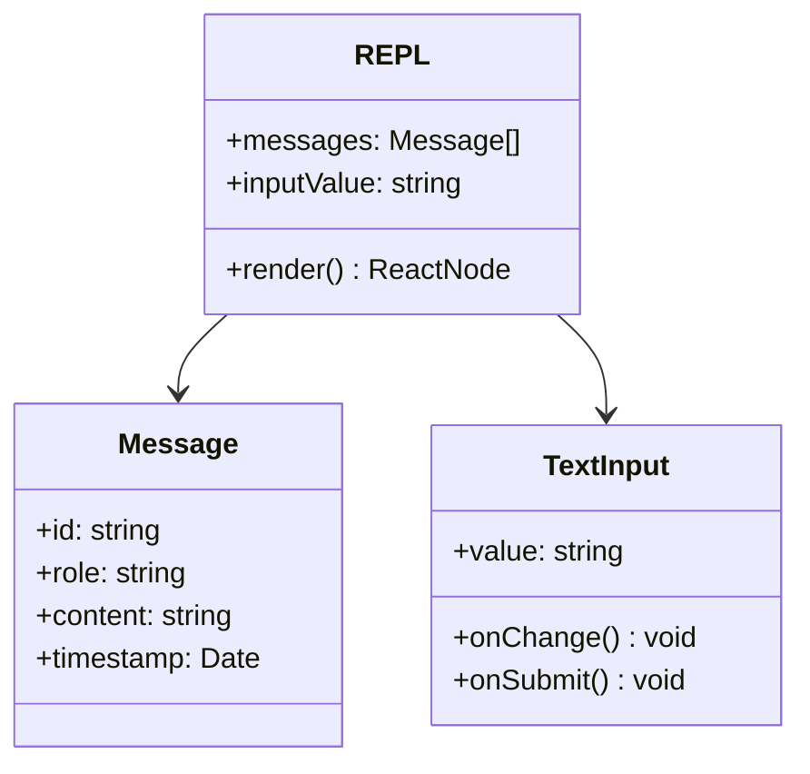
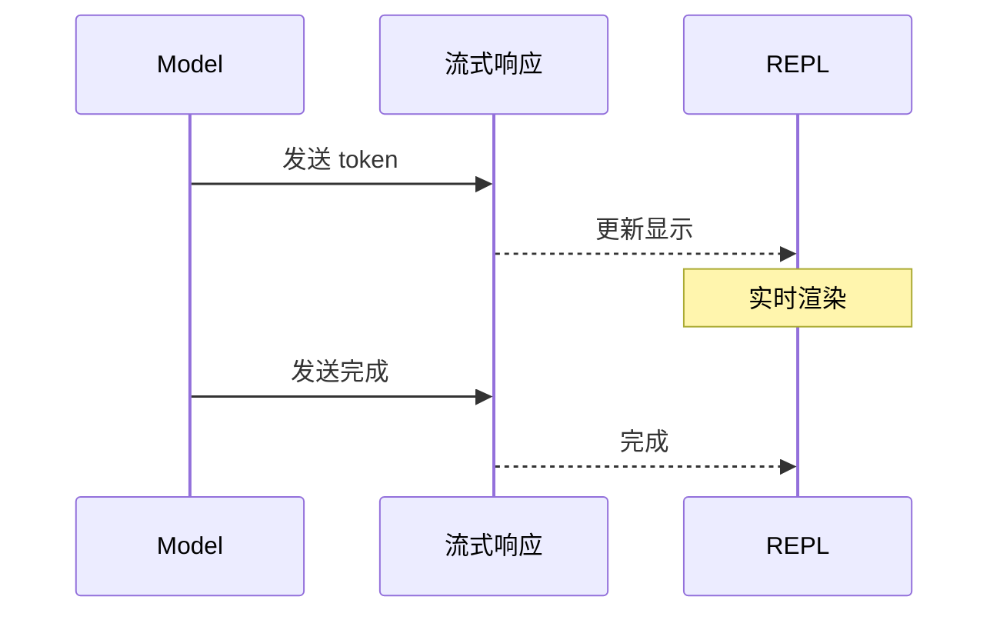

# REPL 界面

## 概述

REPL（Read-Eval-Print Loop）界面是 Claude Code 的主要用户交互界面，提供交互式命令行体验。界面使用 Ink 渲染，支持实时输入、输出显示和命令补全。

核心实现在 [screens/REPL.tsx](/restored-src/src/screens/REPL.tsx) 文件中。

## 架构位置



## 功能特性

| 功能 | 说明 | 相关文件 |
|------|------|----------|
| 命令输入 | 用户输入处理 | [components/TextInput.tsx](/restored-src/src/components/TextInput.tsx) |
| 消息显示 | 对话消息渲染 | [components/Message.tsx](/restored-src/src/components/Message.tsx) |
| 流式输出 | 实时流式显示 | [components/Messages.tsx](/restored-src/src/components/Messages.tsx) |
| 命令补全 | 智能命令补全 | [hooks/useTypeahead.tsx](/restored-src/src/hooks/useTypeahead.tsx) |

## 文件结构

```
restored-src/src/
├── screens/
│   └── REPL.tsx              # REPL 主界面
├── components/                # React 组件
│   ├── Message.tsx           # 消息组件
│   ├── MessageRow.tsx       # 消息行
│   ├── Messages.tsx         # 消息列表
│   ├── TextInput.tsx        # 文本输入
│   ├── SearchBox.tsx        # 搜索框
│   ├── Onboarding.tsx      # 入门界面
│   └── ...
├── hooks/                    # React Hooks
│   ├── useInputBuffer.ts   # 输入缓冲
│   ├── useTextInput.ts     # 文本输入
│   ├── useCommandQueue.ts  # 命令队列
│   └── ...
└── ink/                      # Ink 渲染引擎
```

## 核心工作流



## 界面组件



## 状态管理

| 状态 | 说明 | 管理方式 |
|------|------|----------|
| 消息列表 | 对话历史 | React State |
| 输入值 | 当前输入 | React State |
| 发送状态 | 发送中/完成 | React State |
| 错误状态 | 错误信息 | React State |
| 配置 | 用户配置 | AppState Store |

## 输入处理

### 输入缓冲

```typescript
interface InputBuffer {
  value: string           // 当前输入值
  cursor: number         // 光标位置
  history: string[]      // 历史记录
  historyIndex: number   // 历史索引
}
```

### 命令解析

| 类型 | 前缀 | 说明 |
|------|------|------|
| 普通消息 | 无 | 直接发送给模型 |
| 斜杠命令 | `/` | 执行内置命令 |
| 特殊命令 | `--` | CLI 选项 |

## 流式输出

REPL 支持实时流式输出：



## 用户体验

### 命令补全

| 功能 | 触发 | 说明 |
|------|------|------|
| 斜杠命令 | 输入 `/` | 显示可用命令 |
| 参数补全 | 命令后空格 | 显示参数选项 |
| 文件路径 | 输入路径 | 自动补全文件 |

### 键盘快捷键

| 快捷键 | 功能 |
|--------|------|
| `Ctrl+C` | 取消当前输入 |
| `Ctrl+L` | 清屏 |
| `Ctrl+R` | 搜索历史 |
| `↑/↓` | 浏览历史 |
| `Tab` | 补全 |
| `Esc` | 取消 |

## 渲染优化

| 优化 | 说明 |
|------|------|
| 虚拟列表 | 只渲染可见消息 |
| 增量渲染 | 流式更新而非整体刷新 |
| 防抖 | 输入防抖减少渲染 |
| 记忆化 | 缓存组件避免重复渲染 |

## 源码引用

- [REPL.tsx](/restored-src/src/screens/REPL.tsx)
- [components/Message.tsx](/restored-src/src/components/Message.tsx)
- [components/TextInput.tsx](/restored-src/src/components/TextInput.tsx)
- [hooks/useInputBuffer.ts](/restored-src/src/hooks/useInputBuffer.ts)

## 相关文档

- [Ink 引擎](ink.md)
- [架构文档](../architecture.md)

---

*Generated by [Nium-Wiki v0.0.0](https://github.com/niuma996/nium-wiki) | 2026-03-31*
