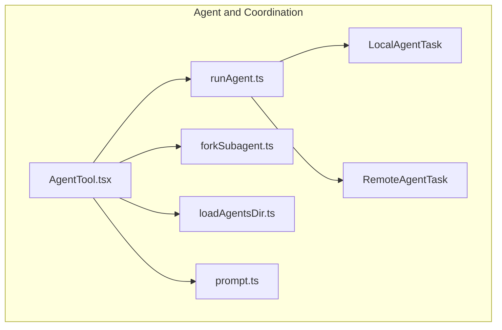
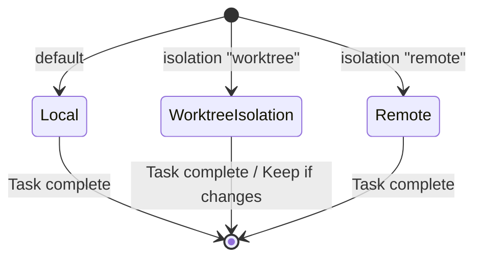

# Agent and Coordination

## Overview

The Agent and Coordination module is the core AI orchestration engine of Claude Code, responsible for managing the lifecycle of AI agents, coordinating multi-agent collaboration, and providing the execution framework for the Agent Tool.

This module contains two core capabilities:

1. **Agent Tool**: Allows the main AI model to spawn subagents to handle complex multi-step tasks
2. **Fork Subagent**: Allows the main AI to directly "fork" itself to handle independent work units

The agent system supports three execution modes: local execution, remote CCR execution, and Git Worktree isolation.

## Submodules

| Module | Description | Document |
|--------|-------------|----------|
| [Agent Tool](agent-tool.md) | Subagent spawning framework | [agent-tool.md](agent-tool.md) |
| [Fork Subagent](fork-subagent.md) | Fork mechanism | [fork-subagent.md](fork-subagent.md) |

## Architecture Position

## Core Concepts

### Agent Types

Claude Code supports three sources of agent definitions:

| Source | Description | Registration |
|--------|-------------|-------------|
| Built-in Agents | Built-in specialized agents (e.g., code-reviewer, test-runner) | [builtInAgents.js](/restored-src/src/tools/AgentTool/built-in/generalPurposeAgent.js) |
| Custom Agents | User/project/policy-defined agents | Loaded from `.md` files or config |
| Plugin Agents | Agents provided by plugins | Registered at plugin load time |

### Execution Modes

## Key Design Decisions

### 1. Agent List Cache Optimization

Dynamic changes to the agent list (MCP connection, plugin reload, permission mode change) cause tool schema cache invalidation. Through the GrowthBook feature switch `tengu_agent_list_attach`, the agent list was migrated from inline tool descriptions to `agent_listing_delta` attachment messages, reducing ~10.2% of cache_creation tokens.

### 2. Fork vs Subagent

| Feature | Fork | Subagent (subagent_type) |
|---------|------|------------------------|
| Context Inheritance | ✅ Full parent context | ❌ Starts from zero |
| Model Selection | Inherits parent model | Can specify different model |
| Tool Pool | Inherits parent tool pool | Can reconfigure |
| Use Case | Fast parallel research | Specialized role tasks |
| Cache Efficiency | High (shares parent cache) | Low (independent cache) |

### 3. Worktree Isolation

Git Worktree creates isolated copies of the repository. Subagent changes don't affect the main working directory. If the subagent produces no changes, Worktree is automatically cleaned up; if changes are produced, the Worktree is preserved and path/branch info is returned in the result.

## Key Types

| Type | Definition Location | Description |
|------|-------------------|-------------|
| `AgentDefinition` | [loadAgentsDir.ts](/restored-src/src/tools/AgentTool/loadAgentsDir.ts) | Agent definition union type |
| `BuiltInAgentDefinition` | [loadAgentsDir.ts](/restored-src/src/tools/AgentTool/loadAgentsDir.ts) | Built-in agent definition |
| `CustomAgentDefinition` | [loadAgentsDir.ts](/restored-src/src/tools/AgentTool/loadAgentsDir.ts) | Custom agent definition |
| `AgentToolCallParams` | [AgentTool.tsx](/restored-src/src/tools/AgentTool/AgentTool.tsx) | Agent tool call parameters |

## Source References

- [AgentTool.tsx](/restored-src/src/tools/AgentTool/AgentTool.tsx)
- [runAgent.ts](/restored-src/src/tools/AgentTool/runAgent.ts)
- [forkSubagent.ts](/restored-src/src/tools/AgentTool/forkSubagent.ts)
- [loadAgentsDir.ts](/restored-src/src/tools/AgentTool/loadAgentsDir.ts)
- [prompt.ts](/restored-src/src/tools/AgentTool/prompt.ts)
- [LocalAgentTask.ts](/restored-src/src/tasks/LocalAgentTask/LocalAgentTask.js)
- [RemoteAgentTask.ts](/restored-src/src/tasks/RemoteAgentTask/RemoteAgentTask.ts)

## Related Documents

- [Architecture Overview](../architecture.md)
- [Home](../index.md)
- [Agent Tool](agent-tool.md)
- [Fork Subagent](fork-subagent.md)

---

*Generated by [Nium-Wiki v0.0.0](https://github.com/niuma996/nium-wiki) | 2026-03-31*
