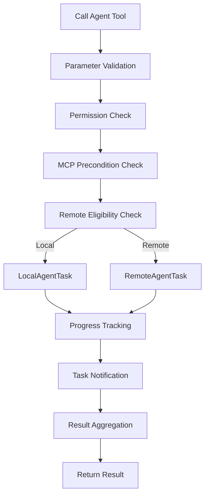

# Agent Tool

## Overview

The Agent Tool is the core tool in Claude Code that allows the main AI model to spawn subagents to handle complex multi-step tasks. [AgentTool.tsx](/restored-src/src/tools/AgentTool/AgentTool.tsx) implements the complete lifecycle of this tool, including parameter validation, precondition checks, task registration, progress tracking, and result aggregation.

## Tool Definition

The Agent Tool is registered to the tool pool via the `buildTool` factory function, with parameters defined by a Zod schema:

```typescript
const agentToolSchema = z.object({
  name: z.string().describe('Agent name (3-5 words)'),
  description: z.string().describe('Task description'),
  subagent_type: z.string().optional().describe('Agent type'),
  prompt: z.string().describe('Task directive'),
  model: z.string().optional().describe('Specify model'),
  isolation: z.enum(['worktree', 'remote']).optional(),
  run_in_background: z.boolean().optional(),
  // ... more parameters
})
```

## Core Execution Flow



## Precondition Checks

### Permission Mode Check

```typescript
// Check if user allows this agent type
const denyRule = getDenyRuleForAgent(params.subagent_type)
if (denyRule) {
  return formatPreconditionError(denyRule)
}
```

### MCP Server Precondition Check

```typescript
// Check if required MCP servers are connected
const mcpRequirementError = filterAgentsByMcpRequirements([agentDef])
if (mcpRequirementError) {
  return formatPreconditionError(mcpRequirementError)
}
```

### Remote Execution Eligibility Check

```typescript
const { checkRemoteAgentEligibility } = await import('../../tasks/RemoteAgentTask/RemoteAgentTask.ts')
const eligibility = await checkRemoteAgentEligibility(params)
if (eligibility.eligible) {
  // Route to remote execution
} else {
  // Fall back to local execution
}
```

## Progress Tracking

Agent Tool supports real-time progress tracking, sending periodic progress updates to users during background task execution:

```typescript
// Auto-background mode: auto-background after 120 seconds
const autoBackgroundMs = getAutoBackgroundMs()

// Progress threshold: show background hint after 2 seconds
const PROGRESS_THRESHOLD_MS = 2000

// Progress updates pushed via agent_listing_delta attachment messages
enqueueAgentNotification(agentId, 'progress', summary)
```

## Source References

- [AgentTool.tsx](/restored-src/src/tools/AgentTool/AgentTool.tsx)
- [loadAgentsDir.ts](/restored-src/src/tools/AgentTool/loadAgentsDir.ts)
- [prompt.ts](/restored-src/src/tools/AgentTool/prompt.ts)
- [runAgent.ts](/restored-src/src/tools/AgentTool/runAgent.ts)
- [LocalAgentTask.ts](/restored-src/src/tasks/LocalAgentTask/LocalAgentTask.js)
- [RemoteAgentTask.ts](/restored-src/src/tasks/RemoteAgentTask/RemoteAgentTask.ts)

## Related Documents

- [Agent and Coordination](../agent/_index.md)
- [Fork Subagent](fork-subagent.md)

---

*Generated by [Nium-Wiki v0.0.0](https://github.com/niuma996/nium-wiki) | 2026-03-31*
