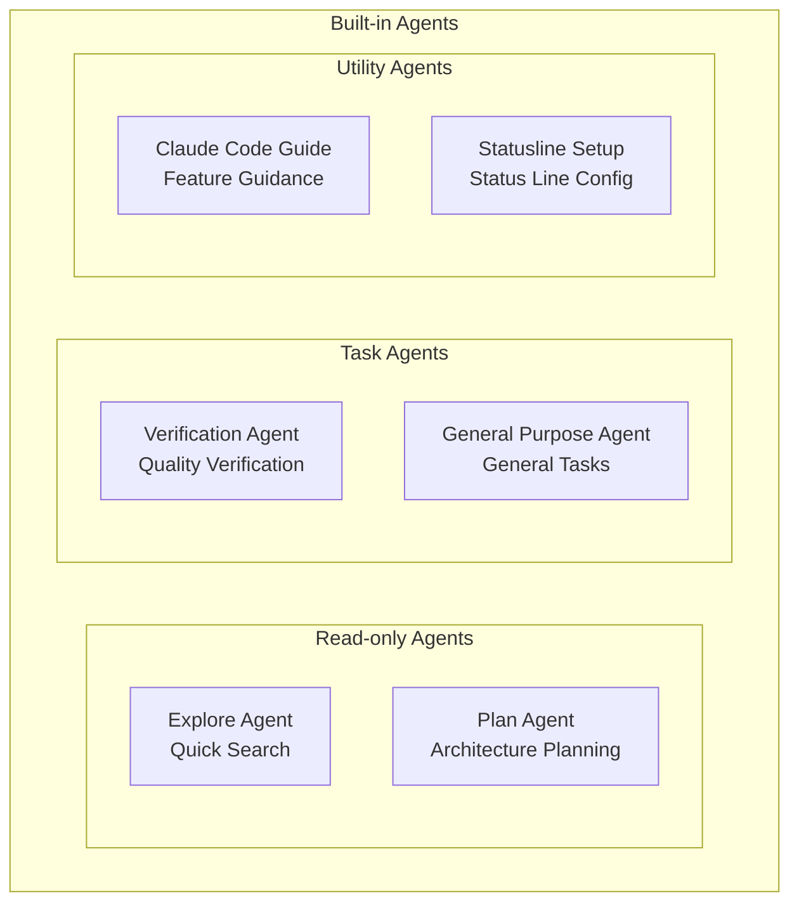
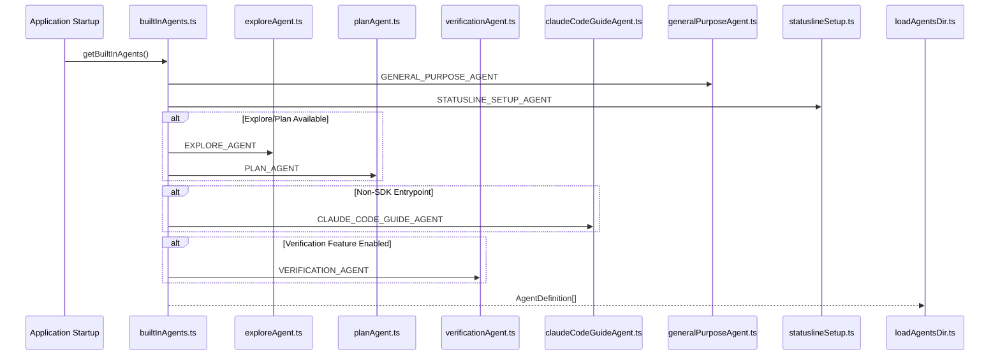

# Built-in Agents

## Overview

Built-in agents are pre-defined specialized agents in Claude Code that provide out-of-the-box solutions for common tasks. They are registered and managed centrally through [builtInAgents.ts](/restored-src/src/tools/AgentTool/builtInAgents.ts).

## Agent List

| Agent | Type Identifier | Model | Purpose |
|-------|----------------|-------|---------|
| [Explore Agent](./explore-agent.md) | `Explore` | Haiku/inherit | Fast codebase exploration |
| [Plan Agent](./plan-agent.md) | `Plan` | inherit | Architecture design and implementation planning |
| [Verification Agent](./verification-agent.md) | `verification` | inherit | Implementation quality verification |
| [Claude Code Guide Agent](./claude-code-guide-agent.md) | `claude-code-guide` | Haiku | Claude Code feature guidance |
| [General Purpose Agent](./general-purpose-agent.md) | `general-purpose` | default | General multi-step tasks |
| [Statusline Setup Agent](./statusline-setup-agent.md) | `statusline-setup` | Sonnet | Status line configuration |

## Architecture Relationships

## Registration Mechanism

## Agent Classification

### By Execution Mode

| Category | Agents | Characteristics |
|----------|--------|-----------------|
| Read-only | Explore, Plan | File modification prohibited |
| Writable | General Purpose, Verification, Statusline Setup | File modification allowed |
| Read-only | Claude Code Guide | Documentation reading only |

### By Model Selection

| Model | Agents | Selection Strategy |
|-------|--------|-------------------|
| `haiku` | Explore (external), Claude Code Guide | Fast response |
| `sonnet` | Statusline Setup | Moderate capability |
| `inherit` | Explore (Ant), Plan, Verification | Inherit main Agent |
| `default` | General Purpose | System default |

## Feature Flags

| Agent | Feature Flags | Default |
|-------|---------------|---------|
| Explore, Plan | `BUILTIN_EXPLORE_PLAN_AGENTS` + `tengu_amber_stoat` | Enabled |
| Verification | `VERIFICATION_AGENT` + `tengu_hive_evidence` | Disabled |
| Claude Code Guide | Non-SDK entrypoints only | Enabled |

## Source References

- [builtInAgents.ts](/restored-src/src/tools/AgentTool/builtInAgents.ts)
- [loadAgentsDir.ts](/restored-src/src/tools/AgentTool/loadAgentsDir.ts)
- [exploreAgent.ts](/restored-src/src/tools/AgentTool/built-in/exploreAgent.ts)
- [planAgent.ts](/restored-src/src/tools/AgentTool/built-in/planAgent.ts)
- [verificationAgent.ts](/restored-src/src/tools/AgentTool/built-in/verificationAgent.ts)
- [claudeCodeGuideAgent.ts](/restored-src/src/tools/AgentTool/built-in/claudeCodeGuideAgent.ts)
- [generalPurposeAgent.ts](/restored-src/src/tools/AgentTool/built-in/generalPurposeAgent.ts)
- [statuslineSetup.ts](/restored-src/src/tools/AgentTool/built-in/statuslineSetup.ts)

## Related Documents

- [Agents Overview](../_index.md)
- [Agent Tool](../agent-tool.md)

---

*Generated by [Nium-Wiki v0.0.0](https://github.com/niuma996/nium-wiki) | 2026-04-02*
