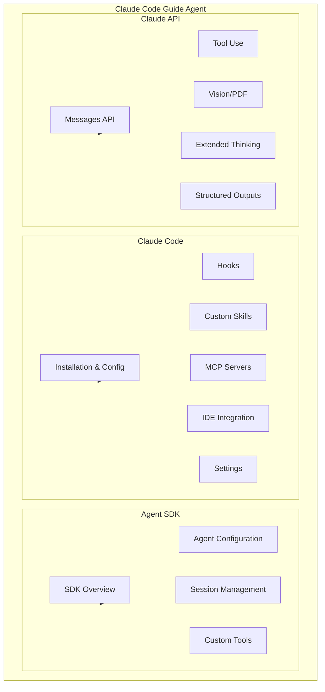
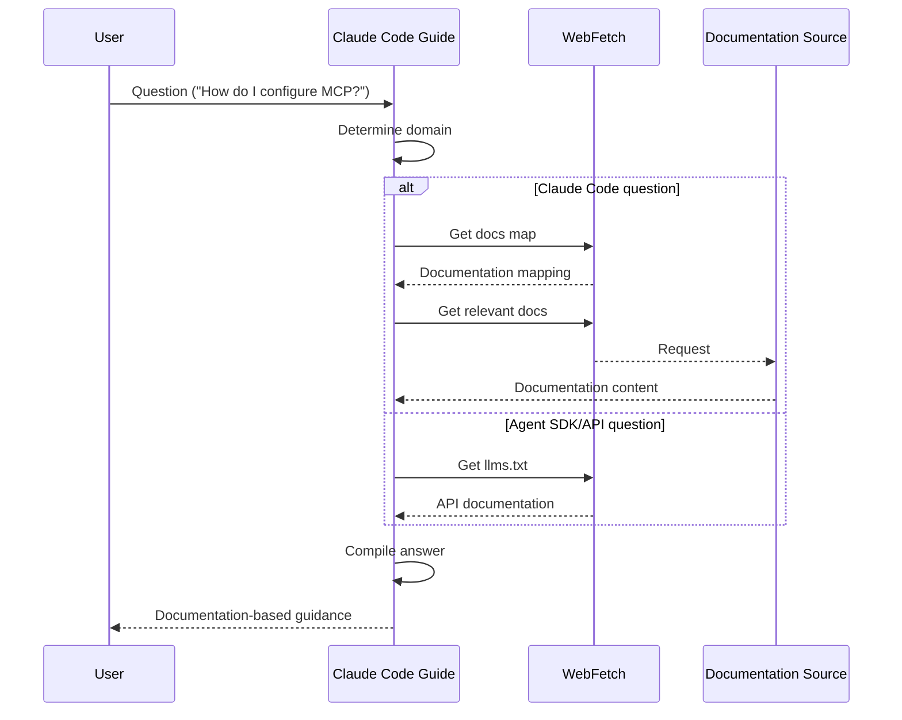

# Claude Code Guide Agent

## Overview

The Claude Code Guide Agent is a built-in agent that helps users understand and effectively use Claude Code, Claude Agent SDK, and Claude API. It provides guidance on features, configuration, hooks, MCP servers, and more.

## Core Features

| Feature | Description |
|---------|-------------|
| **Multi-domain Expert** | Covers Claude Code CLI, Agent SDK, Claude API |
| **Documentation-driven** | Provides accurate guidance based on official documentation |
| **Context-aware** | Provides personalized suggestions based on user configuration |
| **Lightweight Model** | Uses Haiku model for fast responses |

## Three Domains



## System Prompt

```typescript
export const CLAUDE_CODE_GUIDE_AGENT: BuiltInAgentDefinition = {
  agentType: CLAUDE_CODE_GUIDE_AGENT_TYPE,
  whenToUse: `Use this agent when the user asks questions about:
    (1) Claude Code - features, hooks, slash commands, MCP servers...
    (2) Claude Agent SDK - building custom agents
    (3) Claude API - API usage, tool use, Anthropic SDK usage`,
  tools: hasEmbeddedSearchTools()
    ? [BASH_TOOL_NAME, FILE_READ_TOOL_NAME, WEB_FETCH_TOOL_NAME, WEB_SEARCH_TOOL_NAME]
    : [GLOB_TOOL_NAME, GREP_TOOL_NAME, FILE_READ_TOOL_NAME, WEB_FETCH_TOOL_NAME, WEB_SEARCH_TOOL_NAME],
  source: 'built-in',
  baseDir: 'built-in',
  model: 'haiku',
  permissionMode: 'dontAsk',  // Don't ask for permissions
  getSystemPrompt({ toolUseContext }) {
    // Dynamically build context with user configuration
  },
}
```

## Documentation Sources

### Claude Code Documentation

| Document | URL | Coverage |
|---------|-----|----------|
| Docs Map | `https://code.claude.com/docs/en/claude_code_docs_map.md` | Complete CLI tool documentation |

### Claude Agent SDK Documentation

| Document | URL | Coverage |
|---------|-----|----------|
| SDK Docs | `https://platform.claude.com/llms.txt` | SDK overview, Python/TypeScript |

### Claude API Documentation

| Document | URL | Coverage |
|---------|-----|----------|
| API Docs | `https://platform.claude.com/llms.txt` | Messages API, streaming, tool use |

## Response Flow



## User Configuration Context

The Claude Code Guide Agent dynamically collects and uses user configuration information:

### 1. Custom Skills

```markdown
**Available custom skills in this project:**
- /deploy: Deploy the application
- /test: Run test suite
```

### 2. Custom Agents

```markdown
**Available custom agents configured:**
- code-reviewer: Review code changes
- test-runner: Execute tests
```

### 3. MCP Servers

```markdown
**Configured MCP servers:**
- slack
- github
- filesystem
```

### 4. Plugin Skills

```markdown
**Available plugin skills:**
- /jira: Interact with Jira
- /github: GitHub integration
```

### 5. User Settings

```json
{
  "outputStyle": "Explanatory",
  "temperature": 0.7
}
```

## Feedback Handling

Feedback handling differs based on user type:

| User Type | Feedback Method |
|-----------|----------------|
| Direct users | Direct to use `/feedback` command |
| 3P service users | Direct to appropriate feedback channel |

```typescript
function getFeedbackGuideline(): string {
  if (isUsing3PServices()) {
    return `- When you cannot find an answer... direct to ${MACRO.ISSUES_EXPLAINER}`
  }
  return "- When you cannot find an answer... direct user to use /feedback"
}
```

## Use Cases

### When to Use

| Question Type | Example |
|--------------|---------|
| Claude Code features | `"Can Claude auto-save my work?"` |
| Hooks configuration | `"How do I run a script before each command?"` |
| MCP servers | `"How do I configure the GitHub MCP server?"` |
| Settings configuration | `"How do I change the output style?"` |
| Agent SDK usage | `"How do I build a custom agent?"` |
| API questions | `"How do I use tool use in the API?"` |

### Usage Note

> **IMPORTANT**: Before spawning a new agent, check if there is already a running or recently completed claude-code-guide agent that you can continue via SendMessage.

## Tool Configuration

| Environment | Configured Tools |
|-------------|-----------------|
| Standard Build | GlobTool, GrepTool, FileReadTool, WebFetchTool, WebSearchTool |
| Ant-native | BashTool (find/grep), FileReadTool, WebFetchTool, WebSearchTool |

## Availability Conditions

The Claude Code Guide Agent is only available for non-SDK entrypoints:

```typescript
const isNonSdkEntrypoint =
  process.env.CLAUDE_CODE_ENTRYPOINT !== 'sdk-ts' &&
  process.env.CLAUDE_CODE_ENTRYPOINT !== 'sdk-py' &&
  process.env.CLAUDE_CODE_ENTRYPOINT !== 'sdk-cli'

if (isNonSdkEntrypoint) {
  agents.push(CLAUDE_CODE_GUIDE_AGENT)
}
```

| Entrypoint | Availability |
|------------|--------------|
| `sdk-ts` | ❌ Not available |
| `sdk-py` | ❌ Not available |
| `sdk-cli` | ❌ Not available |
| Others | ✅ Available |

## Source References

- [claudeCodeGuideAgent.ts](/restored-src/src/tools/AgentTool/built-in/claudeCodeGuideAgent.ts)
- [builtInAgents.ts](/restored-src/src/tools/AgentTool/builtInAgents.ts)
- [constants.ts](/restored-src/src/tools/AgentTool/constants.ts)

## Related Documents

- [Agents Overview](../_index.md)
- [Agent Tool](../agent-tool.md)
- [Built-in Agents](./_index.md)

---

*Generated by [Nium-Wiki v0.0.0](https://github.com/niuma996/nium-wiki) | 2026-04-02*
