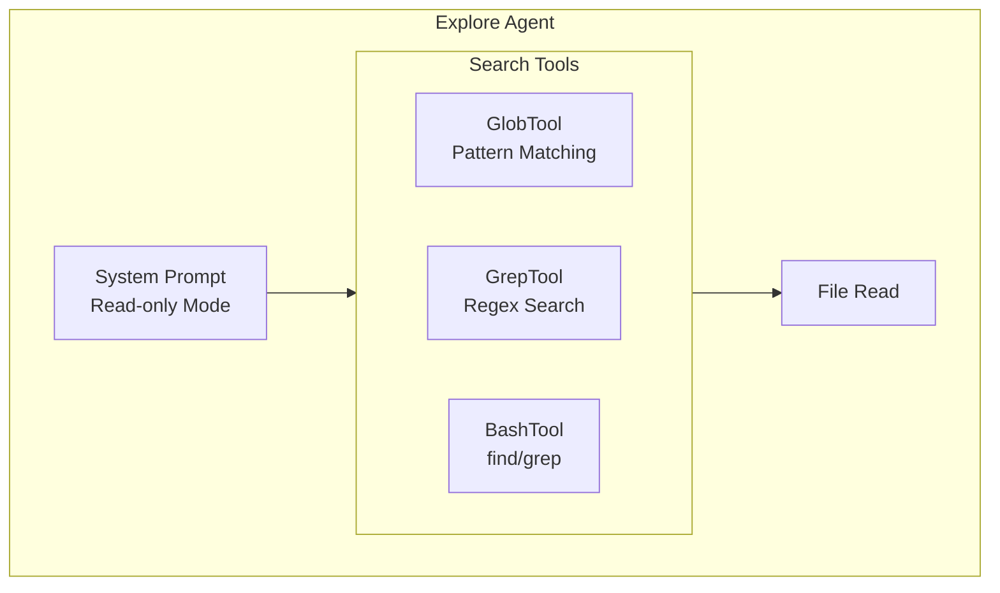
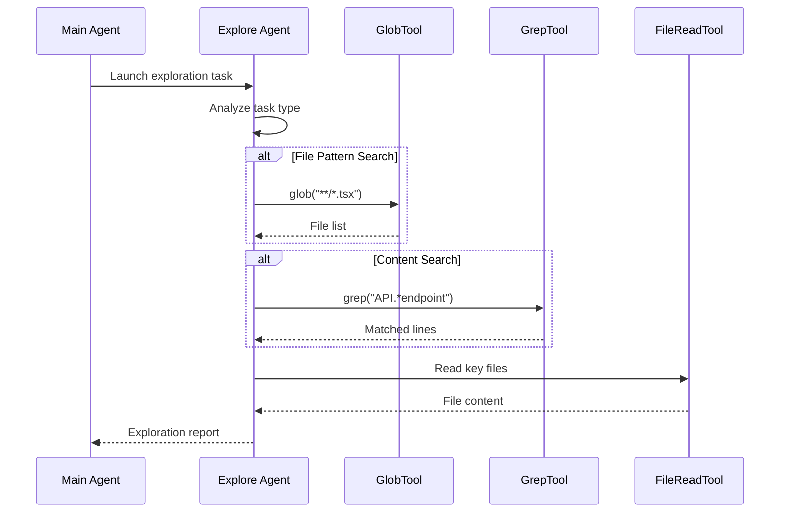

# Explore Agent

## Overview

The Explore Agent is a built-in agent specialized for quickly searching and analyzing codebases. It is designed to execute read-only file search and content exploration tasks, rapidly locating files, searching code patterns, and reading/analyzing file contents.

## Core Features

| Feature | Description |
|---------|-------------|
| **Read-only Mode** | Strictly prohibits any file modification operations |
| **Fast Execution** | Designed to return results quickly using parallel tool calls |
| **Professional Search** | Supports Glob pattern matching and regex content search |
| **Lightweight Model** | Uses Haiku model for external users for speed |

## System Prompt

```typescript
export const EXPLORE_AGENT: BuiltInAgentDefinition = {
  agentType: 'Explore',
  whenToUse: 'Fast agent specialized for exploring codebases...',
  disallowedTools: [
    AGENT_TOOL_NAME,
    EXIT_PLAN_MODE_TOOL_NAME,
    FILE_EDIT_TOOL_NAME,
    FILE_WRITE_TOOL_NAME,
    NOTEBOOK_EDIT_TOOL_NAME,
  ],
  source: 'built-in',
  baseDir: 'built-in',
  model: process.env.USER_TYPE === 'ant' ? 'inherit' : 'haiku',
  omitClaudeMd: true,
  getSystemPrompt: () => getExploreSystemPrompt(),
}
```

## Architecture Position



## Disallowed Tools

The Explore Agent is configured for read-only mode and prohibits the following tools:

| Tool Type | Tool Name | Reason |
|-----------|-----------|--------|
| Agent | `Agent` | Prevents nested calls |
| Exit Plan Mode | `ExitPlanMode` | Not needed |
| File Edit | `Edit` | Prohibits file modification |
| File Write | `Write` | Prohibits file creation/write |
| Notebook Edit | `NotebookEdit` | Prohibits notebook editing |

## Use Cases

### When to Use Explore Agent

| Scenario | Example |
|----------|---------|
| Find files by pattern | `"Find all React component files"` |
| Search code keywords | `"Find API endpoint implementations"` |
| Understand codebase structure | `"How do API endpoints work?"` |
| Quick investigation | `"Find where this error is thrown"` |

### When Not to Use

- Tasks requiring file modifications (should use General Purpose Agent)
- Tasks that need to run commands changing system state
- Operations requiring access to editing tools

## Execution Flow



## Search Tool Adaptation

The Explore Agent intelligently detects Ant-native build environments and adapts search tools:

| Environment | Glob Tool | Grep Tool |
|------------|-----------|-----------|
| Standard Build | `GlobTool` | `GrepTool` |
| Ant-native | `find` via Bash | `grep` via Bash |

```typescript
function getExploreSystemPrompt(): string {
  const embedded = hasEmbeddedSearchTools()
  const globGuidance = embedded
    ? `- Use \`find\` via ${BASH_TOOL_NAME} for broad file pattern matching`
    : `- Use ${GLOB_TOOL_NAME} for broad file pattern matching`
  // ...
}
```

## Model Selection Strategy

| User Type | Model Selection | Reason |
|------------|----------------|--------|
| Ant (internal user) | `inherit` | Inherits main Agent model |
| External | `haiku` | Uses fast model for quick response |

## Output Format

The Explore Agent returns a concise exploration report:

```markdown
## Exploration Results

### File Locations
- `/src/components/Button.tsx`
- `/src/components/Icon.tsx`

### Key Findings
1. All components inherit from `BaseComponent` class
2. API endpoints defined in `src/api/routes.ts`
3. Error handling unified using `ErrorHandler` middleware
```

## Source References

- [exploreAgent.ts](/restored-src/src/tools/AgentTool/built-in/exploreAgent.ts)
- [loadAgentsDir.ts](/restored-src/src/tools/AgentTool/loadAgentsDir.ts)
- [constants.ts](/restored-src/src/tools/AgentTool/constants.ts)

## Related Documents

- [Agents Overview](../_index.md)
- [Plan Agent](./plan-agent.md)
- [Agent Tool](../agent-tool.md)
- [Built-in Agents](./_index.md)

---

*Generated by [Nium-Wiki v0.0.0](https://github.com/niuma996/nium-wiki) | 2026-04-02*
