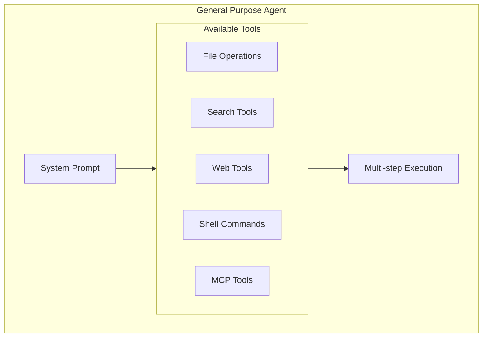
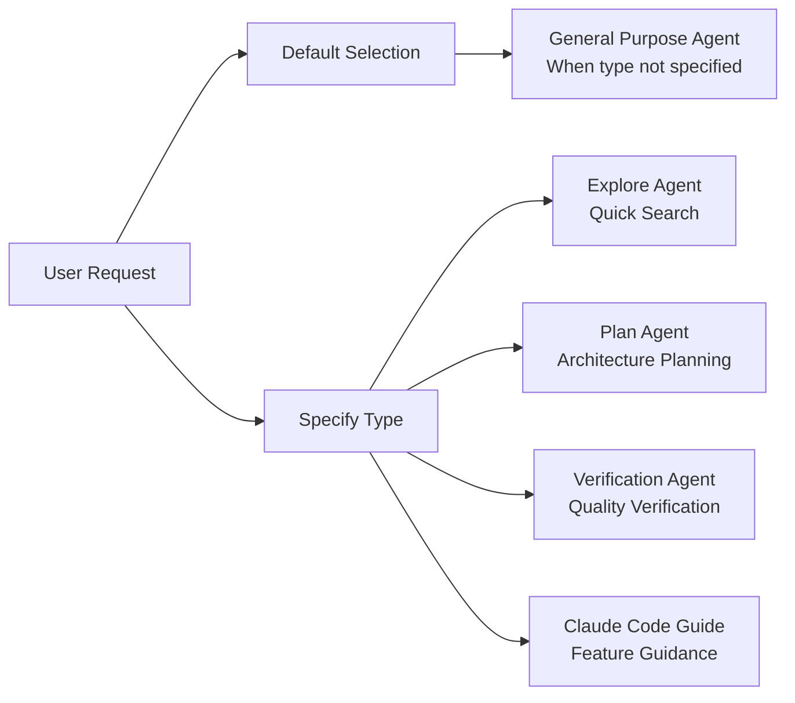

# General Purpose Agent

## Overview

The General Purpose Agent is the default built-in agent in Claude Code, designed for handling complex research questions, code searches, and multi-step task execution. It is the fallback option when no specific agent type is specified by the user.

## Core Features

| Feature | Description |
|---------|-------------|
| **Full Tool Access** | Has access to all available tools |
| **General Purpose** | Suitable for various complex tasks |
| **Flexible Execution** | No restriction on specific functionality |

## System Prompt

```typescript
export const GENERAL_PURPOSE_AGENT: BuiltInAgentDefinition = {
  agentType: 'general-purpose',
  whenToUse: 'General-purpose agent for researching complex questions...',
  tools: ['*'],  // Full tool access
  source: 'built-in',
  baseDir: 'built-in',
  // model intentionally omitted - uses getDefaultSubagentModel()
  getSystemPrompt: getGeneralPurposeSystemPrompt,
}
```

## Shared Guidelines

```typescript
const SHARED_PREFIX = `You are an agent for Claude Code, Anthropic's official CLI for Claude. Given the user's message, you should use the tools available to complete the task. Complete the task fully—don't gold-plate, but don't leave it half-done.`

const SHARED_GUIDELINES = `Your strengths:
- Searching for code, configurations, and patterns across large codebases
- Analyzing multiple files to understand system architecture
- Investigating complex questions that require exploring many files
- Performing multi-step research tasks

Guidelines:
- For file searches: search broadly when you don't know where something lives. Use Read when you know the specific file path.
- For analysis: Start broad and narrow down. Use multiple search strategies if the first doesn't yield results.
- Be thorough: Check multiple locations, consider different naming conventions, look for related files.
- NEVER create files unless they're absolutely necessary for achieving the goal. ALWAYS prefer editing an existing file to creating a new one.
- NEVER proactively create documentation files (*.md) or README files. Only create documentation files if explicitly requested.`
```

## Architecture Position



## Tool Configuration

The General Purpose Agent is configured with `tools: ['*']`, meaning it has access to all available tools:

| Tool Category | Example Tools |
|--------------|---------------|
| File Operations | Read, Edit, Write, Glob, Grep |
| Shell | Bash, PowerShell |
| Web | WebFetch, WebSearch |
| MCP | All configured MCP tools |
| Agent | Agent (if allowed) |

## Use Cases

### When to Use

| Scenario | Example |
|----------|---------|
| Complex research tasks | `"Research the best approach for caching in Node.js"` |
| Multi-step implementation | `"Add authentication to the API"` |
| Keyword searching | `"Find where error handling is implemented"` |
| Configuration changes | `"Update the logging configuration"` |
| Code review | `"Review the new payment integration"` |

### Relationship with Other Agents



## Default Behavior

When the Agent tool is called without specifying `subagent_type`:

```typescript
const effectiveType = subagent_type ?? (isForkSubagentEnabled()
  ? undefined  // Fork path
  : GENERAL_PURPOSE_AGENT.agentType)  // Default to general purpose
```

| Condition | Agent Used |
|-----------|-----------|
| Specify `subagent_type` | Specified agent type |
| Not specified + Fork enabled | Fork path |
| Not specified + Fork disabled | General Purpose Agent |

## Output Requirements

```typescript
function getGeneralPurposeSystemPrompt(): string {
  return `${SHARED_PREFIX} When you complete the task, respond with a concise report covering what was done and any key findings — the caller will relay this to the user, so it only needs the essentials.

${SHARED_GUIDELINES}`
}
```

The General Purpose Agent should return:
- A concise report of work done to complete the task
- Any key findings
- No need to be overly detailed - the main agent will relay to the user

## Model Configuration

The General Purpose Agent does not specify a model and uses `getDefaultSubagentModel()` to obtain the default model:

```typescript
// model intentionally omitted - uses getDefaultSubagentModel()
```

This allows dynamic selection of an appropriate model based on task complexity.

## Best Practices

### ✅ Recommended

1. Provide clear, specific task descriptions
2. Include necessary context information
3. State expected output format
4. Clarify whether it's a research task or needs file modifications

### ❌ Avoid

1. Vague task descriptions ("help me look at this")
2. Missing key context
3. Expecting the Agent to infer intent
4. Unnecessary file creation

## Source References

- [generalPurposeAgent.ts](/restored-src/src/tools/AgentTool/built-in/generalPurposeAgent.ts)
- [builtInAgents.ts](/restored-src/src/tools/AgentTool/builtInAgents.ts)
- [AgentTool.tsx](/restored-src/src/tools/AgentTool/AgentTool.tsx)

## Related Documents

- [Agents Overview](../_index.md)
- [Agent Tool](../agent-tool.md)
- [Built-in Agents](./_index.md)
- [Explore Agent](./explore-agent.md)
- [Plan Agent](./plan-agent.md)

---

*Generated by [Nium-Wiki v0.0.0](https://github.com/niuma996/nium-wiki) | 2026-04-02*
