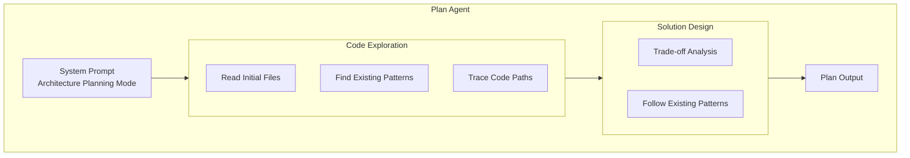
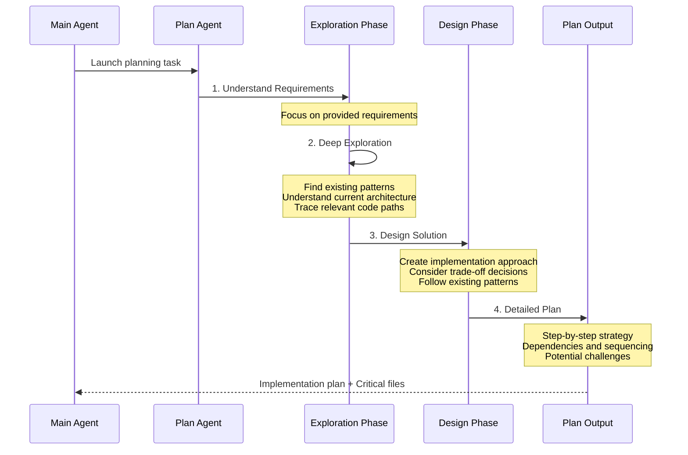

# Plan Agent

## Overview

The Plan Agent is a built-in agent specialized for software architecture design and implementation planning. Its role is to explore the codebase and design implementation plans, providing step-by-step implementation strategies, identifying critical files, and considering architectural trade-offs.

## Core Features

| Feature | Description |
|---------|-------------|
| **Read-only Mode** | Strictly prohibits any file modification operations |
| **Architecture Perspective** | Analyzes and plans from a software architecture perspective |
| **Detailed Plans** | Provides step-by-step implementation strategies |
| **Critical Files Identification** | Lists the most critical files for implementation |

## System Prompt

```typescript
export const PLAN_AGENT: BuiltInAgentDefinition = {
  agentType: 'Plan',
  whenToUse: 'Software architect agent for designing implementation plans...',
  disallowedTools: [
    AGENT_TOOL_NAME,
    EXIT_PLAN_MODE_TOOL_NAME,
    FILE_EDIT_TOOL_NAME,
    FILE_WRITE_TOOL_NAME,
    NOTEBOOK_EDIT_TOOL_NAME,
  ],
  source: 'built-in',
  tools: EXPLORE_AGENT.tools,  // Inherits Explore Agent's toolset
  baseDir: 'built-in',
  model: 'inherit',  // Inherits main Agent model
  omitClaudeMd: true,  // Does not read CLAUDE.md
  getSystemPrompt: () => getPlanV2SystemPrompt(),
}
```

## Architecture Position



## Planning Flow



## Disallowed Tools

Similar to Explore Agent, Plan Agent is also configured for read-only mode:

| Tool Type | Tool Name | Reason |
|-----------|-----------|--------|
| Agent | `Agent` | Prevents nested calls |
| Exit Plan Mode | `ExitPlanMode` | Not needed |
| File Edit | `Edit` | Prohibits file modification |
| File Write | `Write` | Prohibits file creation/write |
| Notebook Edit | `NotebookEdit` | Prohibits notebook editing |

## Use Cases

### When to Use Plan Agent

| Scenario | Example |
|----------|---------|
| Design new feature architecture | `"Design the architecture for adding real-time notifications"` |
| Plan refactoring approach | `"Plan a refactoring approach for the authentication module"` |
| Evaluate implementation complexity | `"What's the best approach to implement this feature?"` |
| Identify critical dependencies | `"Which files would need to change to add this API?"` |

### Difference from Explore Agent

| Aspect | Explore Agent | Plan Agent |
|--------|---------------|------------|
| **Primary Goal** | Search and locate | Design and plan |
| **Output Type** | Exploration report | Implementation plan |
| **Analysis Depth** | Quick location | Deep architectural analysis |
| **Content** | File locations | Implementation steps |

## Required Output

The Plan Agent's response must end with the following format:

```markdown
### Critical Files for Implementation
List 3-5 files most critical for implementing this plan:
- path/to/file1.ts
- path/to/file2.ts
- path/to/file3.ts
```

This format ensures the main Agent can obtain the critical file information needed for implementation.

## Feature Flags

The Plan Agent's availability is controlled by GrowthBook feature flags:

```typescript
export function areExplorePlanAgentsEnabled(): boolean {
  if (feature('BUILTIN_EXPLORE_PLAN_AGENTS')) {
    return getFeatureValue_CACHED_MAY_BE_STALE('tengu_amber_stoat', true)
  }
  return false
}
```

| Flag | Description |
|------|-------------|
| `BUILTIN_EXPLORE_PLAN_AGENTS` | Main feature flag |
| `tengu_amber_stoat` | A/B test switch (treatment group disabled) |

## Model Inheritance Strategy

The Plan Agent uses `model: 'inherit'` configuration, inheriting the main Agent's model. This ensures sufficient reasoning capability for complex planning tasks.

## Source References

- [planAgent.ts](/restored-src/src/tools/AgentTool/built-in/planAgent.ts)
- [exploreAgent.ts](/restored-src/src/tools/AgentTool/built-in/exploreAgent.ts)
- [builtInAgents.ts](/restored-src/src/tools/AgentTool/builtInAgents.ts)

## Related Documents

- [Agents Overview](../_index.md)
- [Explore Agent](./explore-agent.md)
- [Agent Tool](../agent-tool.md)
- [Built-in Agents](./_index.md)

---

*Generated by [Nium-Wiki v0.0.0](https://github.com/niuma996/nium-wiki) | 2026-04-02*
