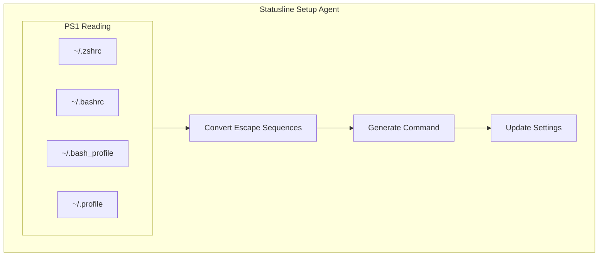
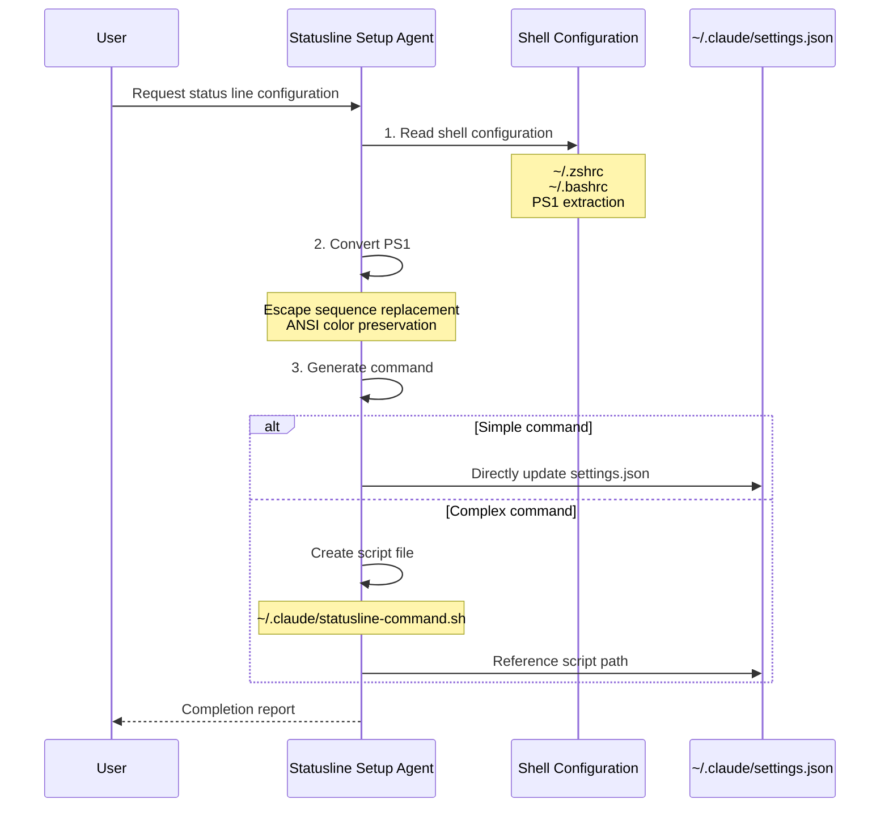

# Statusline Setup Agent

## Overview

The Statusline Setup Agent is a built-in agent specialized for configuring the user's Claude Code status line. Its role is to help users create or update the `statusLine` command, converting shell PS1 configurations into Claude Code status line commands.

## Core Features

| Feature | Description |
|---------|-------------|
| **PS1 Conversion** | Converts shell PS1 configurations to status line commands |
| **Color Preservation** | Preserves ANSI color codes |
| **JSON Data Access** | Access to session state information |
| **Model Optimization** | Uses Sonnet model |

## System Prompt

```typescript
export const STATUSLINE_SETUP_AGENT: BuiltInAgentDefinition = {
  agentType: 'statusline-setup',
  whenToUse: "Use this agent to configure the user's Claude Code status line setting.",
  tools: ['Read', 'Edit'],  // File read and edit only
  source: 'built-in',
  baseDir: 'built-in',
  model: 'sonnet',  // Use Sonnet model
  color: 'orange',  // Orange indicator
  getSystemPrompt: () => STATUSLINE_SYSTEM_PROMPT,
}
```

## Architecture Position



## PS1 Escape Sequence Conversion

### Supported Escape Sequences

| PS1 Sequence | Converted Result | Example |
|-------------|------------------|---------|
| `\u` | `$(whoami)` | `$(whoami)` |
| `\h` | `$(hostname -s)` | `$(hostname -s)` |
| `\H` | `$(hostname)` | `$(hostname)` |
| `\w` | `$(pwd)` | `$(pwd)` |
| `\W` | `$(basename "$(pwd)")` | `$(basename "$(pwd)")` |
| `\$` | `$` | `$` |
| `\n` | newline | `\n` |
| `\t` | `$(date +%H:%M:%S)` | `$(date +%H:%M:%S)` |
| `\d` | `$(date "+%a %b %d")` | `$(date "+%a %b %d")` |
| `\@` | `$(date +%I:%M%p)` | `$(date +%I:%M%p)` |
| `\#` | `#` | `#` |
| `\!` | `!` | `!` |

## Input JSON Data Structure

The Statusline command receives the following JSON data via stdin:

```typescript
interface StatusLineInput {
  session_id: string           // Unique session ID
  session_name?: string        // Optional: session name
  transcript_path: string      // Conversation transcript path
  cwd: string                  // Current working directory
  model: {
    id: string                 // Model ID
    display_name: string       // Display name
  }
  workspace: {
    current_dir: string        // Current directory
    project_dir: string        // Project root directory
    added_dirs: string[]       // Directories added via /add-dir
  }
  version: string               // Claude Code version
  output_style: {
    name: string               // Output style name
  }
  context_window: {
    total_input_tokens: number
    total_output_tokens: number
    context_window_size: number
    current_usage: {
      input_tokens: number
      output_tokens: number
      cache_creation_input_tokens: number
      cache_read_input_tokens: number
    } | null
    used_percentage: number | null   // Pre-calculated: used percentage
    remaining_percentage: number | null  // Pre-calculated: remaining percentage
  }
  rate_limits?: {              // Only visible to subscribers
    five_hour: {
      used_percentage: number
      resets_at: number
    }
    seven_day: {
      used_percentage: number
      resets_at: number
    }
  }
  vim?: {                      // Only when vim mode is enabled
    mode: 'INSERT' | 'NORMAL'
  }
  agent?: {                    // When started with --agent flag
    name: string
    type: string
  }
  worktree?: {                 // When in --worktree session
    name: string
    path: string
    branch: string
    original_cwd: string
    original_branch: string
  }
}
```

## Usage Examples

### Basic Usage

```bash
# Display model and current directory
input=$(cat)
echo "$(echo "$input" | jq -r '.model.display_name') in $(echo "$input" | jq -r '.workspace.current_dir')"
```

### Context Usage Percentage

```bash
# Using pre-calculated field
input=$(cat)
remaining=$(echo "$input" | jq -r '.context_window.remaining_percentage // empty')
[ -n "$remaining" ] && echo "Context: $remaining% remaining"
```

### Claude.ai Subscription Limits

```bash
# Display 5-hour limit
input=$(cat)
pct=$(echo "$input" | jq -r '.rate_limits.five_hour.used_percentage // empty')
[ -n "$pct" ] && printf "5h: %.0f%%" "$pct"
```

### Display Rate Limits

```bash
# Display both 5-hour and 7-day limits
input=$(cat)
five=$(echo "$input" | jq -r '.rate_limits.five_hour.used_percentage // empty')
week=$(echo "$input" | jq -r '.rate_limits.seven_day.used_percentage // empty')
out=""
[ -n "$five" ] && out="5h:$(printf '%.0f' "$five")%"
[ -n "$week" ] && out="$out 7d:$(printf '%.0f' "$week")%"
echo "$out"
```

## Configuration Flow



## Color Handling

The Agent emphasizes preserving ANSI color codes:

> When using ANSI color codes, be sure to use `printf`. Do not remove colors.

### Examples

```bash
# ❌ Wrong - colors removed
PS1="${degreen}\u@\h${reset} \w$ "

# ✅ Correct - colors preserved
PS1="$(printf '%s' \"\$green\\\u@\h\$reset \w$ \")"
```

## Output Requirements

After completing configuration, the Agent must:
1. Return a summary of what was configured
2. Include the script filename if a script file was created
3. Notify the parent agent that the "statusline-setup" agent must be used for further status line changes
4. Inform the user that they can ask Claude to continue making changes to the status line

## Tool Restrictions

The Statusline Setup Agent only allows the following tools:

| Tool | Purpose |
|------|---------|
| `Read` | Read shell configuration files |
| `Edit` | Update settings.json |

Prohibited:
- `Write` (should use Edit)
- `Bash` (not directly needed)
- `Agent` (nested not allowed)
- All other tools

## Source References

- [statuslineSetup.ts](/restored-src/src/tools/AgentTool/built-in/statuslineSetup.ts)
- [builtInAgents.ts](/restored-src/src/tools/AgentTool/builtInAgents.ts)
- [constants.ts](/restored-src/src/tools/AgentTool/constants.ts)

## Related Documents

- [Agents Overview](../_index.md)
- [Agent Tool](../agent-tool.md)
- [Built-in Agents](./_index.md)

---

*Generated by [Nium-Wiki v0.0.0](https://github.com/niuma996/nium-wiki) | 2026-04-02*
