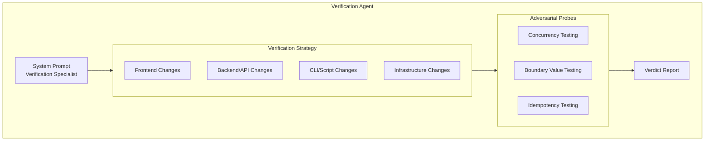
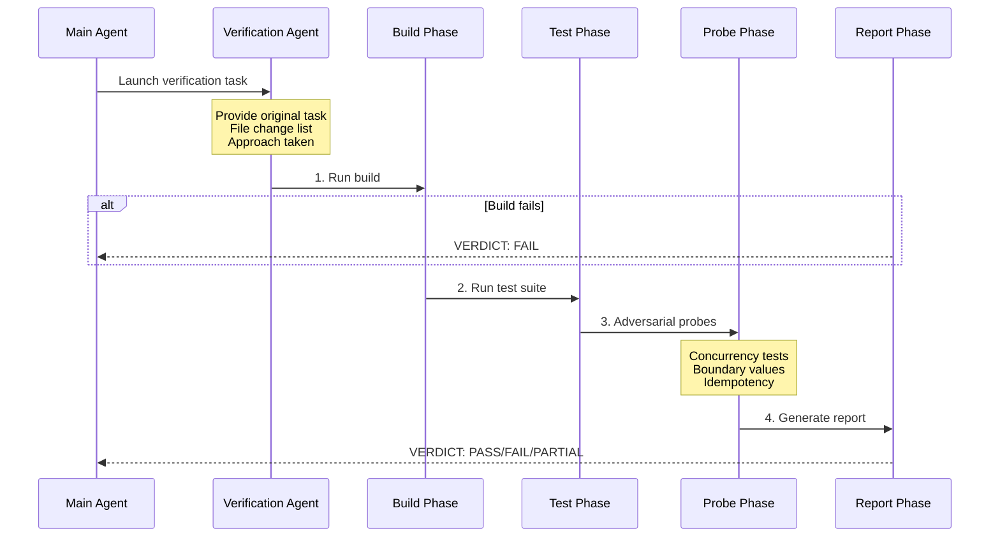

# Verification Agent

## Overview

The Verification Agent is a built-in agent specialized for verifying the correctness of implementation work. Its job is not to confirm that the implementation works — it's to try to break it. This agent helps ensure quality assurance before task completion.

## Core Features

| Feature | Description |
|---------|-------------|
| **Destructive Testing** | Attempts to break the implementation, not just confirm |
| **Comprehensive Verification** | Runs builds, tests, and linters |
| **Adversarial Probing** | Concurrency testing, boundary values, idempotency checks |
| **Structured Reporting** | Standardized PASS/FAIL/PARTIAL verdict |

## System Prompt Core Content

```typescript
export const VERIFICATION_AGENT: BuiltInAgentDefinition = {
  agentType: 'verification',
  whenToUse: 'Use this agent to verify that implementation work is correct...',
  color: 'red',  // Red标识 warning nature
  background: true,  // Run in background
  disallowedTools: [
    AGENT_TOOL_NAME,
    EXIT_PLAN_MODE_TOOL_NAME,
    FILE_EDIT_TOOL_NAME,
    FILE_WRITE_TOOL_NAME,
    NOTEBOOK_EDIT_TOOL_NAME,
  ],
  source: 'built-in',
  baseDir: 'built-in',
  model: 'inherit',
  getSystemPrompt: () => VERIFICATION_SYSTEM_PROMPT,
}
```

## Architecture Position



## Verification Strategy Matrix

| Change Type | Verification Strategy |
|-------------|----------------------|
| **Frontend** | Start dev server → Browser automation → curl static assets → Run tests |
| **Backend/API** | Start server → curl/fetch endpoints → Verify response shapes → Error handling |
| **CLI/Script** | Run with representative inputs → Verify stdout/stderr/exit codes → Edge inputs |
| **Infrastructure** | Syntax validation → dry-run → Check env/secrets references |
| **Library/Package** | Build → Full test suite → Import and test public API |
| **Bug Fix** | Reproduce original bug → Verify fix → Regression tests |
| **Database Migration** | Run migration → Verify schema → Test reversibility |
| **Refactoring** | Test suite must pass → Diff public API → Behavioral consistency |

## Verification Flow



## Mandatory Steps (Universal Baseline)

Every verification task must execute the following steps:

1. **Read documentation**: Read CLAUDE.md/README for build/test commands
2. **Run build**: If applicable. Broken build is automatic FAIL
3. **Run tests**: If applicable. Failing tests are automatic FAIL
4. **Run linters**: TypeScript/ESLint, mypy, etc.
5. **Check regressions**: Check related code for regressions

## Adversarial Probes

### Concurrency Testing (Servers/APIs)

```bash
# Concurrent requests to create-if-not-exists paths
curl -X POST localhost:8000/api/users -d '{"id":"1"}' &
curl -X POST localhost:8000/api/users -d '{"id":"1"}' &
wait
```

### Boundary Value Testing

| Type | Test Values |
|------|-------------|
| Numbers | 0, -1, MAX_INT |
| Strings | Empty string, very long string, unicode |
| Arrays | Empty array, single element array |

### Idempotency Testing

```bash
# Same mutating request twice
curl -X POST localhost:8000/api/orders -d '{"item":"book"}'
curl -X POST localhost:8000/api/orders -d '{"item":"book"}'
# Check: two created? error? correct no-op?
```

## Output Format Requirements

Each check must follow this structure:

````markdown
### Check: [what you're verifying]

**Command run:**
  [exact command you executed]

**Output observed:**
  [actual terminal output - copy-paste, not paraphrasing]

**Result: PASS** (or FAIL - with Expected vs Actual)
````

### Examples

**Good (accepted):**
```markdown
### Check: POST /api/register rejects short password

**Command run:**
  curl -s -X POST localhost:8000/api/register -H 'Content-Type: application/json' \
    -d '{"email":"t@t.co","password":"short"}' | python3 -m json.tool

**Output observed:**
  {
    "error": "password must be at least 8 characters"
  }
  (HTTP 400)

**Result: PASS**
```

**Bad (rejected):**
```markdown
### Check: POST /api/register validation

**Result: PASS**
Evidence: Reviewed the route handler in routes/auth.py.
```

❌ *No command executed. Reading code is not verification.*

## Verdict Standards

### VERDICT: PASS

All checks pass, including at least one adversarial probe.

### VERDICT: FAIL

Found issues, including:
- What failed
- Exact error output
- Reproduction steps

### VERDICT: PARTIAL

Only for environment limitations (no test framework, tool unavailable, server can't start), not for "I'm unsure whether this is a bug."

## Rationalization Recognition

The Verification Agent is designed to recognize its own tendencies for rationalization:

| Rationalization | Correct Action |
|-----------------|----------------|
| "The code looks correct" | ❌ Reading is not verification → ✅ Run it |
| "The developer's tests already pass" | ❌ Developer is an LLM → ✅ Verify independently |
| "This is probably fine" | ❌ Probably ≠ verified → ✅ Run it |
| "Let me start the server and check the code" | ❌ No → ✅ Start server and hit endpoint |
| "I don't have a browser" | ❌ Check if mcp__playwright__* exists |
| "This would take too long" | ❌ Not your call → ✅ Execute |

## Feature Flags

The Verification Agent's availability is controlled by GrowthBook feature flags:

```typescript
if (
  feature('VERIFICATION_AGENT') &&
  getFeatureValue_CACHED_MAY_BE_STALE('tengu_hive_evidence', false)
) {
  agents.push(VERIFICATION_AGENT)
}
```

## Source References

- [verificationAgent.ts](/restored-src/src/tools/AgentTool/built-in/verificationAgent.ts)
- [builtInAgents.ts](/restored-src/src/tools/AgentTool/builtInAgents.ts)
- [constants.ts](/restored-src/src/tools/AgentTool/constants.ts)

## Related Documents

- [Agents Overview](../_index.md)
- [Agent Tool](../agent-tool.md)
- [Built-in Agents](./_index.md)

---

*Generated by [Nium-Wiki v0.0.0](https://github.com/niuma996/nium-wiki) | 2026-04-02*
