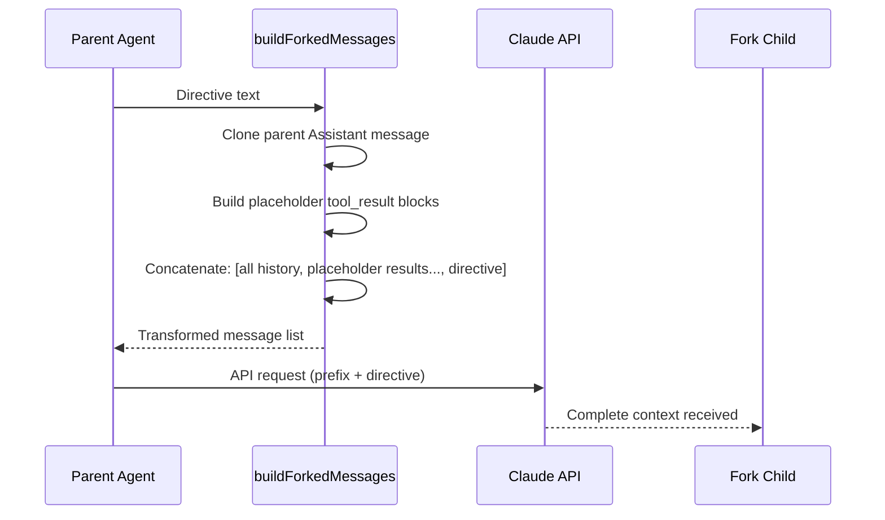

# Fork Subagent

## Overview

Fork Subagent is Claude Code's lightweight parallelization mechanism, allowing the main AI model to directly "fork" itself to handle independent work units. Unlike traditional subagents (specifying `subagent_type`), Fork inherits the parent agent's complete conversation context and system prompt, launching parallel tasks with minimal overhead.

This feature is controlled by the GrowthBook feature switch `FORK_SUBAGENT` and is mutually exclusive with coordinator mode.

## Core Concepts

### Fork vs Subagent

| Dimension | Fork (Implicit Fork) | Subagent (Explicit subagent_type) |
|-----------|---------------------|----------------------------------|
| Context | Full parent conversation history | Starts from zero |
| System Prompt | Inherits parent's rendered prompt | Re-renders |
| Model | Must inherit parent model | Freely selectable |
| Tool Pool | Identical | Can reconfigure |
| Use Case | Fast parallel research | Specialized role tasks |
| Prompt Cache | Highly shared (~95%+) | Independent (~30-50%) |
| Usage | Omit subagent_type | Explicitly specify subagent_type |

## How It Works

### 1. Message Structure Transformation

The key to Fork is transforming the parent conversation history into the child agent's API request prefix, maximizing prompt cache sharing:



### 2. Recursive Fork Guard

Fork children still hold the Agent Tool (for communication with other subagents), but recursive Fork breaks cache efficiency. Prevention is done by detecting the Fork tag in conversation history:

```typescript
export function isInForkChild(messages: MessageType[]): boolean {
  return messages.some(m => {
    if (m.type !== 'user') return false
    const content = m.message.content
    if (!Array.isArray(content)) return false
    return content.some(
      block =>
        block.type === 'text' &&
        block.text.includes(`<${FORK_BOILERPLATE_TAG}>`),
    )
  })
}
```

## Performance Characteristics

| Metric | Fork | Subagent |
|--------|------|----------|
| Cold Start Latency | ~0ms (shared process) | ~500-2000ms (new process) |
| API Requests | 1 (inherits parent context) | 2+ (independent requests) |
| Cache Hit Rate | Very high (~95%+) | Low (~30-50%) |
| Memory Usage | Shared (incremental) | Independent (full copy) |

## Source References

- [forkSubagent.ts](/restored-src/src/tools/AgentTool/forkSubagent.ts)
- [prompt.ts](/restored-src/src/tools/AgentTool/prompt.ts)
- [AgentTool.tsx](/restored-src/src/tools/AgentTool/AgentTool.tsx)
- [LocalAgentTask.ts](/restored-src/src/tasks/LocalAgentTask/LocalAgentTask.js)

## Related Documents

- [Agent and Coordination](../agent/_index.md)
- [Agent Tool](agent-tool.md)

---

*Generated by [Nium-Wiki v0.0.0](https://github.com/niuma996/nium-wiki) | 2026-03-31*
