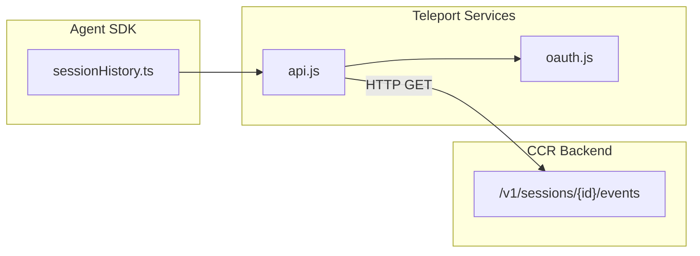
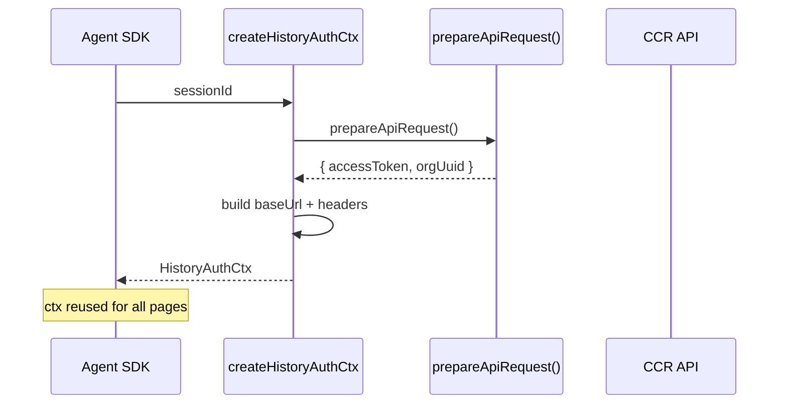

# Session History

## Overview

`assistant/sessionHistory.ts` is the session history module of the Claude Code Agent SDK. It fetches paginated conversation/event history for the current session via the CCR (Cloud Code Runtime) session events API. This module is the SDK-side consumer, retrieving history from the backend so the Agent SDK can replay prior conversation turns with full context.

Core capability: cursor-based pagination, traversing the event stream from newest to oldest.

## Architecture Position



## API Summary

| Function | Description | Signature |
|----------|-------------|-----------|
| `createHistoryAuthCtx(sessionId)` | Prepares auth context (OAuth token + org UUID) | `Promise<HistoryAuthCtx>` |
| `fetchLatestEvents(ctx, limit?)` | Fetches the latest N events (newest first) | `Promise<HistoryPage \| null>` |
| `fetchOlderEvents(ctx, beforeId, limit?)` | Fetches events before cursor `beforeId` | `Promise<HistoryPage \| null>` |

## Data Types

### `HistoryPage`

```typescript
export type HistoryPage = {
  events: SDKMessage[]      // chronological order within the page
  firstId: string | null   // oldest event ID → next page's before_id
  hasMore: boolean         // true = older events exist
}
```

### `HistoryAuthCtx`

```typescript
export type HistoryAuthCtx = {
  baseUrl: string                              // "${BASE_API_URL}/v1/sessions/${sessionId}/events"
  headers: Record<string, string>             // Authorization, anthropic-beta, x-org-uuid
}
```

### Constants

```typescript
export const HISTORY_PAGE_SIZE = 100  // default events per page
```

## Core Flow

### Auth Context Initialization



```typescript
// Prepare auth context once; all paginated requests reuse it
export async function createHistoryAuthCtx(sessionId: string): Promise<HistoryAuthCtx> {
  const { accessToken, orgUuid } = await prepareApiRequest()
  return {
    baseUrl: `${BASE_API_URL}/v1/sessions/${sessionId}/events`,
    headers: {
      'Authorization': `Bearer ${accessToken}`,
      'anthropic-beta': 'ccr-byoc-2025-07-29',
      'x-org-uuid': orgUuid,
    },
  }
}
```

### Pagination

```typescript
// Fetch latest events (newest first, up to limit)
export async function fetchLatestEvents(
  ctx: HistoryAuthCtx,
  limit = HISTORY_PAGE_SIZE,
): Promise<HistoryPage | null> {
  return fetchPage(ctx, { limit, anchor_to_latest: true })
}

// Fetch events before a cursor (for walking backward)
export async function fetchOlderEvents(
  ctx: HistoryAuthCtx,
  beforeId: string,
  limit = HISTORY_PAGE_SIZE,
): Promise<HistoryPage | null> {
  return fetchPage(ctx, { limit, before_id: beforeId })
}
```

**API Request Format:**
```typescript
// GET ${baseUrl}?limit=100&anchor_to_latest=true
// GET ${baseUrl}?limit=100&before_id=${beforeId}
```

**Response Normalization:**
```typescript
// API returns: { data: [...], first_id: "...", has_more: true }
// Normalized to HistoryPage
```

## Design Decisions

### Fail-Silent Strategy

Any network or HTTP error returns `null` instead of throwing:

```typescript
// validateStatus: () => true → all status codes treated as non-throwing
// Callers detect errors via result === null
```

This lets callers handle unavailable history gracefully (e.g., network disruption) without propagating exceptions up the call chain.

### Cursor-Based Pagination

The API only supports forward pagination (fetching older events), using the `first_id` field as a cursor:

```
[Newest] ──► [Page 2] ──► [Page 3] ──► ... ──► [Oldest]
            firstId_1    firstId_2              firstId_n=null (hasMore=false)
```

Backwards pagination (fetching newer events) is not supported — this is a CCR API design constraint.

### Beta Header

All requests carry `anthropic-beta: ccr-byoc-2025-07-29`, marking use of the CCR BYOC session events API version.

## Usage Examples

### Full Paginated Traversal

```typescript
import {
  createHistoryAuthCtx,
  fetchLatestEvents,
  fetchOlderEvents,
  HISTORY_PAGE_SIZE,
} from './assistant/sessionHistory'

async function dumpFullHistory(sessionId: string): Promise<void> {
  // 1. Prepare auth context (once)
  const ctx = await createHistoryAuthCtx(sessionId)

  // 2. Fetch latest page
  let page = await fetchLatestEvents(ctx)
  if (!page) {
    console.log('Unable to fetch history')
    return
  }

  // 3. Append to collector
  const allEvents: SDKMessage[] = [...page.events]

  // 4. Loop backward
  while (page.hasMore) {
    page = await fetchOlderEvents(ctx, page.firstId!)
    if (!page) break
    allEvents.push(...page.events)
  }

  console.log(`Fetched ${allEvents.length} events`)
  return allEvents
}
```

### Simple: Fetch 50 Most Recent

```typescript
const ctx = await createHistoryAuthCtx(sessionId)
const latest = await fetchLatestEvents(ctx, 50)
// latest.events = most recent 50 (chronological within page)
```

## Source References

- [sessionHistory.ts](/src/assistant/sessionHistory.ts)

## Related Documents

- [Agents & Coordination](../agent/_index.md)
- [Agent Tool](../agent/agent-tool.md)
- [Fork Subagent](../agent/fork-subagent.md)

---

*Generated by [Nium-Wiki v0.0.0](https://github.com/niuma996/nium-wiki) | 2026-04-01*
