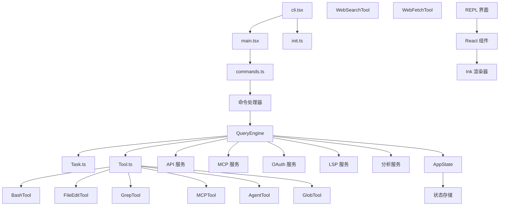
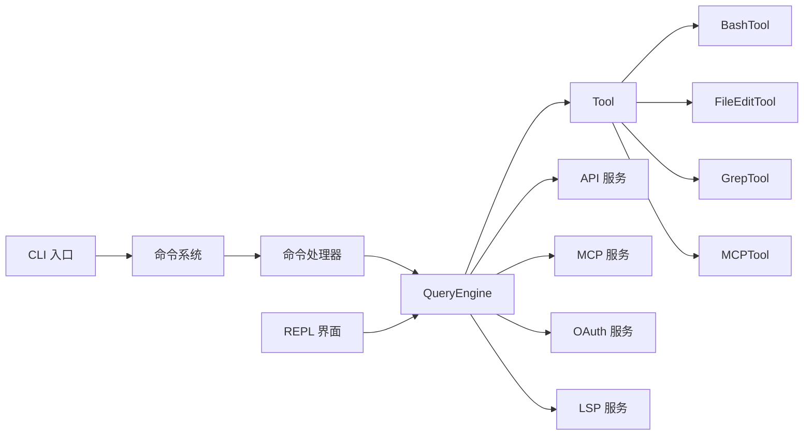
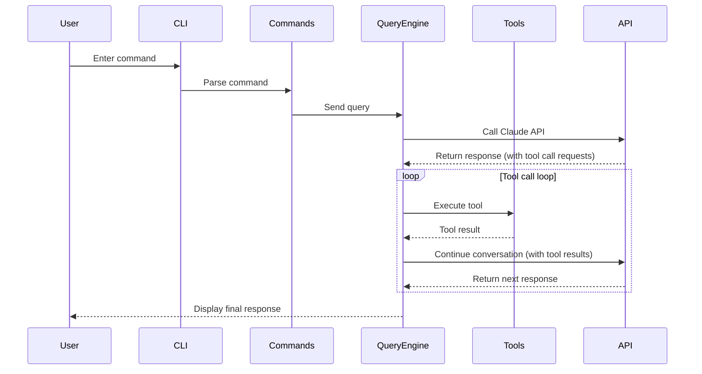
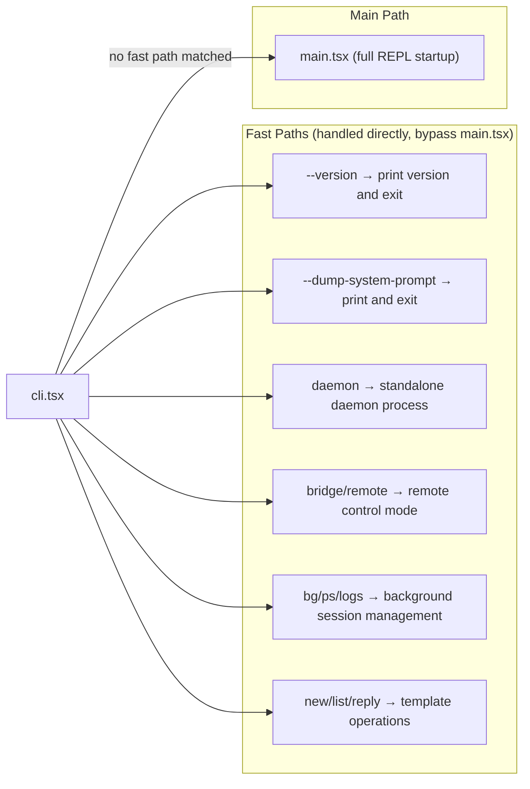

# System Architecture

## Executive Summary

Claude Code is a modular command-line tool with a layered architecture design. The entire system is divided into five main layers: CLI entry layer, command system, core engine, service layer, and user interface.

The CLI entry layer handles command-line arguments and fast-path optimization, implementing features like zero-module loading version checks through dynamic import strategies. The command system manages 80+ slash commands using lazy loading mechanisms to ensure performance. The core engine centers on QueryEngine, which coordinates AI model calls and tool execution (Task.ts is a pure type-definition file, not a coordinator). The service layer provides infrastructure services such as API, MCP, OAuth, and LSP. The user interface layer uses Ink (a React-like terminal UI library) to render interactive interfaces.

The architecture follows these principles: lazy loading for startup performance optimization, conditional compilation for differentiating between internal builds and external releases, and feature flag-driven feature switches.

## System Architecture Diagram



**Source Code References**
- [cli.tsx](/restored-src/src/entrypoints/cli.tsx) - CLI Fast Path
- [main.tsx](/restored-src/src/main.tsx) - Main Entry Point

## Technology Stack

| Technology | Version/Role | Purpose | Selection Reason |
|------------|--------------|---------|------------------|
| TypeScript | Source Language | Type Safety, IDE Support | Provides compile-time type checking and better code organization |
| Node.js | >=18.0.0 | Runtime Environment | Cross-platform support, mature ecosystem |
| Ink | UI Rendering | Terminal UI Components | React-like API, zero dependencies, lightweight |
| Bun | Build Tool | Bundling and Development | Fast startup, built-in TypeScript support |
| OpenTelemetry | Telemetry | Metrics, Logs, Tracing | Standardized telemetry, vendor-agnostic |
| Model Context Protocol | Plugin Protocol | MCP Tool Integration | Standardized AI tool interface |

## Module Dependency Diagram



**Diagram Source**
- [commands.ts](/restored-src/src/commands.ts) - Command System

## Detailed Module Descriptions

### CLI Entry Layer

The CLI entry layer is the first layer when the application starts, responsible for handling command-line arguments and fast-path optimization.

- **Responsibilities**: Argument parsing, fast-path detection (version checks and other zero-import paths), startup performance profiling, special flag handling
- **Key Interfaces**: `main()` function, dynamic import strategy, `feature()` conditional compilation
- **Dependencies**: None (fast-path has zero dependencies)
- **Features**: Supports multiple startup modes such as daemon, bridge mode, background sessions, and templates

[Source: cli.tsx](/restored-src/src/entrypoints/cli.tsx#L1) - CLI Fast Path Implementation
[Source: main.tsx](/restored-src/src/main.tsx#L1) - Main Entry Point
[Source: init.ts](/restored-src/src/entrypoints/init.ts#L1) - Initialization Logic

**Fast Path Examples**
- `--version` check: [cli.tsx fast path handling](/restored-src/src/entrypoints/cli.tsx)
- Daemon mode: [cli.tsx daemon support](/restored-src/src/entrypoints/cli.tsx)
- Bridge mode: [cli.tsx bridge mode](/restored-src/src/entrypoints/cli.tsx)

### Command System

The command system manages all available slash commands, including built-in commands, plugin commands, and skills.

- **Responsibilities**: Command registration, command lookup, command availability checking, dynamic command loading
- **Key Interfaces**: `getCommands()`, `findCommand()`, `Command` type
- **Dependencies**: Core engine, service layer
- **Command Examples**: /help, /commit, /review, /config, /plan, /memory and 80+ commands

[Source: commands.ts](/restored-src/src/commands.ts#L1) - Command System Core Implementation
[Source: commands/](/restored-src/src/commands/) - Command Implementation Directory

**Command Implementation Examples**
- [/help command](/restored-src/src/commands/help/) - Help System
- [/config command](/restored-src/src/commands/config/) - Configuration Management
- [/commit command](/restored-src/src/commands/commit/) - Commit Functionality
- [/review command](/restored-src/src/commands/review/) - Code Review
- [/plan command](/restored-src/src/commands/plan/) - Planning Functionality
- [/memory command](/restored-src/src/commands/memory/) - Memory Management

### Core Engine

The core engine coordinates AI model calls, task management, and tool execution.

- **Responsibilities**: QueryEngine handles query flow (including API calls, tool execution, permission checks), Task defines task types and state, Tool executes specific operations
- **Key Interfaces**: `QueryEngine.submitMessage()`, tool `call()` methods
- **Dependencies**: Command system, service layer

**QueryEngine** ([1177 lines](/restored-src/src/QueryEngine.ts)) - Core implementation of the query engine, managing the entire query lifecycle and session state. Each `submitMessage()` call starts a new conversation turn, with state (messages, file cache, usage, etc.) persisting between turns.
- [Class definition L184](/restored-src/src/QueryEngine.ts#L184)
- [submitMessage method L209](/restored-src/src/QueryEngine.ts#L209)
- [Configuration types L130-L173](/restored-src/src/QueryEngine.ts#L130-L173)

**Task** ([125 lines](/restored-src/src/Task.ts)) - Task type definitions and state management, supporting multiple task types: local_bash, local_agent, remote_agent, in_process_teammate, local_workflow, monitor_mcp, dream.
- [TaskType definition L6-L13](/restored-src/src/Task.ts#L6-L13)
- [TaskStatus definition L15-L20](/restored-src/src/Task.ts#L15-L20)
- [generateTaskId function L98](/restored-src/src/Task.ts#L98)

**Tool** ([792 lines](/restored-src/src/Tool.ts)) - Abstract base class for tools, defining tool interface specifications including `call()`, `description()`, `prompt()` and other methods.
- [Tool base class definition](/restored-src/src/Tool.ts)
- [Tool registry](/restored-src/src/Tool.ts)

[Source: QueryEngine.ts](/restored-src/src/QueryEngine.ts#L184) - Query Engine Core
[Source: Task.ts](/restored-src/src/Task.ts#L1) - Task System
[Source: Tool.ts](/restored-src/src/Tool.ts#L1) - Tool Base Class

### Tool System

The tool system provides execution capabilities for AI agents, including file system operations, terminal commands, search, etc.

- **Responsibilities**: Tool registration, tool execution, tool result processing
- **Key Tools**:
  - BashTool: Execute shell commands
  - FileEditTool: Edit files
  - GrepTool: Code search
  - GlobTool: File pattern matching
  - MCPTool: MCP protocol tools
  - AgentTool: Sub-agent creation
  - WebSearchTool: Web search
  - WebFetchTool: Webpage fetching

[Source: tools/BashTool/](/restored-src/src/tools/BashTool/) - Bash Execution Tool
[Source: tools/FileEditTool/](/restored-src/src/tools/FileEditTool/) - File Editing Tool
[Source: tools/GrepTool/](/restored-src/src/tools/GrepTool/) - Code Search Tool
[Source: tools/GlobTool/](/restored-src/src/tools/GlobTool/) - File Pattern Matching Tool
[Source: tools/MCPTool/](/restored-src/src/tools/MCPTool/) - MCP Protocol Tool
[Source: tools/AgentTool/](/restored-src/src/tools/AgentTool/) - Sub-agent Creation Tool

**Tool Registration**
- [Tool base class](/restored-src/src/Tool.ts)
- [tools.ts tool registry](/restored-src/src/tools.ts)

### Service Layer

The service layer provides infrastructure functionality, including API communication, MCP protocol, OAuth authentication, etc.

- **Responsibilities**: API call encapsulation, MCP client management, OAuth flow handling, LSP support, analytics services
- **Key Interfaces**: `claude.ts` API client, `client.ts` MCP client
- **Dependencies**: State management

**API Services**
- [claude.ts](/restored-src/src/services/api/claude.ts) - API call encapsulation
- [client.ts](/restored-src/src/services/api/client.ts) - API client
- [errors.ts](/restored-src/src/services/api/errors.ts) - Error handling

**MCP Services**
- [client.ts](/restored-src/src/services/mcp/client.ts) - MCP client
- [auth.ts](/restored-src/src/services/mcp/auth.ts) - MCP authentication
- [config.ts](/restored-src/src/services/mcp/config.ts) - MCP configuration

**OAuth Services**
- [client.ts](/restored-src/src/services/oauth/client.ts) - OAuth client
- [crypto.ts](/restored-src/src/services/oauth/crypto.ts) - Cryptography utilities

**Other Services**
- [LSP Service](/restored-src/src/services/lsp/) - Language Server Protocol support
- [Analytics Service](/restored-src/src/services/analytics/) - Usage analytics
- [Voice Service](/restored-src/src/services/voice.ts) - Voice services

[Source: services/api/claude.ts](/restored-src/src/services/api/claude.ts) - API Service
[Source: services/mcp/client.ts](/restored-src/src/services/mcp/client.ts) - MCP Client

### User Interface Layer

The user interface layer uses Ink to render interactive terminal UI.

- **Responsibilities**: REPL interface rendering, component-based UI, user input processing
- **Key Interfaces**: `REPL` component, Ink component library
- **Dependencies**: Core engine, state management

**REPL Interface**
- [screens/REPL.tsx](/restored-src/src/screens/REPL.tsx) - REPL main component
- [screens/Doctor.tsx](/restored-src/src/screens/Doctor.tsx) - Doctor check interface

**Ink Rendering Engine**
- [ink/](/restored-src/src/ink/) - Ink core library
- [ink/renderer.ts](/restored-src/src/ink/renderer.ts) - Renderer
- [ink/components/](/restored-src/src/ink/components/) - Ink components

**React Components**
- [components/](/restored-src/src/components/) - React component library
- [components/Message.tsx](/restored-src/src/components/Message.tsx) - Message component
- [components/Messages.tsx](/restored-src/src/components/Messages.tsx) - Message list

**State Management**
- [state/AppState.tsx](/restored-src/src/state/AppState.tsx) - Application state
- [state/store.ts](/restored-src/src/state/store.ts) - State store

[Source: screens/REPL.tsx](/restored-src/src/screens/REPL.tsx) - REPL Interface
[Source: ink/](/restored-src/src/ink/) - Ink Rendering Engine

## Data Flow Diagram



## Directory Structure

```
restored-src/src/
├── main.tsx                    # CLI Main Entry
├── QueryEngine.ts              # Query Engine (1177 lines)
├── Task.ts                     # Task Management (125 lines)
├── Tool.ts                     # Tool Base Class (792 lines)
├── commands.ts                 # Command Registration
├── query.ts                    # Query Loop
│
├── entrypoints/                # Entry Points
│   ├── cli.tsx               # CLI Fast Path
│   ├── init.ts               # Initialization Logic
│   └── mcp.ts                # MCP Entry
│
├── commands/                   # Command Implementations (80+ commands)
│   ├── help/                 # /help command
│   ├── config/               # /config command
│   ├── commit/               # /commit command
│   ├── review/               # /review command
│   ├── plan/                 # /plan command
│   ├── memory/               # /memory command
│   └── ...
│
├── tools/                      # Tool Implementations
│   ├── BashTool/             # Bash Execution Tool
│   ├── FileEditTool/         # File Editing Tool
│   ├── GrepTool/             # Search Tool
│   ├── GlobTool/             # File Matching Tool
│   ├── MCPTool/              # MCP Tool
│   ├── AgentTool/            # Sub-agent Tool
│   ├── WebSearchTool/         # Web Search Tool
│   ├── WebFetchTool/         # Webpage Fetching Tool
│   └── ...
│
├── services/                   # Service Layer
│   ├── api/                  # API Service
│   ├── mcp/                  # MCP Client
│   ├── oauth/                # OAuth Authentication
│   ├── lsp/                  # LSP Support
│   ├── analytics/            # Analytics Service
│   └── ...
│
├── components/                 # React Components
├── hooks/                     # React Hooks
├── context/                   # React Context
├── state/                     # State Management
├── constants/                 # Constant Definitions
├── types/                     # Type Definitions
├── utils/                     # Utility Functions
├── query/                     # Query Configuration
├── memdir/                    # Memory Directory
├── screens/                   # Screen Components
├── bridge/                    # Bridge Mode
├── ink/                       # Ink Rendering Engine
└── ...
```

## Design Patterns and Principles

| Pattern/Principle | Application Scenario | Reason |
|-------------------|---------------------|--------|
| Lazy Loading | Fast paths, feature modules | Optimizes startup performance, reduces unnecessary module loading |
| Conditional Compilation | Internal/external build differences | Implements build-time feature switches through `feature()` function |
| Command Pattern | Slash command system | Unifies command interface, supports dynamic registration and extension |
| Observer Pattern | State change notifications | Foundation for React Context and event systems |
| Factory Pattern | Tool creation | Unifies tool instantiation logic |
| Singleton Pattern | Global configuration, state store | Ensures globally unique instances |
| Strategy Pattern | Tool execution strategies | Allows runtime selection of different execution strategies |
| Decorator Pattern | Hook system | Adds composable behavior to components and functions |

## Fast Path Optimization

Claude Code uses multiple fast-path optimizations for startup performance:



## Related Documentation

- [Home](index.md)
- [Quick Start](getting-started.md)
- [Documentation Map](doc-map.md)
- [Core Modules](core/_index.md)
- [Query Engine](core/query.md)

---

*Generated by [Nium-Wiki v0.0.0](https://github.com/niuma996/nium-wiki) | 2026-05-16*
