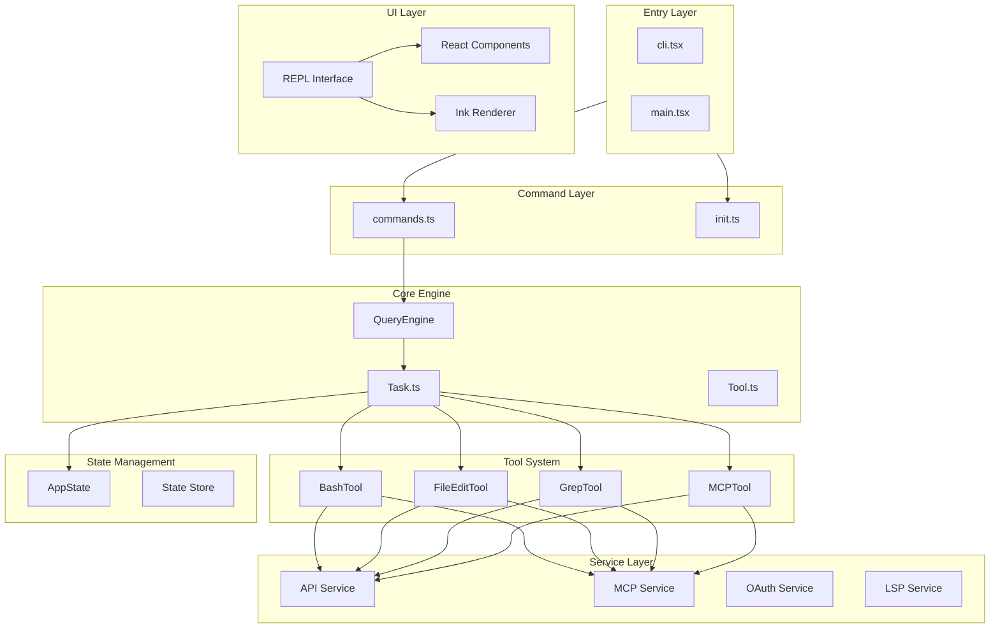
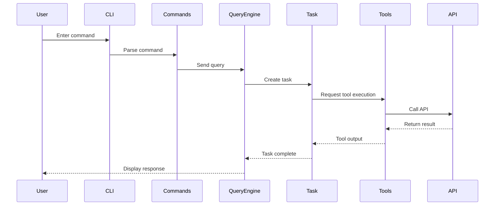

# System Architecture

## Executive Summary

Claude Code is a modular command-line tool designed with a layered architecture. The entire system is divided into five main layers: CLI entry layer, command system, core engine, service layer, and user interface.

The CLI entry layer handles command-line arguments and fast-path optimization, implementing zero-module-loading version checks through dynamic import strategies. The command system manages 80+ slash commands using lazy loading to ensure performance. The core engine includes QueryEngine and Task systems, coordinating AI model calls and tool execution. The service layer provides infrastructure services like API, MCP, and OAuth. The user interface layer uses Ink (a React-like terminal UI library) to render interactive interfaces.

The architecture follows these principles: lazy loading for startup performance optimization, conditional compilation for differentiating internal builds from external releases, and feature flag-driven feature toggles.

## System Architecture Diagram



**Source References**
- [cli.tsx](/restored-src/src/entrypoints/cli.tsx)
- [main.tsx](/restored-src/src/main.tsx)

## Tech Stack

| Technology | Version/Role | Purpose | Rationale |
|------------|--------------|---------|-----------|
| TypeScript | Source language | Type safety, IDE support | Provides compile-time type checking and better code organization |
| Node.js | >=18.0.0 | Runtime environment | Cross-platform support, mature ecosystem |
| Ink | UI rendering | Terminal UI components | React-like API, zero dependencies, lightweight |
| Bun | Build tool | Bundling and development | Fast startup, built-in TypeScript support |
| OpenTelemetry | Telemetry | Metrics, logs, tracing | Standardized telemetry, vendor-agnostic |
| Model Context Protocol | Plugin protocol | MCP tool integration | Standardized AI tool interface |

## Module Dependency Diagram

```mermaid
flowchart LR
    subgraph UL ["User Interface"]
        REPL[REPL Interface]
    end
    subgraph CM ["Command System"]
        GetCmds[getCommands()]
    end
    subgraph CO ["Core Engine"]
        Query[QueryEngine]
        Task[Task]
    end
    subgraph SV ["Service Layer"]
        API[API Service]
        MCP[MCP Service]
        OAuth[OAuth Service]
    end
    GetCmds --> Query
    Query --> Task
    Task --> SV
    UL --> Query
    Task --> UL
```

**Diagram Source**
- [commands.ts](/restored-src/src/commands.ts)

## Detailed Module Descriptions

### CLI Entry Layer

The CLI entry layer is the first layer when the application starts, responsible for handling command-line arguments and fast-path optimization.

- **Responsibilities**: Argument parsing, fast-path detection (zero-import paths like version checks), startup performance profiling
- **Key Interfaces**: `main()` function, dynamic import strategy
- **Dependencies**: None (fast-path zero dependencies)

### Command System

The command system manages all available slash commands, including built-in commands, plugin commands, and skills.

- **Responsibilities**: Command registration, command lookup, command availability checks, dynamic command loading
- **Key Interfaces**: `getCommands()`, `findCommand()`, `Command` type
- **Dependencies**: Core engine, service layer

### Core Engine

The core engine coordinates AI model calls, task management, and tool execution.

- **Responsibilities**: QueryEngine handles query flow, Task manages task state, Tool executes specific operations
- **Key Interfaces**: `QueryEngine.query()`, `Task.run()`, tool `call()` methods
- **Dependencies**: Command system, service layer

### Service Layer

The service layer provides infrastructure functionality, including API communication, MCP protocol, OAuth authentication, etc.

- **Responsibilities**: API call encapsulation, MCP client management, OAuth flow handling, LSP support
- **Key Interfaces**: `claude.ts` API client, `client.ts` MCP client
- **Dependencies**: State management

### User Interface Layer

The user interface layer uses Ink to render interactive terminal UI.

- **Responsibilities**: REPL interface rendering, component-based UI, user input processing
- **Key Interfaces**: `REPL` component, Ink component library
- **Dependencies**: Core engine, state management

## Data Flow Diagram



## Directory Structure

```
restored-src/
├── src/
│   ├── main.tsx              # CLI main entry
│   ├── entrypoints/          # Entry points (CLI, Init, MCP)
│   │   ├── cli.tsx          # CLI fast path
│   │   ├── init.ts          # Initialization logic
│   │   └── mcp.ts           # MCP entry
│   ├── commands/             # Command implementations (80+ commands)
│   │   ├── help/            # /help command
│   │   ├── config/          # /config command
│   │   ├── commit/          # /commit command
│   │   ├── review/          # /review command
│   │   └── ...
│   ├── tools/                # Tool implementations
│   │   ├── BashTool/        # Bash execution tool
│   │   ├── FileEditTool/    # File editing tool
│   │   ├── GrepTool/        # Search tool
│   │   ├── MCPTool/         # MCP tool
│   │   └── ...
│   ├── services/             # Service layer
│   │   ├── api/             # API service
│   │   ├── mcp/             # MCP client
│   │   ├── oauth/           # OAuth authentication
│   │   ├── lsp/             # LSP support
│   │   └── ...
│   ├── components/           # React components
│   ├── ink/                 # Ink rendering engine
│   ├── hooks/               # React Hooks
│   ├── context/             # React Context
│   ├── state/               # State management
│   ├── constants/           # Constant definitions
│   ├── types/               # Type definitions
│   ├── utils/               # Utility functions
│   └── query/               # Query engine
```

## Design Patterns and Principles

| Pattern/Principle | Application Scenario | Rationale |
|-------------------|---------------------|-----------|
| Lazy Loading | Fast paths, feature modules | Optimize startup performance, reduce unnecessary module loading |
| Conditional Compilation | Internal/external build differences | Implement build-time feature toggles via `feature()` function |
| Command Pattern | Slash command system | Unified command interface, support dynamic registration and extension |
| Observer Pattern | State change notifications | Foundation for React Context and event systems |
| Factory Pattern | Tool creation | Unified tool instantiation logic |
| Singleton Pattern | Global configuration, state store | Ensure globally unique instances |

## Related Documents

- [Home](index.md)
- [Getting Started](getting-started.md)
- [Doc Map](doc-map.md)

---

*Generated by [Nium-Wiki v0.0.0](https://github.com/niuma996/nium-wiki) | 2026-03-31*
