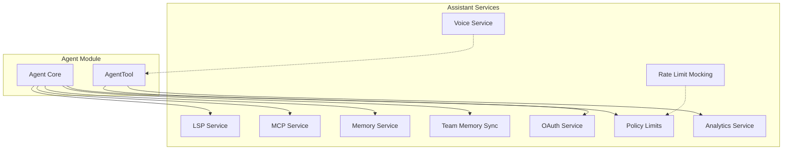
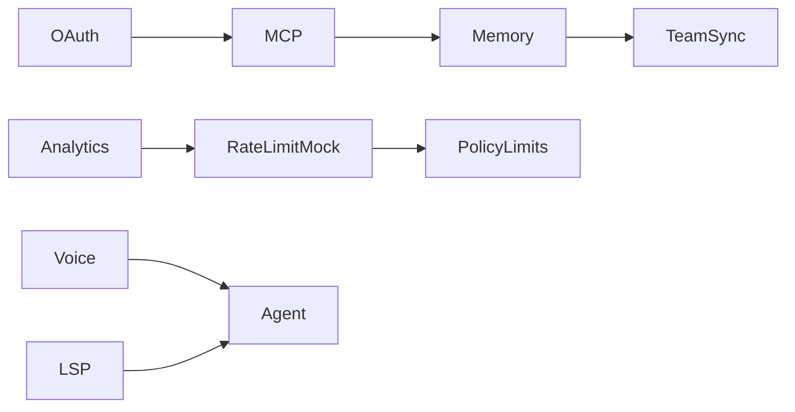
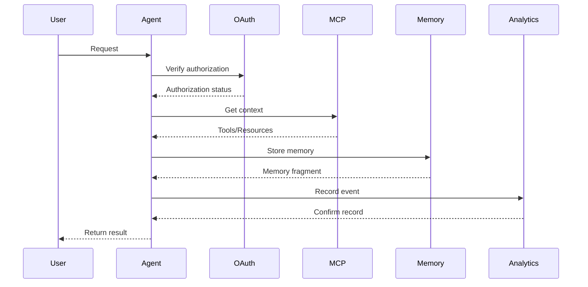

# Assistant Services

## Overview

The Assistant Services module is the core auxiliary capability collection of Claude Code, providing critical functions for external system integration, data processing, and permission control. This module contains multiple independent services that work together to support the complete lifecycle of agents and user interaction experiences.

## Submodules

| Module | Description | Documentation |
|--------|-------------|---------------|
| [LSP Service](lsp.md) | Language Server Protocol integration | [lsp.md](lsp.md) |
| [MCP Service](mcp.md) | Model Context Protocol client | [mcp.md](mcp.md) |
| [OAuth Service](oauth.md) | OAuth 2.0 authentication and authorization | [oauth.md](oauth.md) |
| [Analytics Service](analytics.md) | Usage analytics and telemetry | [analytics.md](analytics.md) |
| [Memory Service](memory.md) | Persistent memory storage and management | [memory.md](memory.md) |
| [Team Memory Sync](team-memory-sync.md) | Multi-user team memory synchronization | [team-memory-sync.md](team-memory-sync.md) |
| [Voice Service](voice.md) | Audio recording and microphone access | [voice.md](voice.md) |
| [Policy Limits](policy-limits.md) | Usage policies and rate limit management | [policy-limits.md](policy-limits.md) |
| [Rate Limit Mocking](rate-limit-mocking.md) | Test rate limit simulation | [rate-limit-mocking.md](rate-limit-mocking.md) |

## Architecture Position

## Core Concepts

### Service Dependencies

### Data Flow Overview

## Key Design Decisions

### 1. Service Isolation Architecture

Each service module runs independently with clearly defined interfaces for communication. This design allows:
- On-demand service loading/unloading
- Independent testing and debugging
- Flexible extension and customization

### 2. Authentication and Authorization Separation

The OAuth service specifically handles third-party authentication, while policy limits are managed independently by policyLimits, achieving separation of concerns.

### 3. Tiered Memory Storage

- **Session Memory**: Current conversation context
- **Persistent Memory**: Long-term memory storage
- **Team Memory**: Cross-user shared knowledge

## Source References

- [services/lsp/](/restored-src/src/services/lsp/)
- [services/mcp/](/restored-src/src/services/mcp/)
- [services/oauth/](/restored-src/src/services/oauth/)
- [services/analytics/](/restored-src/src/services/analytics/)
- [memdir/](/restored-src/src/memdir/)
- [services/teamMemorySync/](/restored-src/src/services/teamMemorySync/)
- [services/voice.ts](/restored-src/src/services/voice.ts)
- [services/policyLimits/](/restored-src/src/services/policyLimits/)
- [services/rateLimitMocking.ts](/restored-src/src/services/rateLimitMocking.ts)

## Related Documentation

- [Agent & Coordination](../agent/_index.md)
- [Architecture Overview](../architecture.md)
- [Home](../index.md)

---

*Generated by [Nium-Wiki v0.0.0](https://github.com/niuma996/nium-wiki) | 2026-04-02*
