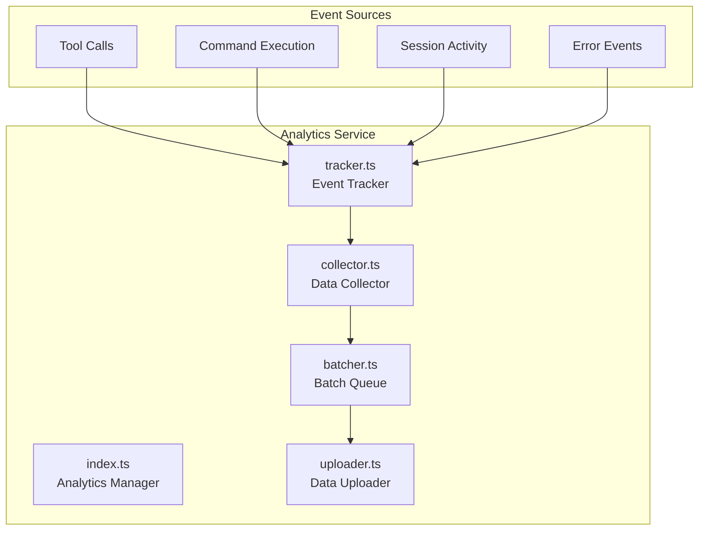
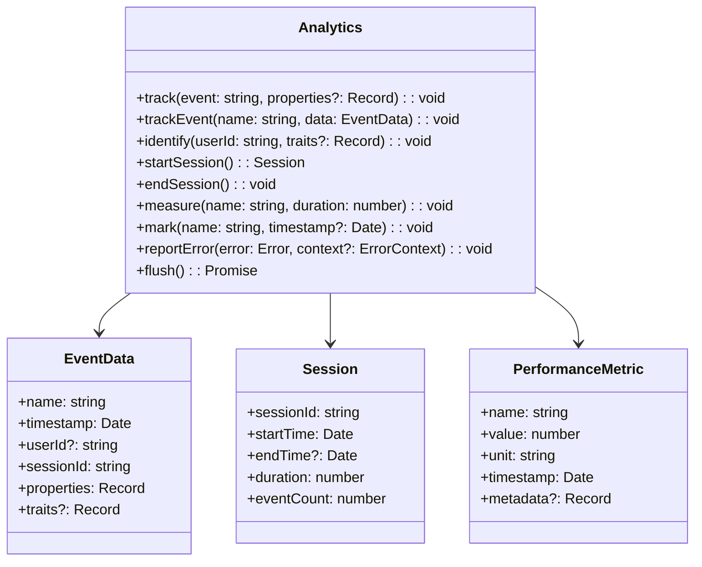
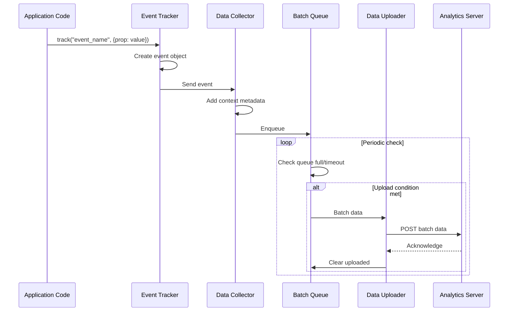
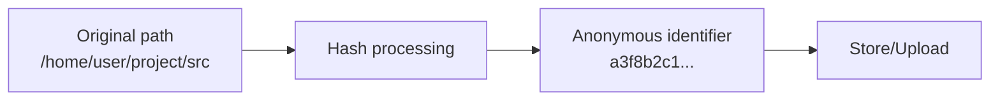

# Analytics Service

## Overview

The Analytics service is Claude Code's usage analytics and telemetry data collection module. This service is responsible for collecting, aggregating, and reporting anonymous usage data to help teams understand user behavior patterns, product usage, and optimize product experiences.

The analytics service strictly follows privacy protection principles:
- Only collects anonymized data, without personally identifiable information
- Users can opt out of data collection
- All data is transmitted encrypted
- Compliant with GDPR, CCPA, and other privacy regulations

## Architecture Position



## Core Features

| Feature | Description | Related API |
|---------|-------------|-------------|
| Event Tracking | Record user operations and system events | `track`, `trackEvent` |
| Session Analytics | Track session lifecycle and activity | `startSession`, `endSession` |
| Performance Monitoring | Collect performance metrics and benchmarks | `measure`, `mark` |
| Error Reporting | Collect and process error telemetry | `reportError`, `reportException` |
| Batch Upload | Efficiently batch upload telemetry data | `flush`, `upload` |

## File Structure

```
services/analytics/
├── index.ts           # Analytics service entry
├── tracker.ts         # Event tracking core
├── collector.ts       # Data collector
├── batcher.ts         # Batch queue
└── uploader.ts        # Data uploader
```

### Responsibilities

| File | Responsibility |
|------|----------------|
| index.ts | Provide unified analytics interface, manage tracker lifecycle |
| tracker.ts | Define event types, register event handlers |
| collector.ts | Collect raw event data, perform initial processing |
| batcher.ts | Cache event batches, control upload frequency |
| uploader.ts | Manage data upload, handle retries and error recovery |

## Core Types



## Data Flow



## API Summary

### Analytics

| Method | Description | Parameters |
|--------|-------------|------------|
| `track` | Track generic event | `event`, `properties?` |
| `trackEvent` | Track event with detailed data | `name`, `data` |
| `identify` | Set user identity and properties | `userId`, `traits?` |
| `startSession` | Start new session | - |
| `endSession` | End current session | - |
| `measure` | Record performance metric | `name`, `duration` |
| `mark` | Record performance marker | `name`, `timestamp?` |
| `reportError` | Report error | `error`, `context?` |
| `flush` | Immediately upload pending data | - |

### Predefined Event Types

```typescript
enum AnalyticsEvent {
  // Session events
  SESSION_START = 'session_start',
  SESSION_END = 'session_end',
  SESSION_RESUME = 'session_resume',

  // Tool events
  TOOL_INVOKED = 'tool_invoked',
  TOOL_COMPLETED = 'tool_completed',
  TOOL_FAILED = 'tool_failed',

  // Command events
  COMMAND_EXECUTED = 'command_executed',
  COMMAND_COMPLETED = 'command_completed',
  COMMAND_FAILED = 'command_failed',

  // Agent events
  AGENT_STARTED = 'agent_started',
  AGENT_COMPLETED = 'agent_completed',
  AGENT_FAILED = 'agent_failed',

  // Error events
  ERROR_OCCURRED = 'error_occurred',
  EXCEPTION_THROWN = 'exception_thrown'
}
```

### EventData

```typescript
interface EventData {
  name: string                           // Event name
  timestamp: Date                        // Event timestamp
  userId?: string                        // User identifier (anonymous ID)
  sessionId: string                      // Session identifier
  properties: Record<string, any>       // Event properties
  traits?: Record<string, any>          // User properties
  context?: EventContext                 // Context information
}

interface EventContext {
  platform: string                       // Platform (darwin, linux, win32)
  version: string                        // Application version
  locale: string                         // Locale setting
  environment: 'development' | 'production'
}
```

## Usage Examples

### Basic Event Tracking

```typescript
import { analytics } from './services/analytics/index'

// Track tool call
analytics.track('tool_invoked', {
  tool_name: 'Read',
  file_path: '/path/to/file.ts',
  success: true
})

// Track command execution
analytics.trackEvent('command_executed', {
  name: 'command_executed',
  properties: {
    command: 'npm install',
    exit_code: 0,
    duration_ms: 5000
  }
})
```

### Performance Measurement

```typescript
// Start measurement
analytics.mark('operation_start')

// Perform operation
await performOperation()

// End measurement and record
analytics.measure('operation_duration', Date.now() - startTime)
```

### Error Reporting

```typescript
try {
  await riskyOperation()
} catch (error) {
  analytics.reportError(error, {
    operation: 'riskyOperation',
    context: {
      file: '/path/to/file.ts',
      line: 42
    }
  })
}
```

### Session Management

```typescript
// On app start
const session = analytics.startSession()

// On app exit
analytics.endSession()

// Manual flush
await analytics.flush()
```

## Data Types Collected

| Category | Data Type | Description |
|----------|-----------|-------------|
| Session Info | Session ID, start/end time, duration | Understand usage duration |
| Tool Usage | Tool name, call frequency, success rate | Optimize common features |
| Command Execution | Command type, parameters, results | Understand user workflows |
| Performance Metrics | Response time, load time, operation latency | Performance optimization basis |
| Error Reports | Error type, stack trace, environment info | Problem diagnosis |
| Anonymous ID | Randomly generated device identifier | User behavior correlation (no PII) |

## Privacy Protection Measures

### Data NOT Collected

- Personal information like username, email, phone number
- File content, code content
- API keys, tokens, passwords
- Project name, repository path (unless anonymized)

### Anonymization



### Data Security

| Measure | Description |
|---------|-------------|
| Transport encryption | All data transmitted via HTTPS/TLS 1.3 |
| Storage encryption | Server-side encrypted data storage |
| Access control | Strict data access permission management |
| Data retention | Retention period set per regulations |

## Best Practices

### Recommended Patterns

| Scenario | Recommended Approach |
|----------|----------------------|
| Event naming | Use dot-separated naming: `feature.action` |
| Property values | Use predefined enum values for easier aggregation |
| Batch operations | Use `trackEvent` to batch record similar events |
| Error handling | Async tracking doesn't block main business logic |

### Things to Avoid

| Practice | Problem |
|----------|---------|
| Tracking sensitive info | Violates privacy policy |
| Synchronous blocking upload | Affects app performance |
| Over-tracking | Data noise, analysis difficulty |

## Design Decisions

### 1. Batch Upload

To reduce network requests, events are first cached locally and uploaded in batches when thresholds are met.

### 2. Offline Support

When network is unavailable, events are cached locally and automatically uploaded when connection is restored.

### 3. Sampling Mechanism

In high-traffic scenarios, some event types are sampled to reduce data volume.

## Source References

- [services/analytics/index.ts](/restored-src/src/services/analytics/index.ts)
- [services/analytics/tracker.ts](/restored-src/src/services/analytics/tracker.ts)
- [services/analytics/collector.ts](/restored-src/src/services/analytics/collector.ts)
- [services/analytics/batcher.ts](/restored-src/src/services/analytics/batcher.ts)
- [services/analytics/uploader.ts](/restored-src/src/services/analytics/uploader.ts)

## Related Documentation

- [Assistant Services Index](_index.md)
- [Agent Tools](../agent/agent-tool.md) - Tool calling
- [Rate Limit Mocking](rate-limit-mocking.md) - Internal testing tool
- [Home](../index.md)

---

*Generated by [Nium-Wiki v0.0.0](https://github.com/niuma996/nium-wiki) | 2026-04-02*
