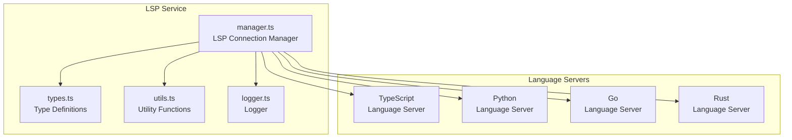
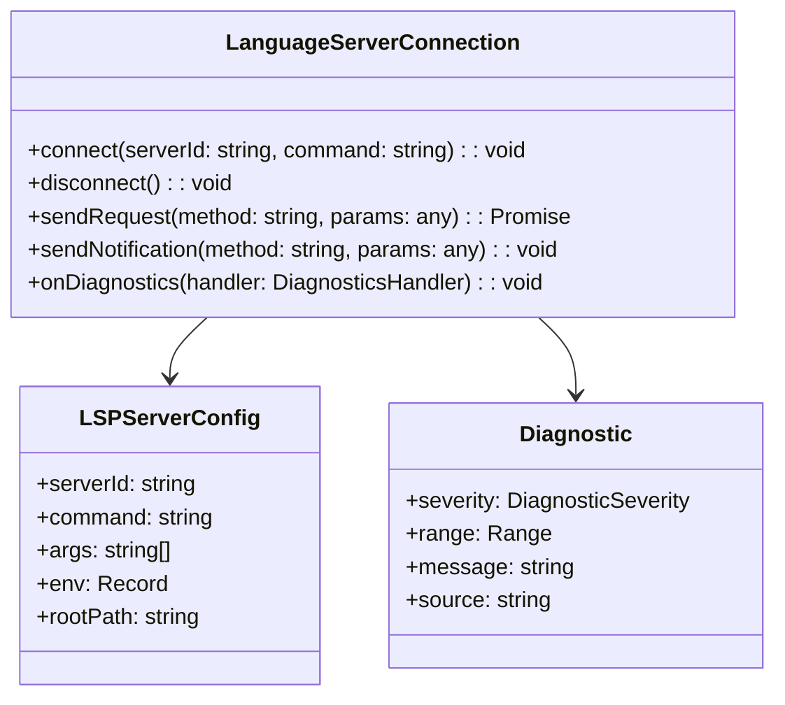
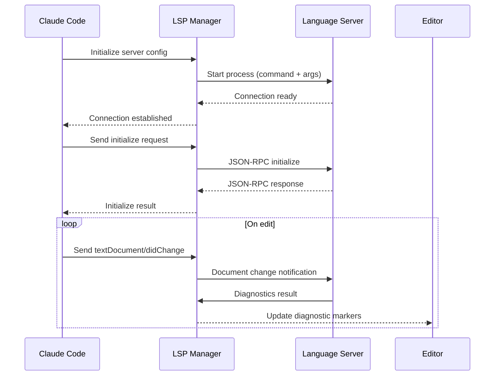

# LSP Service

## Overview

The LSP (Language Server Protocol) service is the core module for Claude Code to communicate with external Language Servers. LSP is a JSON-RPC protocol that provides language intelligence features such as code completion, go-to-definition, find references, and hover documentation between editors/IDEs and language servers.

This service enables Claude Code to integrate with any LSP-compliant language server through standardized protocol interfaces, providing multi-language support.

## Architecture Position



## Core Features

| Feature | Description | Related API |
|---------|-------------|-------------|
| Connection Management | Establish and maintain connections with language servers | `LanguageServerConnection` |
| Request Handling | Send and receive LSP requests/responses | `sendRequest`, `sendNotification` |
| Diagnostics Integration | Receive and process code diagnostic information | `onDiagnostics` |
| Progress Reporting | Support progress notifications for long-running operations | `onProgress` |
| Workspace Symbols | Search symbols in the workspace | `workspaceSymbol` |

## File Structure

```
services/lsp/
├── manager.ts      # LSP connection manager core
├── types.ts        # LSP protocol type definitions
├── utils.ts        # Utility functions
└── logger.ts       # Logger
```

### Responsibilities

| File | Responsibility |
|------|----------------|
| manager.ts | Manage language server lifecycle, handle connections, requests, responses, and diagnostics |
| types.ts | Define all types in the LSP protocol including request parameters, response results, notification payloads |
| utils.ts | Provide connection factories, configuration parsing, error handling utilities |
| logger.ts | Unified management of LSP-related log output for debugging |

## Core Types



## Workflow



## API Summary

### LanguageServerConnection

| Method | Description | Parameters |
|--------|-------------|------------|
| `connect` | Establish connection to language server | `serverId`, `command`, `args` |
| `disconnect` | Disconnect and cleanup resources | - |
| `sendRequest` | Send bidirectional request and wait for response | `method`, `params` |
| `sendNotification` | Send one-way notification | `method`, `params` |
| `onDiagnostics` | Register diagnostics handler | `handler` |

### Configuration Options

```typescript
interface LSPServerConfig {
  serverId: string      // Unique server identifier
  command: string        // Startup command path
  args?: string[]       // Command line arguments
  env?: Record<string, string>  // Environment variables
  rootPath?: string    // Workspace root path
}
```

## Usage Examples

### Basic Connection

```typescript
import { LanguageServerConnection } from './services/lsp/manager'

const connection = new LanguageServerConnection()

// Connect to TypeScript language server
await connection.connect('typescript', 'typescript-language-server', [
  '--stdio'
])

// Send initialize request
const result = await connection.sendRequest('initialize', {
  processId: process.pid,
  rootUri: 'file:///path/to/project',
  capabilities: {}
})

// Send initialized notification
connection.sendNotification('initialized', {})
```

### Diagnostics Handling

```typescript
// Register diagnostics handler
connection.onDiagnostics((params: PublishDiagnosticsParams) => {
  const { uri, diagnostics } = params
  console.log(`Diagnostics for ${uri}:`, diagnostics)
})
```

### Symbol Search

```typescript
// Search workspace symbols
const symbols = await connection.sendRequest('workspace/symbol', {
  query: 'searchTerm'
})

symbols.forEach(symbol => {
  console.log(`${symbol.name} at ${symbol.location.uri}`)
})
```

## Best Practices

### Recommended Patterns

| Scenario | Recommended Approach |
|----------|----------------------|
| Server startup | Use `lazyConnect` for delayed connection to avoid blocking at startup |
| Error handling | Implement reconnection logic for automatic restart on server crash |
| Resource cleanup | Explicitly call `disconnect()` to release process resources |
| Logging | Enable detailed logging for debugging LSP communication issues |

### Things to Avoid

| Practice | Problem | Alternative |
|----------|---------|-------------|
| Synchronous wait for long operations | Blocks event loop | Use progress reporting API |
| Not handling server crashes | Connection leaks | Implement `onServerExit` callback |
| Frequent reconnection | Performance overhead | Maintain long-lived connections |

## Design Decisions

### 1. Standard Protocol First

Adopts the official LSP specification rather than custom protocols, ensuring compatibility with the existing ecosystem (e.g., VS Code extensions).

### 2. Connection Pool Management

Supports multiple language servers running concurrently, distinguishing different server instances through unique `serverId`.

### 3. Streaming Diagnostics

Uses streaming approach to receive diagnostic updates, supporting real-time display of code issues without waiting for complete analysis.

## Source References

- [services/lsp/manager.ts](/restored-src/src/services/lsp/manager.ts)
- [services/lsp/types.ts](/restored-src/src/services/lsp/types.ts)
- [services/lsp/utils.ts](/restored-src/src/services/lsp/utils.ts)
- [services/lsp/logger.ts](/restored-src/src/services/lsp/logger.ts)

## Related Documentation

- [Assistant Services Index](_index.md)
- [MCP Service](mcp.md) - Another protocol integration module
- [Home](../index.md)

---

*Generated by [Nium-Wiki v0.0.0](https://github.com/niuma996/nium-wiki) | 2026-04-02*
