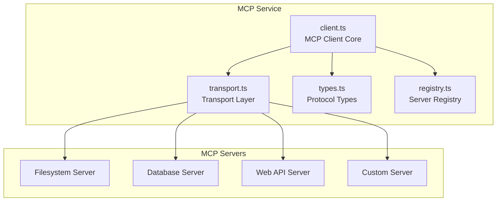
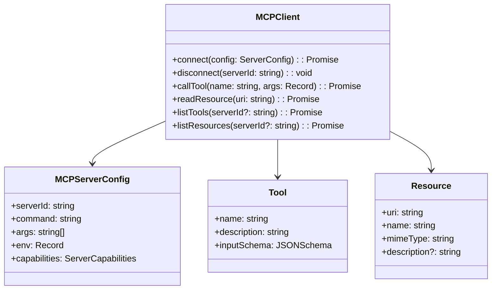
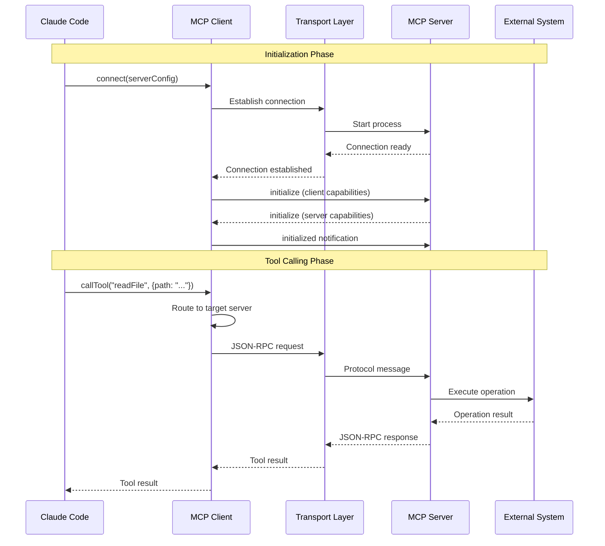

# MCP Service

## Overview

The MCP (Model Context Protocol) service is the core module for Claude Code to interact with external tools and resources. MCP is an emerging protocol specifically designed to provide AI models with standardized tool calling and resource access capabilities.

This service implements MCP client functionality, enabling Claude Code to:
- Call remote tools (Tools)
- Access external resources (Resources)
- Use prompt templates (Prompts)
- Safely interact with external systems like filesystems, databases, APIs

## Architecture Position



## Core Features

| Feature | Description | Related API |
|---------|-------------|-------------|
| Tool Calling | Execute remote tools and get results | `callTool`, `listTools` |
| Resource Access | Read external resource content | `readResource`, `listResources` |
| Prompt Templates | Use predefined prompts to generate content | `getPrompt`, `listPrompts` |
| Connection Management | Manage MCP server lifecycle | `connect`, `disconnect` |
| Server Discovery | Auto-discover available MCP servers | `discoverServers` |

## File Structure

```
services/mcp/
├── client.ts        # MCP client core implementation
├── transport.ts     # Transport layer (stdio, HTTP, SSE)
├── types.ts         # MCP protocol type definitions
└── registry.ts      # MCP server registry
```

### Responsibilities

| File | Responsibility |
|------|----------------|
| client.ts | Implement MCP client logic, handle protocol communication, request routing, response parsing |
| transport.ts | Abstract underlying transport mechanisms, support multiple transport methods (stdio, HTTP SSE) |
| types.ts | Define all types and interfaces for MCP protocol |
| registry.ts | Manage connected MCP server instances, support dynamic registration and unloading |

## Core Types



## MCP Protocol Flow



## API Summary

### MCPClient

| Method | Description | Return Type |
|--------|-------------|-------------|
| `connect` | Connect to MCP server | `Promise<void>` |
| `disconnect` | Disconnect specified server | `void` |
| `callTool` | Call remote tool | `Promise<ToolResult>` |
| `readResource` | Read resource content | `Promise<ResourceContent>` |
| `listTools` | List available tools | `Promise<Tool[]>` |
| `listResources` | List available resources | `Promise<Resource[]>` |
| `getPrompt` | Get prompt template | `Promise<PromptResult>` |

### ServerConfig

```typescript
interface MCPServerConfig {
  serverId: string                      // Server unique identifier
  command: string                        // Startup command
  args?: string[]                        // Command line arguments
  env?: Record<string, string>           // Environment variables
  transport?: 'stdio' | 'http' | 'sse'  // Transport type
  timeout?: number                        // Request timeout
}
```

### ToolResult

```typescript
interface ToolResult {
  content: Array<{
    type: 'text' | 'image' | 'resource'
    text?: string
    data?: string
    mimeType?: string
  }>
  isError?: boolean
}
```

## Usage Examples

### Basic Connection and Tool Calling

```typescript
import { MCPClient } from './services/mcp/client'

const client = new MCPClient()

// Connect to filesystem MCP server
await client.connect({
  serverId: 'filesystem',
  command: 'npx',
  args: ['-y', '@modelcontextprotocol/server-filesystem', '/path/to/project']
})

// List available tools
const tools = await client.listTools()
console.log('Available tools:', tools.map(t => t.name))

// Call tool
const result = await client.callTool('read_file', {
  path: '/path/to/project/package.json'
})
console.log('File content:', result.content)
```

### Resource Access

```typescript
// List all resources
const resources = await client.listResources()
resources.forEach(resource => {
  console.log(`${resource.name}: ${resource.uri}`)
})

// Read specific resource
const content = await client.readResource('file:///path/to/config.json')
console.log('Resource content:', content)
```

### Prompt Templates

```typescript
// Get predefined prompt
const prompt = await client.getPrompt('code-review', {
  files: ['src/index.ts', 'src/utils.ts'],
  context: 'Review for security issues'
})
console.log('Generated prompt:', prompt.messages)
```

## Best Practices

### Recommended Patterns

| Scenario | Recommended Approach |
|----------|----------------------|
| Server configuration | Externalize server definitions using config files |
| Error handling | Implement retry logic for temporary network failures |
| Resource cleanup | Call `disconnect()` on application exit |
| Tool selection | Use `listTools()` for dynamic discovery instead of hardcoding |

### Things to Avoid

| Practice | Problem | Alternative |
|----------|---------|-------------|
| Synchronous blocking calls | Affects response performance | Use Promise + async/await |
| Hardcoding tool names | Inflexible | Use `listTools()` for dynamic discovery |
| Not handling timeouts | Requests hang indefinitely | Configure reasonable timeout |

## Differences from LSP

| Feature | MCP | LSP |
|---------|-----|-----|
| Design Goal | AI tool calling and resource access | Editor language intelligence |
| Protocol Level | Application layer protocol | Protocol + transport layer |
| Primary Use | Extend AI capability boundaries | Code completion, navigation, etc. |
| State Management | Stateless requests/responses | Persistent connection state |

## Design Decisions

### 1. Transport Layer Abstraction

By abstracting the transport layer, supports multiple connection methods including stdio (local process) and HTTP/SSE (remote service).

### 2. Server Registry

Uses registry pattern to manage multiple MCP servers, supporting on-demand loading and dynamic extension.

### 3. Tool Sandbox

Each tool call executes in an isolated environment, preventing malicious tools from affecting main process security.

## Source References

- [services/mcp/client.ts](/restored-src/src/services/mcp/client.ts)
- [services/mcp/transport.ts](/restored-src/src/services/mcp/transport.ts)
- [services/mcp/types.ts](/restored-src/src/services/mcp/types.ts)
- [services/mcp/registry.ts](/restored-src/src/services/mcp/registry.ts)

## Related Documentation

- [Assistant Services Index](_index.md)
- [LSP Service](lsp.md) - Language Server Protocol integration
- [Agent Tools](../agent/agent-tool.md) - Tool calling framework
- [Home](../index.md)

---

*Generated by [Nium-Wiki v0.0.0](https://github.com/niuma996/nium-wiki) | 2026-04-02*
