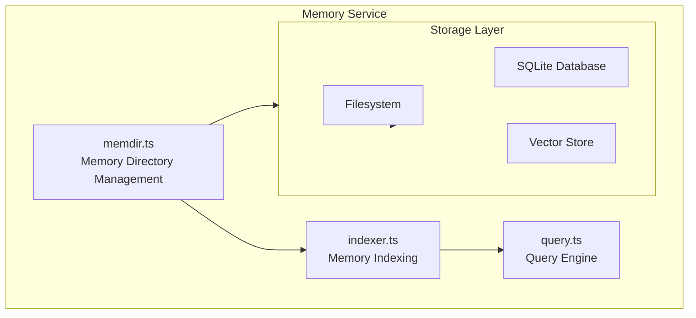
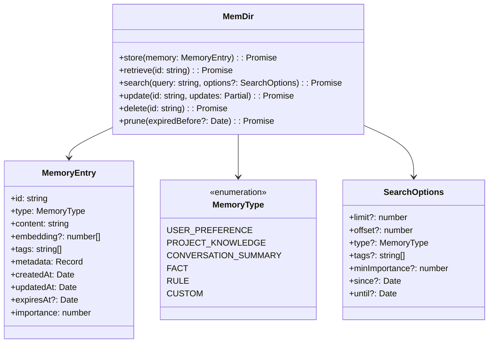
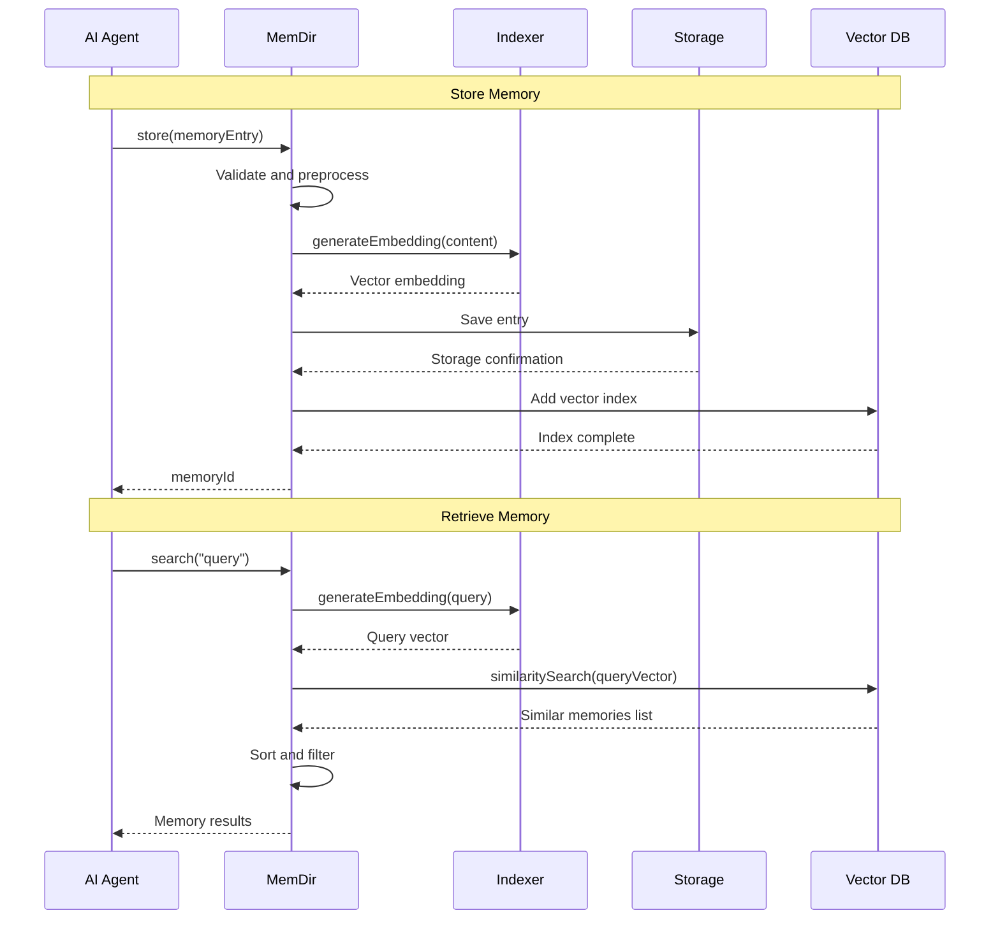
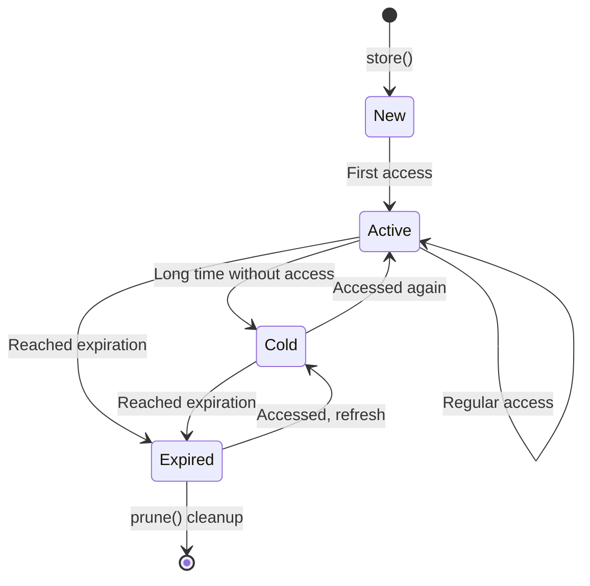
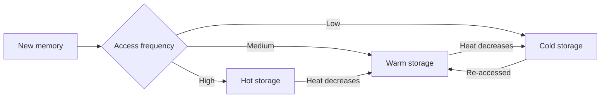

# Memory Service

## Overview

The Memory Service is Claude Code's persistent memory storage module, responsible for managing AI's long-term memory and context information. This service enables Claude Code to retain important information across sessions, learn user preferences, remember project-specific knowledge, and provide more personalized and intelligent interaction experiences.

The memory service uses a hierarchical storage architecture:
- **Working Memory**: Short-term context for current session
- **Persistent Memory**: Long-term memory across sessions
- **Project Memory**: Project-specific knowledge base

## Architecture Position



## Core Features

| Feature | Description | Related API |
|---------|-------------|-------------|
| Memory Storage | Save and retrieve memory entries | `store`, `retrieve` |
| Semantic Search | Vector similarity-based memory retrieval | `search`, `similar` |
| Memory Classification | Organize memories by type/tag | `categorize`, `tag` |
| Auto-Expiration | Automatic cleanup of expired memories | `expire`, `prune` |
| Incremental Updates | Incremental modification of memory fragments | `update`, `patch` |

## File Structure

```
memdir/
├── memdir.ts        # Memory directory core implementation
├── storage.ts       # Persistent storage adapter
├── indexer.ts       # Memory index construction
└── query.ts         # Query and retrieval engine
```

### Responsibilities

| File | Responsibility |
|------|----------------|
| memdir.ts | Provide unified memory interface, manage memory lifecycle |
| storage.ts | Abstract underlying storage, support mixed file and database storage |
| indexer.ts | Build memory vector index, support semantic search |
| query.ts | Implement memory retrieval, filtering, and sorting logic |

## Core Types



## Memory Storage Flow



## API Summary

### MemDir

| Method | Description | Return Type |
|--------|-------------|-------------|
| `store` | Store new memory | `Promise<string>` (returns memory ID) |
| `retrieve` | Retrieve memory by ID | `Promise<MemoryEntry>` |
| `search` | Semantic search memories | `Promise<MemoryEntry[]>` |
| `update` | Update memory content | `Promise<void>` |
| `delete` | Delete memory | `Promise<void>` |
| `prune` | Clean up expired memories | `Promise<number>` (deleted count) |
| `list` | List memories (with pagination) | `Promise<MemoryList>` |

### MemoryEntry

```typescript
interface MemoryEntry {
  id: string                      // Unique identifier
  type: MemoryType                // Memory type
  content: string                 // Memory content
  embedding?: number[]            // Vector embedding (auto-generated)
  tags: string[]                  // Tags
  metadata: Record<string, any>   // Metadata
  createdAt: Date                 // Creation time
  updatedAt: Date                 // Update time
  expiresAt?: Date                // Expiration time (optional)
  importance: number              // Importance score (0-10)
  accessCount: number             // Access count
  lastAccessedAt?: Date           // Last access time
}
```

### MemoryType

```typescript
enum MemoryType {
  USER_PREFERENCE = 'user_preference',       // User preference settings
  PROJECT_KNOWLEDGE = 'project_knowledge',   // Project-specific knowledge
  CONVERSATION_SUMMARY = 'conversation_summary', // Conversation summary
  FACT = 'fact',                             // Factual knowledge
  RULE = 'rule',                             // Rules/constraints
  CUSTOM = 'custom'                          // Custom type
}
```

## Usage Examples

### Basic Storage and Retrieval

```typescript
import { memdir } from './memdir/memdir'

// Store user preference
const prefId = await memdir.store({
  type: MemoryType.USER_PREFERENCE,
  content: 'User prefers TypeScript, default 2-space indentation',
  tags: ['preferences', 'typescript'],
  importance: 8
})

// Retrieve memory
const preference = await memdir.retrieve(prefId)
console.log(preference.content)
```

### Semantic Search

```typescript
// Search relevant memories
const results = await memdir.search(
  'What are user preferences for code formatting?',
  {
    limit: 5,
    type: MemoryType.USER_PREFERENCE,
    minImportance: 5
  }
)

results.forEach(memory => {
  console.log(`[${memory.importance}] ${memory.content}`)
})
```

### Memory Update and Cleanup

```typescript
// Update memory
await memdir.update(prefId, {
  content: 'User now prefers 4-space indentation',
  importance: 9
})

// Clean up expired memories
const deletedCount = await memdir.prune(new Date())
console.log(`Deleted ${deletedCount} expired memories`)
```

### Project Knowledge Base

```typescript
// Store project-specific knowledge
await memdir.store({
  type: MemoryType.PROJECT_KNOWLEDGE,
  content: 'This project uses pnpm as package manager, Monorepo structure',
  tags: ['project', 'monorepo', 'package-manager'],
  metadata: {
    projectId: 'my-project',
    language: 'TypeScript'
  },
  importance: 10
})
```

## Memory Lifecycle



## Storage Strategy

### Tiered Storage

| Tier | Storage Location | Capacity | Access Speed |
|------|----------------|----------|--------------|
| Hot | Memory/Redis | ~100 entries | < 1ms |
| Warm | SQLite | ~10,000 entries | < 10ms |
| Cold | Filesystem | Unlimited | < 100ms |

### Automatic Tiering



## Best Practices

### Recommended Patterns

| Scenario | Recommended Approach |
|----------|----------------------|
| Memory organization | Use tags and types for classification, easier retrieval |
| Importance scoring | Set importance 0-10 based on memory value |
| Expiration strategy | Set reasonable expiration times, regular cleanup |
| Search optimization | Use precise type and tag filtering |

### Things to Avoid

| Practice | Problem | Alternative |
|----------|---------|-------------|
| Storing sensitive info | Security risk | Use encrypted storage or avoid storing |
| Redundant memories | Storage waste | Use update instead of repeated creation |
| Unlimited growth | Performance degradation | Set auto-expiration and cleanup |

## Vector Search Implementation

### Embedding Generation

```typescript
// Use OpenAI or local model to generate embeddings
async function generateEmbedding(text: string): Promise<number[]> {
  const response = await openai.embeddings.create({
    model: 'text-embedding-ada-002',
    input: text
  })
  return response.data[0].embedding
}
```

### Similarity Calculation

```typescript
// Cosine similarity calculation
function cosineSimilarity(a: number[], b: number[]): number {
  const dotProduct = a.reduce((sum, val, i) => sum + val * b[i], 0)
  const magnitudeA = Math.sqrt(a.reduce((sum, val) => sum + val * val, 0))
  const magnitudeB = Math.sqrt(b.reduce((sum, val) => sum + val * val, 0))
  return dotProduct / (magnitudeA * magnitudeB)
}
```

## Design Decisions

### 1. Hybrid Vector + Keyword Search

Combines vector similarity and BM25 keyword matching to provide more accurate search results.

### 2. Automatic Importance Decay

Memories not accessed for a long time automatically reduce importance score, facilitating cleanup of low-value data.

### 3. Incremental Embedding Updates

Only regenerate embeddings for changed content, saving computational resources.

## Source References

- [memdir/memdir.ts](/restored-src/src/memdir/memdir.ts)
- [memdir/storage.ts](/restored-src/src/memdir/storage.ts)
- [memdir/indexer.ts](/restored-src/src/memdir/indexer.ts)
- [memdir/query.ts](/restored-src/src/memdir/query.ts)

## Related Documentation

- [Assistant Services Index](_index.md)
- [Team Memory Sync](team-memory-sync.md) - Multi-user memory sharing
- [Agent Tools](../agent/agent-tool.md) - Agent tool calling
- [Home](../index.md)

---

*Generated by [Nium-Wiki v0.0.0](https://github.com/niuma996/nium-wiki) | 2026-04-02*
