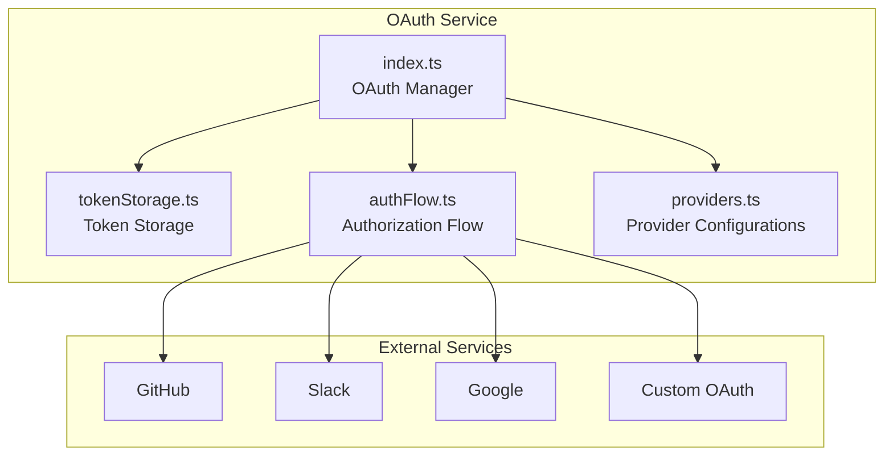
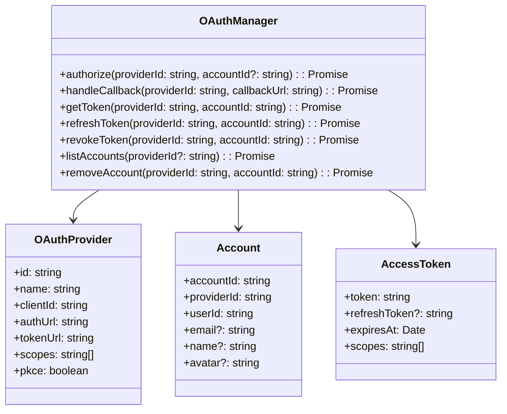
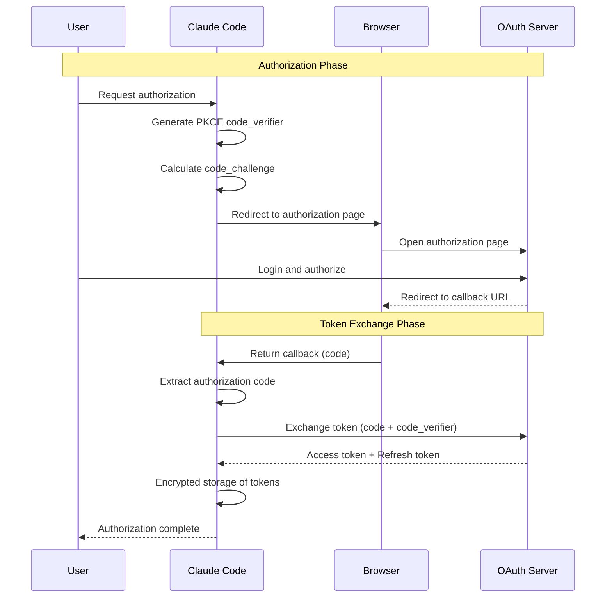

# OAuth Service

## Overview

The OAuth service is Claude Code's identity authentication and authorization management module, responsible for handling OAuth 2.0 authentication flows for third-party services. This service supports multiple OAuth 2.0 authorization patterns, enabling Claude Code to securely access user-authorized external services (such as GitHub, Slack, Google, etc.).

The service follows OAuth 2.0 specification best practices, including secure token storage, automatic refresh, and revocation handling.

## Architecture Position



## Core Features

| Feature | Description | Related API |
|---------|-------------|-------------|
| Authorization Code Flow | Implement standard OAuth 2.0 authorization code pattern | `authorize`, `handleCallback` |
| Token Management | Securely store and auto-refresh access tokens | `getToken`, `refreshToken`, `revokeToken` |
| Service Providers | Pre-configured common service provider settings | `registerProvider`, `getProvider` |
| PKCE Support | PKCE extension support for enhanced security | `generateCodeVerifier`, `generateCodeChallenge` |
| Multi-Account | Support multiple accounts for the same provider | `addAccount`, `removeAccount` |

## File Structure

```
services/oauth/
├── index.ts           # OAuth manager entry point
├── tokenStorage.ts    # Secure token storage
├── authFlow.ts        # Authorization flow handling
└── providers.ts       # OAuth service provider configurations
```

### Responsibilities

| File | Responsibility |
|------|----------------|
| index.ts | Provide unified OAuth interface, manage all providers and accounts |
| tokenStorage.ts | Encrypted token storage, handle token lifecycle |
| authFlow.ts | Implement authorization code acquisition, callback handling, token exchange |
| providers.ts | Define supported OAuth service provider configurations |

## Core Types



## OAuth Authorization Flow



## API Summary

### OAuthManager

| Method | Description | Return Type |
|--------|-------------|-------------|
| `authorize` | Initiate authorization flow | `Promise<AuthorizationResult>` |
| `handleCallback` | Handle OAuth callback | `Promise<Account>` |
| `getToken` | Get valid access token | `Promise<AccessToken>` |
| `refreshToken` | Refresh expired token | `Promise<AccessToken>` |
| `revokeToken` | Revoke authorization | `Promise<void>` |
| `listAccounts` | List authorized accounts | `Promise<Account[]>` |
| `removeAccount` | Remove account authorization | `Promise<void>` |

### OAuthProvider Configuration

```typescript
interface OAuthProviderConfig {
  id: string              // Provider unique identifier
  name: string            // Display name
  clientId: string        // OAuth app client ID
  clientSecret?: string  // Client secret (for backend flow)
  authUrl: string         // Authorization endpoint URL
  tokenUrl: string        // Token endpoint URL
  redirectUri: string     // Callback URI
  scopes: string[]        // Requested permission scopes
  pkce: boolean           // Enable PKCE
  revocationUrl?: string  // Revocation endpoint URL (optional)
}
```

### AccessToken

```typescript
interface AccessToken {
  token: string           // Access token
  refreshToken?: string   // Refresh token (optional)
  expiresAt: Date         // Expiration time
  scopes: string[]        // Authorized scopes
  tokenType: string       // Token type (usually Bearer)
}
```

## Usage Examples

### Initialization and Configuration

```typescript
import { OAuthManager } from './services/oauth/index'
import { GitHubProvider, SlackProvider } from './services/oauth/providers'

const oauthManager = new OAuthManager()

// Register service providers
oauthManager.registerProvider(GitHubProvider)
oauthManager.registerProvider(SlackProvider)
```

### User Authorization Flow

```typescript
// Initiate authorization
const result = await oauthManager.authorize('github', {
  scopes: ['repo', 'user:email']
})

if (result.type === 'redirect') {
  // Open browser for authorization
  console.log('Open URL:', result.authUrl)
}

// Get token
const token = await oauthManager.getToken('github', accountId)
console.log('Access token:', token.token)
```

### Handling Callback

```typescript
// In OAuth callback page
app.get('/oauth/callback', async (req, res) => {
  const { code, state } = req.query

  try {
    const account = await oauthManager.handleCallback('github', {
      code: code as string,
      state: state as string
    })

    console.log('Authorized account:', account.email)
    res.send('Authorization successful!')
  } catch (error) {
    console.error('Authorization failed:', error)
    res.status(400).send('Authorization failed')
  }
})
```

### Token Refresh

```typescript
// Automatic token refresh (handled internally)
// Or manual refresh
const newToken = await oauthManager.refreshToken('github', accountId)
console.log('New token expires at:', newToken.expiresAt)
```

## Best Practices

### Recommended Patterns

| Scenario | Recommended Approach |
|----------|----------------------|
| Token storage | Always use encrypted storage, don't keep in memory long-term |
| PKCE | Always enable PKCE extension to prevent authorization code interception |
| Token refresh | Implement auto-refresh to avoid user operation interruption |
| Error handling | Properly handle user rejection, revocation, etc. |

### Things to Avoid

| Practice | Problem | Alternative |
|----------|---------|-------------|
| Plaintext token storage | Security risk | Use OS keychain or encrypted storage |
| Hardcoding client secrets | Difficult to manage | Use environment variables or key management service |
| Ignoring token expiration | User operations interrupted | Implement auto-refresh mechanism |

## Security Mechanisms

### PKCE Flow

```mermaid
flowchart LR
    A[Generate random<br/>code_verifier] --> B[SHA256 hash]
    B --> C[Base64 URL encode<br/>code_challenge]
    C --> D[Authorization request<br/>with code_challenge]
    D --> E[Token request<br/>with code_verifier]
    E --> F{Verify<br/>hash(code_verifier)<br/>== code_challenge}
    F -->|Pass| G[Return token]
    F -->|Fail| H[Deny request]
```

### Secure Token Storage

- Use OS keychain (Keychain, Credential Manager)
- Encrypt refresh token storage
- Set reasonable expiration time for access tokens
- Support token revocation and account logout

## Design Decisions

### 1. PKCE Enforcement

PKCE extension enabled for all OAuth flows, preventing authorization code interception attacks even with known client secrets.

### 2. Automatic Token Management

Token storage module automatically handles expiration detection and refresh, transparent to upper-layer applications.

### 3. Multi-Account Support

Use `accountId` to isolate multiple accounts from the same provider, facilitating user identity management.

## Source References

- [services/oauth/index.ts](/restored-src/src/services/oauth/index.ts)
- [services/oauth/tokenStorage.ts](/restored-src/src/services/oauth/tokenStorage.ts)
- [services/oauth/authFlow.ts](/restored-src/src/services/oauth/authFlow.ts)
- [services/oauth/providers.ts](/restored-src/src/services/oauth/providers.ts)

## Related Documentation

- [Assistant Services Index](_index.md)
- [MCP Service](mcp.md) - MCP tool calling
- [Home](../index.md)

---

*Generated by [Nium-Wiki v0.0.0](https://github.com/niuma996/nium-wiki) | 2026-04-02*
