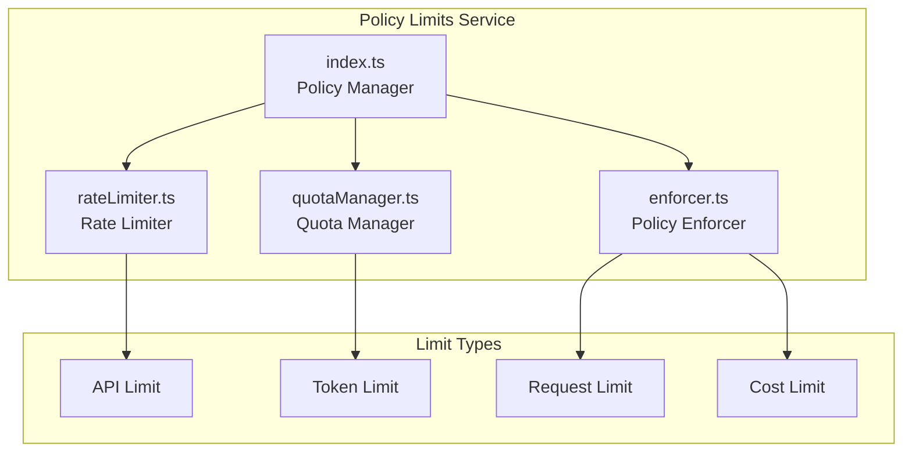
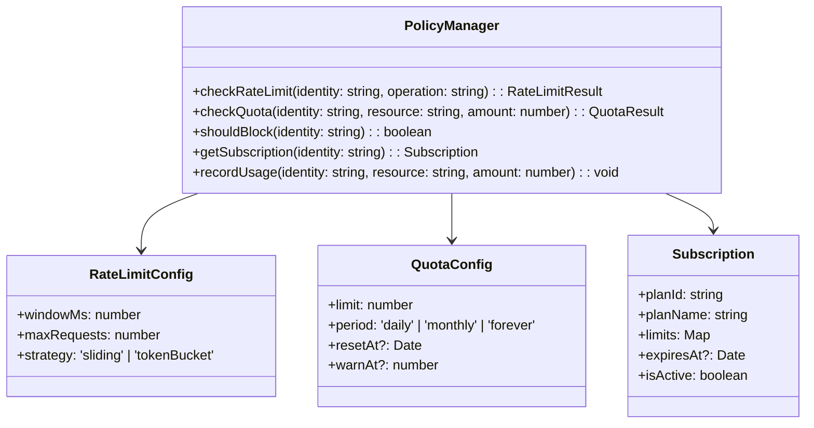
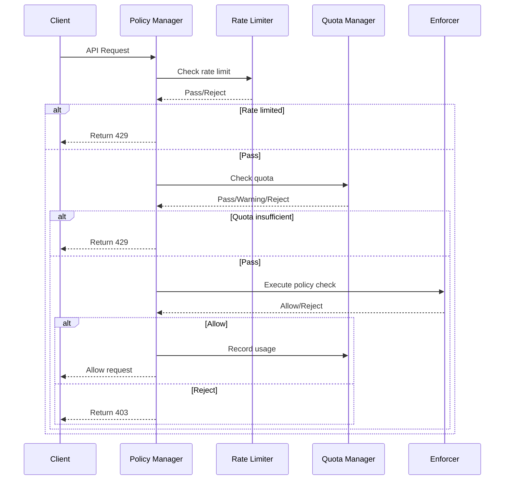
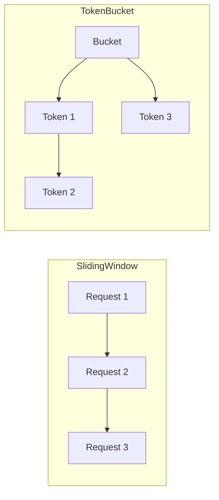

# Policy Limits

## Overview

The Policy Limits service is Claude Code's usage policy and rate limit management module. This service is responsible for:
- Enforcing API usage quotas and limits
- Managing user subscription levels and permissions
- Implementing rate limits to prevent abuse
- Tracking usage and budgets

The service follows an extensible design principle, supporting multiple limit types and custom policy configurations.

## Architecture Position



## Core Features

| Feature | Description | Related API |
|---------|-------------|-------------|
| Rate Limiting | Limit API request frequency | `checkRateLimit`, `getRateLimitStatus` |
| Quota Management | Track and manage usage quotas | `checkQuota`, `getQuotaStatus` |
| Subscription Management | Manage user subscription levels | `getSubscription`, `upgradePlan` |
| Policy Enforcement | Enforce usage limits | `enforce`, `shouldBlock` |
| Budget Control | Prevent budget overruns | `checkBudget`, `getBudgetStatus` |

## File Structure

```
services/policyLimits/
├── index.ts           # Policy manager entry point
├── rateLimiter.ts     # Rate limiter
├── quotaManager.ts    # Quota manager
└── enforcer.ts        # Policy enforcer
```

### Responsibilities

| File | Responsibility |
|------|----------------|
| index.ts | Provide unified policy interface, coordinate submodules |
| rateLimiter.ts | Implement sliding window and token bucket algorithms |
| quotaManager.ts | Manage API quotas and usage tracking |
| enforcer.ts | Execute limit decisions, handle denial logic |

## Core Types



## Limit Flow



## Limit Types

### Rate Limit Algorithms



| Algorithm | Description | Use Case |
|-----------|-------------|----------|
| Sliding Window | Request count within fixed time window | Smooth rate limiting |
| Token Bucket | Constant rate token replenishment | Burst traffic |
| Fixed Window | Simple counting | Coarse-grained limits |

### Quota Types

| Type | Description | Example |
|------|-------------|---------|
| API Calls | Daily/monthly API call count | 1000 calls/day |
| Token Usage | Token consumption limit | 100,000 tokens/month |
| Concurrent | Simultaneous requests | Max 5 concurrent |
| Cost Limit | Spending amount cap | $100/month |

## API Summary

### PolicyManager

| Method | Description | Return Type |
|--------|-------------|-------------|
| `checkRateLimit` | Check rate limit | `RateLimitResult` |
| `checkQuota` | Check quota | `QuotaResult` |
| `shouldBlock` | Check if request should be blocked | `boolean` |
| `getSubscription` | Get subscription info | `Subscription` |
| `recordUsage` | Record usage | `void` |
| `getRateLimitStatus` | Get rate limit status | `RateLimitStatus` |
| `getQuotaStatus` | Get quota status | `QuotaStatus` |

### RateLimitResult

```typescript
interface RateLimitResult {
  allowed: boolean                // Whether allowed
  remaining: number               // Remaining requests
  limit: number                   // Limit
  resetAt: Date                   // Reset time
  retryAfter?: number            // Seconds until next available
}
```

### QuotaResult

```typescript
interface QuotaResult {
  allowed: boolean                // Whether allowed
  used: number                    // Used amount
  limit: number                   // Limit
  remaining: number               // Remaining
  period: 'daily' | 'monthly' | 'forever'
  resetAt?: Date                 // Reset time
  isWarning: boolean             // Approaching limit
}
```

### Subscription

```typescript
interface Subscription {
  planId: string                  // Subscription plan ID
  planName: string                // Plan name
  tier: 'free' | 'pro' | 'team' | 'enterprise'
  limits: {
    requestsPerDay: number
    requestsPerMonth: number
    tokensPerMonth: number
    maxConcurrent: number
  }
  expiresAt?: Date               // Expiration time
  isActive: boolean              // Whether active
  features: string[]             // Feature list
}
```

## Usage Examples

### Rate Limit Check

```typescript
import { policyManager } from './services/policyLimits/index'

// Check rate limit
const rateLimitResult = policyManager.checkRateLimit(userId, 'api_call')

if (!rateLimitResult.allowed) {
  console.log(`Rate limited. Retry after ${rateLimitResult.retryAfter}s`)
  throw new RateLimitError(rateLimitResult.retryAfter)
}

console.log(`Remaining requests: ${rateLimitResult.remaining}`)
```

### Quota Check

```typescript
// Check API call quota
const quotaResult = policyManager.checkQuota(userId, 'api_requests', 1)

if (!quotaResult.allowed) {
  console.log(`Quota exceeded. Limit: ${quotaResult.limit}`)
  throw new QuotaExceededError()
}

if (quotaResult.isWarning) {
  console.log(`Warning: ${quotaResult.remaining} requests remaining`)
}

// Record usage
policyManager.recordUsage(userId, 'api_requests', 1)
```

### Get Subscription Info

```typescript
// Get user subscription
const subscription = policyManager.getSubscription(userId)

console.log(`Plan: ${subscription.planName}`)
console.log(`Daily limit: ${subscription.limits.requestsPerDay}`)
console.log(`Monthly tokens: ${subscription.limits.tokensPerMonth}`)

if (!subscription.isActive) {
  console.log('Subscription expired or inactive')
}
```

### Complete Check Flow

```typescript
async function handleApiRequest(userId: string, tokens: number) {
  // 1. Check rate limit
  const rateLimit = policyManager.checkRateLimit(userId, 'api_call')
  if (!rateLimit.allowed) {
    throw new RateLimitError(rateLimit.retryAfter)
  }

  // 2. Check token quota
  const tokenQuota = policyManager.checkQuota(userId, 'tokens', tokens)
  if (!tokenQuota.allowed) {
    throw new QuotaExceededError('Token quota exceeded')
  }

  // 3. Check if should block
  if (policyManager.shouldBlock(userId)) {
    throw new ForbiddenError('Account blocked')
  }

  // 4. Execute request
  const result = await executeApiCall()

  // 5. Record usage
  policyManager.recordUsage(userId, 'api_requests', 1)
  policyManager.recordUsage(userId, 'tokens', tokens)

  return result
}
```

## Subscription Plan Examples

```typescript
const subscriptionPlans = {
  free: {
    requestsPerDay: 100,
    requestsPerMonth: 1000,
    tokensPerMonth: 100000,
    maxConcurrent: 1,
    features: ['basic-chat', 'code-completion']
  },
  pro: {
    requestsPerDay: 1000,
    requestsPerMonth: 50000,
    tokensPerMonth: 1000000,
    maxConcurrent: 5,
    features: ['basic-chat', 'code-completion', 'agent', 'voice']
  },
  team: {
    requestsPerDay: 10000,
    requestsPerMonth: 500000,
    tokensPerMonth: 10000000,
    maxConcurrent: 20,
    features: ['basic-chat', 'code-completion', 'agent', 'voice', 'team-sync']
  },
  enterprise: {
    requestsPerDay: Infinity,
    requestsPerMonth: Infinity,
    tokensPerMonth: Infinity,
    maxConcurrent: Infinity,
    features: ['all', 'custom-policies', 'sso', 'audit-logs']
  }
}
```

## Limit Configuration Examples

```typescript
const rateLimitConfig: RateLimitConfig = {
  // Sliding window strategy
  strategy: 'sliding',
  windowMs: 60 * 1000,  // 1 minute window
  maxRequests: 60,       // Max 60 requests per minute

  // Or token bucket strategy
  strategy: 'tokenBucket',
  bucketSize: 100,       // Bucket capacity
  refillRate: 1         // Refill 1 token per second
}

const quotaConfig: QuotaConfig = {
  limit: 1000,
  period: 'daily',
  resetAt: getEndOfDay(),
  warnAt: 0.8            // Warning at 80%
}
```

## Best Practices

### Recommended Patterns

| Scenario | Recommended Approach |
|----------|----------------------|
| Rate limit algorithm | Use sliding window for smoother limits |
| Quota design | Set reasonable warning thresholds to notify users early |
| Cost control | Set hard budget limits to prevent overspending |
| Error handling | Return clear error messages and retry times |

### Things to Avoid

| Practice | Problem | Alternative |
|----------|---------|-------------|
| Fixed window rate limiting | Burst traffic at window boundaries | Use sliding window |
| No warning threshold | User blocked without warning | Set 80% warning |
| Hard quota deletion | Misjudgment causes service interruption | Use soft limit + delayed execution |

## Design Decisions

### 1. Layered Limits

Uses layered limit strategy: Rate limit → Quota check → Budget control → Enforcement decision.

### 2. Real-time Tracking

Uses memory cache for real-time usage tracking, reducing database query pressure.

### 3. Extensible Policies

Policy configuration supports dynamic updates without service restart.

## Source References

- [services/policyLimits/index.ts](/restored-src/src/services/policyLimits/index.ts)
- [services/policyLimits/rateLimiter.ts](/restored-src/src/services/policyLimits/rateLimiter.ts)
- [services/policyLimits/quotaManager.ts](/restored-src/src/services/policyLimits/quotaManager.ts)
- [services/policyLimits/enforcer.ts](/restored-src/src/services/policyLimits/enforcer.ts)

## Related Documentation

- [Assistant Services Index](_index.md)
- [Rate Limit Mocking](rate-limit-mocking.md) - Test limit simulation
- [Analytics Service](analytics.md) - Usage tracking
- [Home](../index.md)

---

*Generated by [Nium-Wiki v0.0.0](https://github.com/niuma996/nium-wiki) | 2026-04-02*
