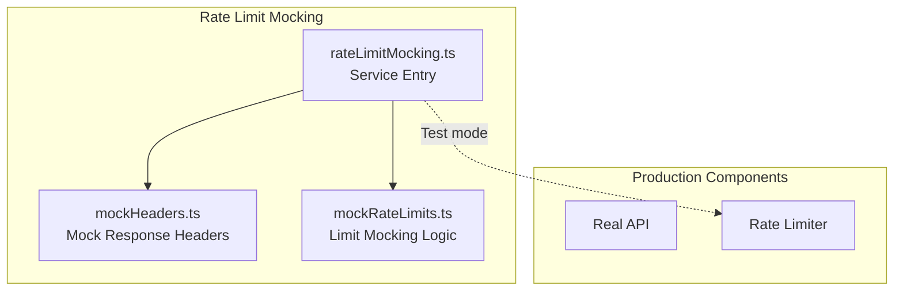
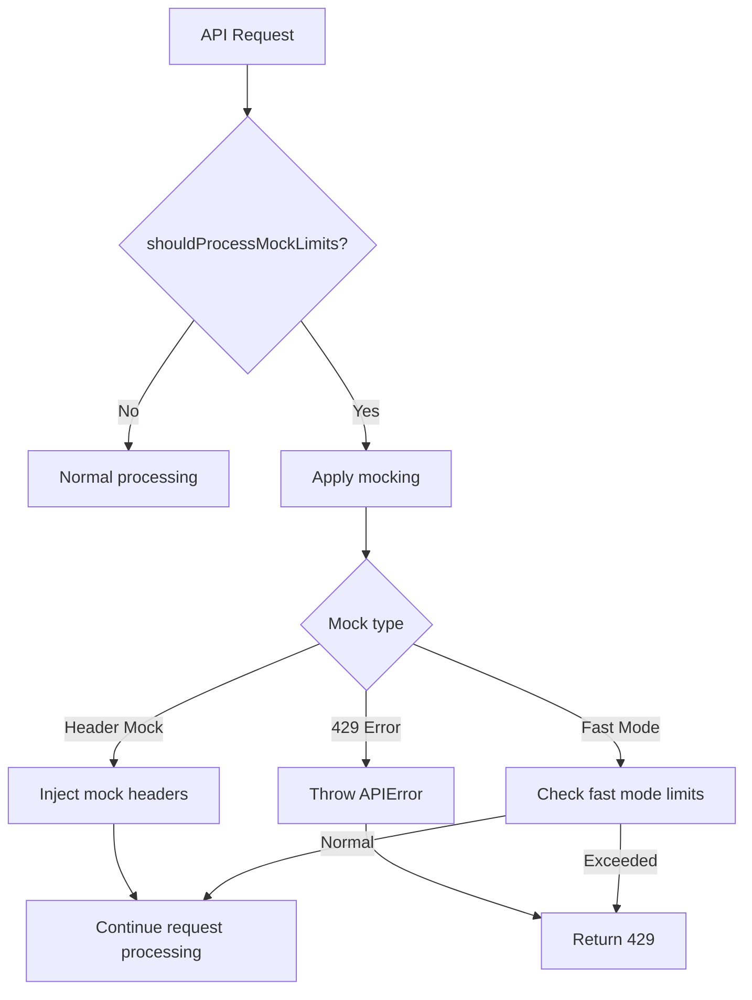
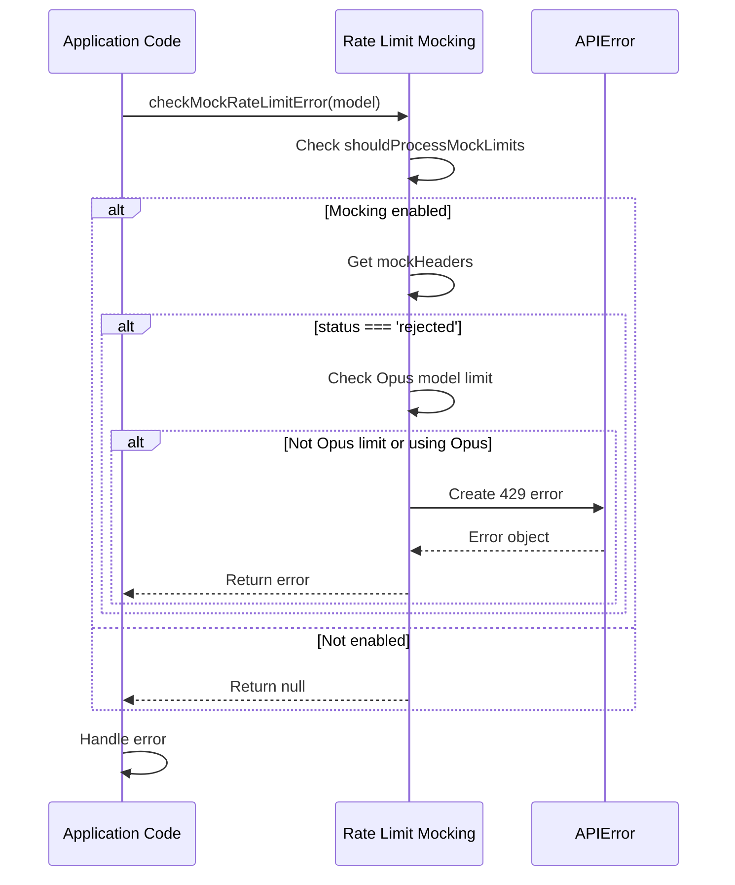
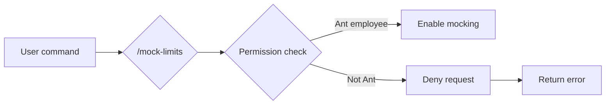

# Rate Limit Mocking

## Overview

The Rate Limit Mocking service is Claude Code's testing and development tool for simulating API rate limit behavior. This service enables developers and testers to:
- Test code paths for rate limit scenarios
- Verify rate limit error handling logic
- Simulate limits for different subscription levels
- Test rate limits in fast mode

**⚠️ Security Restriction**: This service is for Ant internal employees only, activated via the `/mock-limits` command.

## Architecture Position



## Core Features

| Feature | Description | Related API |
|---------|-------------|-------------|
| Header Injection | Inject mock rate limit headers in responses | `processRateLimitHeaders` |
| 429 Error Mocking | Generate mock 429 errors | `checkMockRateLimitError` |
| Fast Mode Limits | Simulate fast mode rate limits | `checkMockFastModeRateLimit` |
| Status Query | Query mocking status | `shouldProcessMockLimits` |

## File Structure

```
services/
├── rateLimitMocking.ts      # Service entry (facade)
├── mockRateLimits.ts        # Limit mocking logic
└── mockHeaders.ts           # Mock response header handling
```

### Responsibilities

| File | Responsibility |
|------|----------------|
| rateLimitMocking.ts | Provide unified interface, isolate mocking logic |
| mockRateLimits.ts | Implement various rate limit scenario simulations |
| mockHeaders.ts | Handle mock response header generation and application |

## How It Works



## Mocking Modes

### 1. Header Injection Mode

Inject mock rate limit information in response headers:

```typescript
interface MockHeaders {
  'anthropic-ratelimit-unified-status': 'rejected' | 'accepted'
  'anthropic-ratelimit-unified-overage-status'?: 'rejected' | 'accepted'
  'anthropic-ratelimit-unified-representative-claim'?: string
  'anthropic-ratelimit-unified-reset'?: string
  'anthropic-ratelimit-unified-remaining'?: string
}
```

### 2. 429 Error Mocking

When mock status is `rejected`, generate 429 error:

```typescript
const error = new APIError(
  429,
  { error: { type: 'rate_limit_error', message: headerlessMessage } },
  headerlessMessage,
  new Headers()
)
```

### 3. Fast Mode Limits

Simulate rate limits in fast mode:

```typescript
interface FastModeHeaders {
  'anthropic-ratelimit-fast-mode-status': 'rejected' | 'accepted'
  'anthropic-ratelimit-fast-mode-reset': string
  'anthropic-ratelimit-fast-mode-remaining': string
}
```

## API Summary

### RateLimitFacade

| Method | Description | Return Type |
|--------|-------------|-------------|
| `processRateLimitHeaders` | Process response headers, apply mocking | `Headers` |
| `shouldProcessRateLimits` | Check if should process limits | `boolean` |
| `checkMockRateLimitError` | Check if should throw 429 | `APIError \| null` |
| `isMockRateLimitError` | Check if mock 429 | `boolean` |
| `shouldProcessMockLimits` | Check mocking status | `boolean` |

### MockRateLimits

| Method | Description | Return Type |
|--------|-------------|-------------|
| `applyMockHeaders` | Apply mock headers | `Headers` |
| `getMockHeaders` | Get current mock headers | `MockHeaders \| null` |
| `isMockFastModeRateLimitScenario` | Check fast mode scenario | `boolean` |
| `checkMockFastModeRateLimit` | Check fast mode limits | `FastModeHeaders \| null` |

## Usage Examples

### Basic Usage

```typescript
import {
  processRateLimitHeaders,
  shouldProcessRateLimits,
  checkMockRateLimitError
} from './services/rateLimitMocking'

// Process response headers
function handleResponse(response: Response) {
  const headers = processRateLimitHeaders(response.headers)
  // headers now contains mock rate limit info
}

// Check if should throw 429
function checkLimit(currentModel: string, isFastModeActive?: boolean) {
  const error = checkMockRateLimitError(currentModel, isFastModeActive)
  if (error) {
    throw error  // Throw mock 429 error
  }
}
```

### Integration with Rate Limiter

```typescript
import { shouldProcessRateLimits } from './services/rateLimitMocking'
import { checkAndEnforceRateLimit } from './services/policyLimits'

async function makeApiRequest(isSubscriber: boolean) {
  // Check if should process rate limits
  // Production: only subscribers
  // Test: subscribers or /mock-limits enabled
  const shouldProcess = shouldProcessRateLimits(isSubscriber)

  if (shouldProcess) {
    await checkAndEnforceRateLimit(userId)
  }

  return await actualApiCall()
}
```

### Opus Model Limits

```typescript
// Special handling for Opus model rate limits
const error = checkMockRateLimitError('claude-opus-4-20240229', false)

if (error) {
  console.log('Opus model rate limited')
  // May need to switch to Sonnet model
}
```

## Mock Header Configuration

### Typical Mock Headers

```typescript
// Mock rejected request
const mockHeaders = {
  'anthropic-ratelimit-unified-status': 'rejected',
  'anthropic-ratelimit-unified-representative-claim': 'seven_day_opus',
  'anthropic-ratelimit-unified-reset': '2024-01-01T00:00:00Z',
  'anthropic-ratelimit-unified-remaining': '0'
}

// Mock overage scenario
const overageHeaders = {
  ...mockHeaders,
  'anthropic-ratelimit-unified-overage-status': 'rejected'
}
```

### Fast Mode Headers

```typescript
const fastModeHeaders = {
  'anthropic-ratelimit-fast-mode-status': 'rejected',
  'anthropic-ratelimit-fast-mode-reset': '2024-01-01T00:01:00Z',
  'anthropic-ratelimit-fast-mode-remaining': '0'
}
```

## Error Handling

### Mock 429 Errors



### Error Information

```typescript
// 429 message without headers
const headerlessMessage = getMockHeaderless429Message()
// May return: "Rate limit exceeded. Please wait and retry."

// Error properties
interface APIError {
  status: 429
  error: {
    type: 'rate_limit_error'
    message: string
  }
  headers: Headers  // Copy of mock headers
}
```

## Security Mechanisms

### Access Control



### Activation Conditions

| Condition | Description |
|-----------|-------------|
| Ant employee | Authenticated via internal identity |
| Explicit activation | Using `/mock-limits` command |
| Session level | Only effective in current session |

## Best Practices

### Recommended Patterns

| Scenario | Recommended Approach |
|----------|----------------------|
| Test coverage | Write test cases for rate limit scenarios |
| Error handling | Ensure 429 errors are properly handled and retried |
| Fast mode | Test boundary cases for fast mode |

### Things to Avoid

| Practice | Problem | Alternative |
|----------|---------|-------------|
| Exposing to external users | Security risk | Strict internal access control |
| Hardcoding mock data | Inflexible | Use config for dynamic settings |
| Ignoring Opus limits | Incomplete testing | Add Opus model tests |

## Design Decisions

### 1. Production Code Isolation

Mocking logic completely isolated in separate module, not affecting production code paths.

### 2. Transparent Header Processing

Mock headers injected transparently, upper-layer code doesn't need to be aware.

### 3. Opus Model Special Handling

Opus model rate limits only affect Opus requests, not other models.

## Source References

- [services/rateLimitMocking.ts](/restored-src/src/services/rateLimitMocking.ts)
- [services/mockRateLimits.ts](/restored-src/src/services/mockRateLimits.ts)
- [services/mockHeaders.ts](/restored-src/src/services/mockHeaders.ts)

## Related Documentation

- [Assistant Services Index](_index.md)
- [Policy Limits](policy-limits.md) - Real rate limit implementation
- [Analytics Service](analytics.md) - Usage tracking
- [Home](../index.md)

---

*Generated by [Nium-Wiki v0.0.0](https://github.com/niuma996/nium-wiki) | 2026-04-02*
