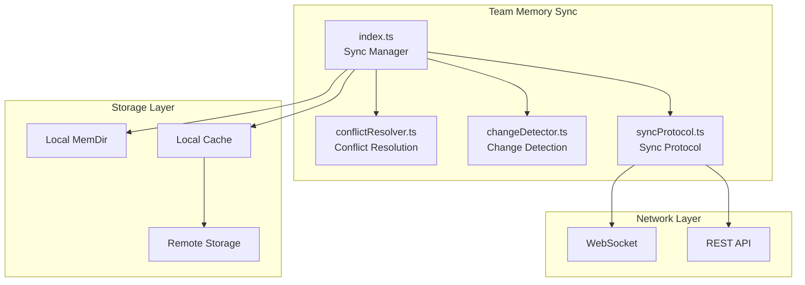
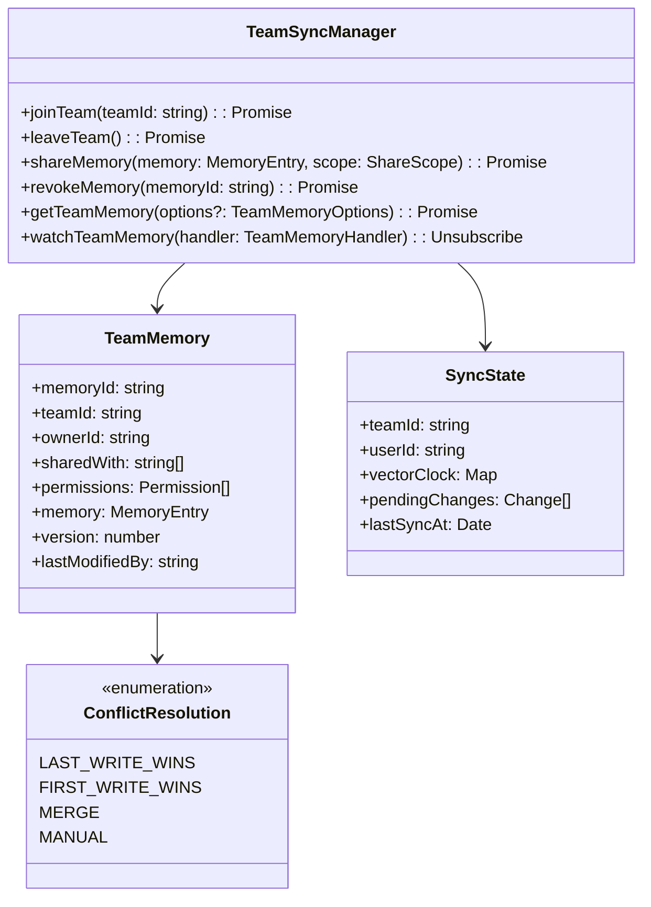
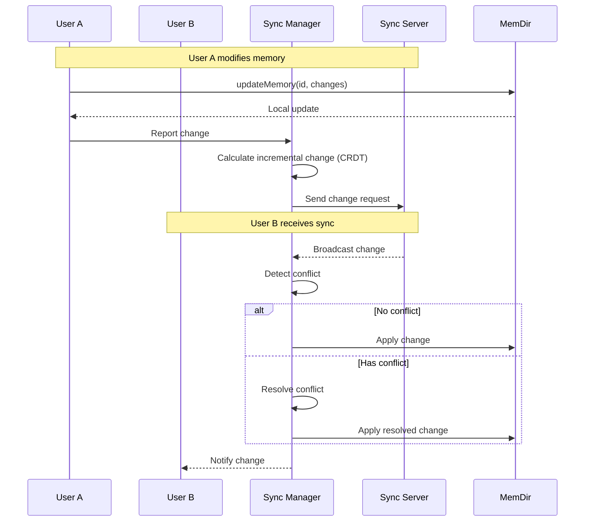
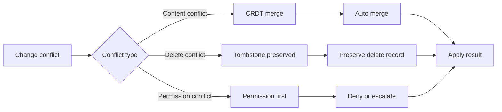
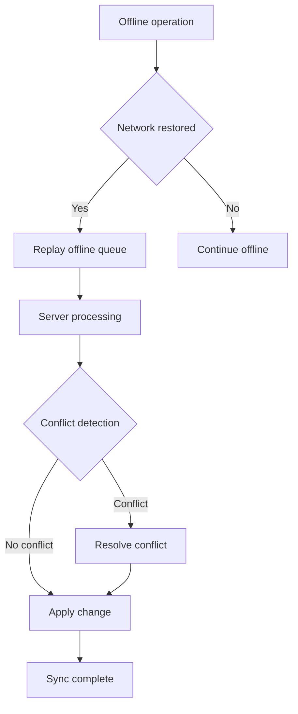

# Team Memory Sync

## Overview

The Team Memory Sync service is Claude Code's multi-user collaborative memory module, responsible for synchronizing and sharing memories among team members. This service enables teams to:
- Share project knowledge and best practices
- Maintain context consistency across users
- Achieve team-level learning and development
- Support real-time collaboration scenarios

The service is based on an event-driven synchronization mechanism, supporting incremental updates and conflict resolution to ensure consistency and availability of team memories.

## Architecture Position



## Core Features

| Feature | Description | Related API |
|---------|-------------|-------------|
| Real-time Sync | Real-time memory synchronization across users | `sync`, `watch` |
| Conflict Resolution | Auto-handle multi-user editing conflicts | `resolve`, `merge` |
| Permission Management | Control memory visibility and edit permissions | `grant`, `revoke` |
| Version Tracking | Record memory change history | `history`, `diff` |
| Offline Support | Local operation cache during network interruption | `queueOffline`, `replay` |

## File Structure

```
services/teamMemorySync/
├── index.ts              # Sync manager entry point
├── conflictResolver.ts   # Conflict resolution strategies
├── changeDetector.ts     # Change detection algorithm
└── syncProtocol.ts       # Sync protocol implementation
```

### Responsibilities

| File | Responsibility |
|------|----------------|
| index.ts | Manage team sync lifecycle, handle connections and coordination |
| conflictResolver.ts | Implement conflict detection and resolution algorithms (CRDT/OT) |
| changeDetector.ts | Calculate incremental changes using CRDT data structures |
| syncProtocol.ts | Implement sync protocol, handle message serialization and routing |

## Core Types



## Sync Flow



## Conflict Resolution Strategies



## API Summary

### TeamSyncManager

| Method | Description | Return Type |
|--------|-------------|-------------|
| `joinTeam` | Join team sync session | `Promise<void>` |
| `leaveTeam` | Leave team sync session | `Promise<void>` |
| `shareMemory` | Share memory with team members | `Promise<void>` |
| `revokeMemory` | Revoke memory sharing | `Promise<void>` |
| `getTeamMemory` | Get team shared memories | `Promise<TeamMemory[]>` |
| `watchTeamMemory` | Watch team memory changes | `Unsubscribe` |
| `getSyncStatus` | Get sync status | `SyncStatus` |

### ShareScope

```typescript
enum ShareScope {
  PRIVATE = 'private',           // Only self visible
  TEAM = 'team',                 // All team members visible
  SPECIFIC_USERS = 'specific',   // Specific users visible
  PUBLIC = 'public'               // All users visible
}

interface ShareOptions {
  scope: ShareScope
  users?: string[]               // When scope is SPECIFIC_USERS
  permissions?: Permission[]      // Permissions granted
  expiresAt?: Date               // Sharing expiration time
}
```

### SyncState

```typescript
interface SyncState {
  teamId: string
  userId: string
  vectorClock: Map<string, number>  // Vector clock
  pendingChanges: PendingChange[]
  syncedVersions: Map<string, number>
  lastSyncAt: Date
  connectionStatus: 'connected' | 'disconnected' | 'reconnecting'
}
```

## Usage Examples

### Joining a Team

```typescript
import { teamSync } from './services/teamMemorySync/index'

// Join team sync session
await teamSync.joinTeam('team-123')

// Watch team memory changes
const unsubscribe = teamSync.watchTeamMemory((event) => {
  console.log(`Memory ${event.memoryId} was ${event.type}`)
  if (event.type === 'updated') {
    console.log('New content:', event.memory.content)
  }
})
```

### Sharing Memory

```typescript
// Share memory with team
await teamSync.shareMemory(memoryId, {
  scope: ShareScope.TEAM,
  permissions: [Permission.READ, Permission.EDIT],
  expiresAt: new Date(Date.now() + 7 * 24 * 60 * 60 * 1000) // Expires in 7 days
})

// Share with specific users
await teamSync.shareMemory(memoryId, {
  scope: ShareScope.SPECIFIC_USERS,
  users: ['user-456', 'user-789'],
  permissions: [Permission.READ]
})
```

### Getting Team Memory

```typescript
// Get all team shared memories
const teamMemories = await teamSync.getTeamMemory()

// Get with filter
const myContributions = await teamSync.getTeamMemory({
  ownerId: 'my-user-id',
  since: new Date('2024-01-01')
})
```

### Permission Management

```typescript
// Revoke sharing
await teamSync.revokeMemory(memoryId)

// Check sync status
const status = teamSync.getSyncStatus()
console.log(`Connected: ${status.connectionStatus}`)
console.log(`Pending changes: ${status.pendingChanges.length}`)
```

## CRDT Implementation

### Vector Clock

```typescript
class VectorClock {
  private clock: Map<string, number> = new Map()

  increment(nodeId: string): void {
    const current = this.clock.get(nodeId) || 0
    this.clock.set(nodeId, current + 1)
  }

  merge(other: VectorClock): void {
    for (const [node, time] of other.clock) {
      this.clock.set(node, Math.max(this.clock.get(node) || 0, time))
    }
  }

  happensBefore(other: VectorClock): boolean {
    let atLeastOneLess = false
    for (const [node, time] of this.clock) {
      if ((other.clock.get(node) || 0) < time) {
        return false
      }
      if ((other.clock.get(node) || 0) > time) {
        atLeastOneLess = true
      }
    }
    return atLeastOneLess
  }
}
```

### Tombstone Mechanism

```typescript
interface Tombstone {
  id: string
  deletedAt: Date
  deletedBy: string
  // Preserve enough info for conflict resolution
}

// Create tombstone instead of actual delete
function softDelete(entry: MemoryEntry, userId: string): Tombstone {
  return {
    id: entry.id,
    deletedAt: new Date(),
    deletedBy: userId
  }
}
```

## Offline Support



### Offline Queue

```typescript
interface OfflineQueue {
  operations: Operation[]
  add(op: Operation): void
  replay(): Promise<void>
  clear(): void
  getPending(): Operation[]
}
```

## Permission Model

| Permission | Description |
|------------|-------------|
| READ | Read memory content |
| EDIT | Modify memory content |
| DELETE | Delete memory |
| SHARE | Share with other users |
| REVOKE | Revoke sharing |
| ADMIN | Manage all permissions |

## Best Practices

### Recommended Patterns

| Scenario | Recommended Approach |
|----------|----------------------|
| Sharing granularity | Avoid over-sharing, share minimum necessary info as needed |
| Conflict handling | Prefer auto-merge to reduce manual intervention |
| Offline operations | Record operation intent for easy recovery and sync |
| Permission control | Follow principle of least privilege |

### Things to Avoid

| Practice | Problem | Alternative |
|----------|---------|-------------|
| Excessive broadcasting | Network congestion | Use room/channel grouping |
| Ignoring conflicts | Data inconsistency | Implement CRDT merge |
| Sync storms | Server pressure | Exponential backoff strategy |

## Design Decisions

### 1. CRDT First

Uses CRDT (Conflict-free Replicated Data Types) to achieve distributed consistency without locks or coordination for concurrent editing.

### 2. Event-Driven Architecture

Uses publish-subscribe pattern for real-time sync, reducing polling overhead.

### 3. Vector Clock Tracking

Uses vector clocks to track causality, accurately determining conflicts and dependencies.

## Source References

- [services/teamMemorySync/index.ts](/restored-src/src/services/teamMemorySync/index.ts)
- [services/teamMemorySync/conflictResolver.ts](/restored-src/src/services/teamMemorySync/conflictResolver.ts)
- [services/teamMemorySync/changeDetector.ts](/restored-src/src/services/teamMemorySync/changeDetector.ts)
- [services/teamMemorySync/syncProtocol.ts](/restored-src/src/services/teamMemorySync/syncProtocol.ts)

## Related Documentation

- [Assistant Services Index](_index.md)
- [Memory Service](memory.md) - Single-user memory storage
- [Agent Tools](../agent/agent-tool.md) - Agent tool calling
- [Home](../index.md)

---

*Generated by [Nium-Wiki v0.0.0](https://github.com/niuma996/nium-wiki) | 2026-04-02*
