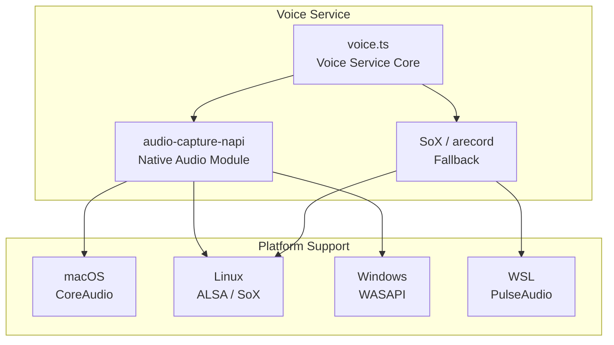
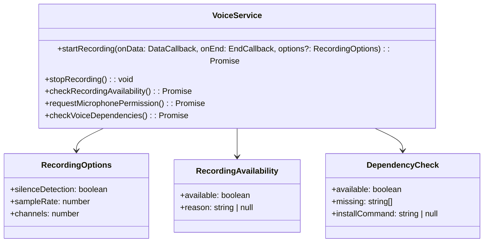
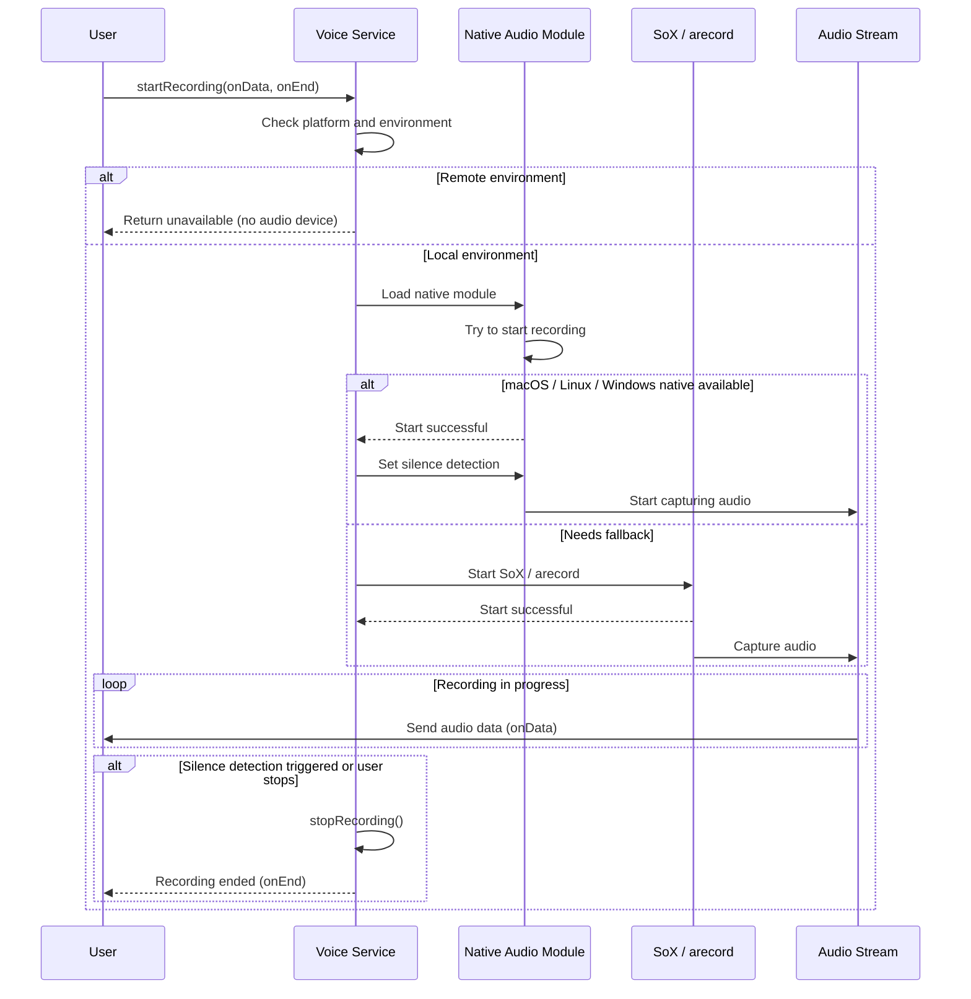
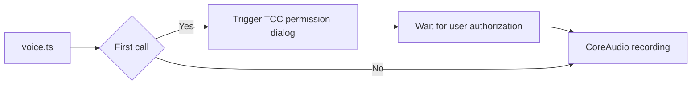
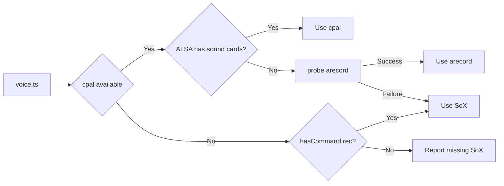
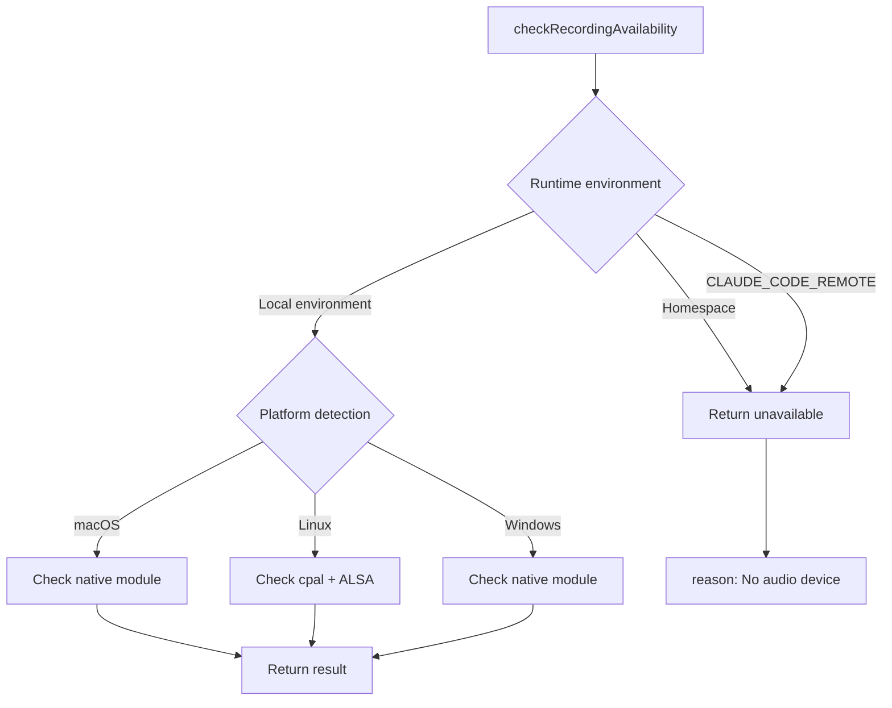

# Voice Service

## Overview

The Voice Service is Claude Code's audio recording module, providing microphone access and voice input functionality. This service enables Claude Code to support voice interaction, allowing users to converse with the AI assistant through voice commands.

The voice service uses cross-platform design, supporting:
- **macOS**: Native CoreAudio + AudioUnit framework
- **Linux**: ALSA (cpal) or SoX/arecord fallback
- **Windows**: WASAPI (cpal)
- **WSL**: WSLg audio support (Windows 11)

## Architecture Position



## Core Features

| Feature | Description | Related API |
|---------|-------------|-------------|
| Recording Start/Stop | Control audio recording state | `startRecording`, `stopRecording` |
| Microphone Detection | Check microphone availability | `checkRecordingAvailability` |
| Permission Request | Request microphone access | `requestMicrophonePermission` |
| Silence Detection | Auto-detect silence to end recording | Built into `startRecording` |
| Dependency Check | Check if SoX etc. are installed | `checkVoiceDependencies` |

## File Structure

```
services/
└── voice.ts          # Voice service implementation
```

## Core Types



## Recording Flow



## Platform-Specific Behavior

### macOS



### Linux



### Windows

| Situation | Behavior |
|-----------|----------|
| Native module available | Use WASAPI recording |
| Native module unavailable | Return error (no fallback) |

### WSL

| Environment | Behavior |
|-------------|----------|
| WSLg (Win11) | arecord succeeds via PulseAudio |
| WSL1 / Win10 | Returns "no audio device" error |

## API Summary

### VoiceService

| Method | Description | Return Type |
|--------|-------------|-------------|
| `startRecording` | Start recording | `Promise<boolean>` |
| `stopRecording` | Stop recording | `void` |
| `checkRecordingAvailability` | Check recording availability | `Promise<RecordingAvailability>` |
| `requestMicrophonePermission` | Request microphone permission | `Promise<boolean>` |
| `checkVoiceDependencies` | Check dependencies | `Promise<DependencyCheck>` |

### Recording Options

```typescript
interface RecordingOptions {
  silenceDetection?: boolean  // Enable silence detection (default true)
}

interface RecordingAvailability {
  available: boolean           // Whether available
  reason: string | null        // Reason when unavailable
}

interface DependencyCheck {
  available: boolean           // Whether dependencies met
  missing: string[]            // Missing dependencies
  installCommand: string | null // Install command hint
}
```

### Audio Format

| Parameter | Value | Description |
|-----------|-------|-------------|
| Sample rate | 16000 Hz | Optimized for speech recognition |
| Channels | 1 (mono) | Single channel sufficient for speech |
| Bit depth | 16 bit | Standard CD quality |
| Format | S16_LE | Signed little-endian |

## Usage Examples

### Basic Recording

```typescript
import { startRecording, stopRecording } from './services/voice'

// Start recording
const started = await startRecording(
  (chunk: Buffer) => {
    // Process audio data chunk
    audioBuffer.push(chunk)
  },
  () => {
    // Recording end callback
    console.log('Recording finished')
    processAudioBuffer()
  }
)

if (started) {
  console.log('Recording started...')
  // Recording in progress...

  // Stop recording
  stopRecording()
}
```

### Silence Detection

```typescript
// Enable silence detection (default)
await startRecording(
  (chunk) => { /* Process audio */ },
  () => { /* Triggered after 2 seconds of silence */ },
  { silenceDetection: true }  // Auto-stops after 2s silence
)

// Disable silence detection (push-to-talk mode)
await startRecording(
  (chunk) => { /* Process audio */ },
  () => { /* User manually stops */ },
  { silenceDetection: false }  // Continuous until stopRecording()
)
```

### Check Availability

```typescript
import { checkRecordingAvailability, checkVoiceDependencies } from './services/voice'

// Check recording availability
const availability = await checkRecordingAvailability()
if (!availability.available) {
  console.error('Recording not available:', availability.reason)
  return
}

// Check dependencies
const deps = await checkVoiceDependencies()
if (!deps.available) {
  console.error('Missing dependencies:', deps.missing)
  if (deps.installCommand) {
    console.log('Install with:', deps.installCommand)
  }
}
```

### Request Microphone Permission

```typescript
import { requestMicrophonePermission } from './services/voice'

const granted = await requestMicrophonePermission()
if (granted) {
  console.log('Microphone permission granted')
} else {
  console.error('Microphone permission denied')
}
```

## Silence Detection Configuration

### SoX Parameters

```bash
# Silence detection parameters
silence 1 0.1 3% 1 2.0 3%
#    │  │    │  │  │   │
#    │  │    │  │  │   └── Stop threshold (3%)
#    │  │    │  │  └────── Stop duration (2.0s)
#    │  │    │  └───────── Start threshold (3%)
#    │  │    └──────────── Start duration (0.1s)
#    │  └────────────────── Position (1 = after file start)
#    └───────────────────── Preserved parameter
```

### Native Module Silence Detection

```typescript
// audio-capture-napi internal implementation
napi.startNativeRecording(
  (data: Buffer) => {
    // Audio data callback
    onData(data)
  },
  () => {
    // Silence detection triggered callback
    nativeRecordingActive = false
    onEnd()
  }
)
```

## Remote Environment Handling



## Dependency Detection

| Platform | Required Dependency | Fallback |
|----------|---------------------|----------|
| macOS | audio-capture-napi | None |
| Linux (cpal) | audio-capture-napi + ALSA | SoX / arecord |
| Linux (no cpal) | SoX / arecord | None |
| Windows | audio-capture-napi | None |
| WSL | PulseAudio + arecord | None |

### Install Command Hints

```typescript
// macOS - Homebrew
'brew install sox'

// Linux - apt-get
'sudo apt-get install -y sox'

// Linux - dnf
'sudo dnf install -y sox'

// Linux - pacman
'sudo pacman -S --noconfirm sox'
```

## Best Practices

### Recommended Patterns

| Scenario | Recommended Approach |
|----------|----------------------|
| Recording start | Start after user explicit intent (key press trigger) |
| Silence detection | Enable for most scenarios, paired with push-to-talk |
| Error handling | Gracefully handle permission denial and no audio device |
| Resource cleanup | Call stopRecording() promptly after recording ends |

### Things to Avoid

| Practice | Problem | Alternative |
|----------|---------|-------------|
| Pre-loading at startup | Blocks event loop 1-8 seconds | Lazy load on first key press |
| Silence detection false trigger | Disconnects on short pauses | Adjust SILENCE_DURATION_SECS |
| Ignoring permission denial | User confusion | Provide clear error messages |

## Design Decisions

### 1. Lazy Load Native Module

audio-capture-napi uses dlopen to load, which blocks the event loop for 1-8 seconds. Therefore, it only loads on the first voice key press, not at application startup.

### 2. Platform Fallback Chain

| Platform | Priority |
|----------|----------|
| macOS | cpal > Error |
| Linux | cpal > arecord > SoX |
| Windows | cpal > Error |
| WSL | arecord > SoX > Error |

### 3. Probe Recording Mechanism

Use probe recording to verify audio device is actually available, not just checking if the command exists.

## Source References

- [services/voice.ts](/restored-src/src/services/voice.ts)
- [vendor/audio-capture-src/index.ts](https://github.com/anthropics/claude-code-vendor/blob/main/audio-capture-src/index.ts) - Native audio module

## Related Documentation

- [Assistant Services Index](_index.md)
- [Agent Tools](../agent/agent-tool.md) - Voice command processing
- [Home](../index.md)

---

*Generated by [Nium-Wiki v0.0.0](https://github.com/niuma996/nium-wiki) | 2026-04-02*
