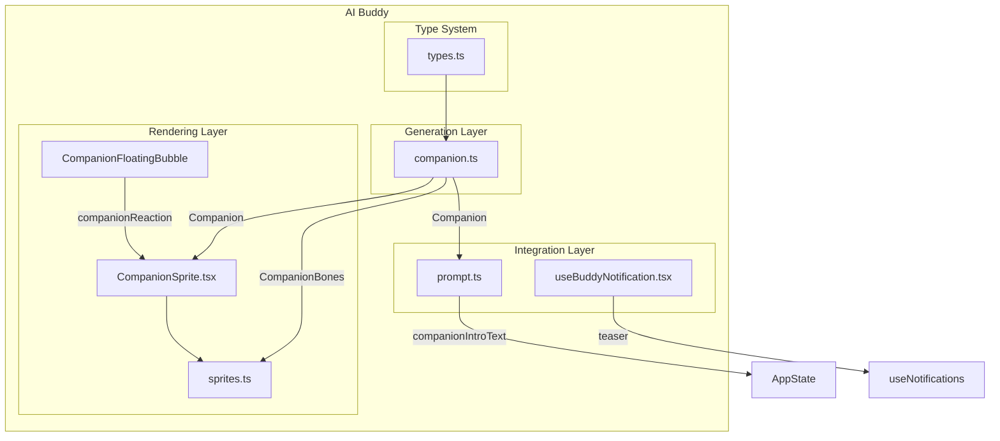
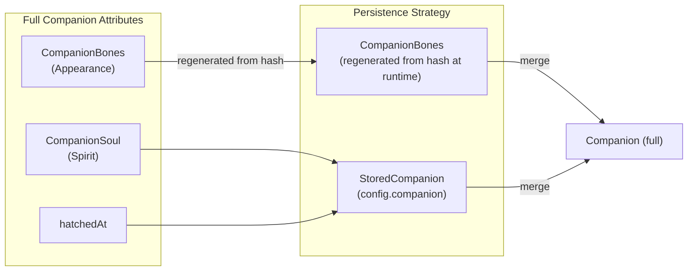
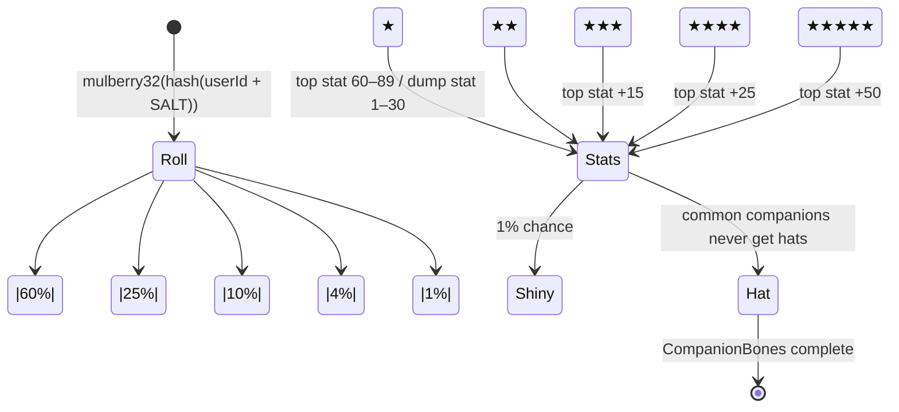
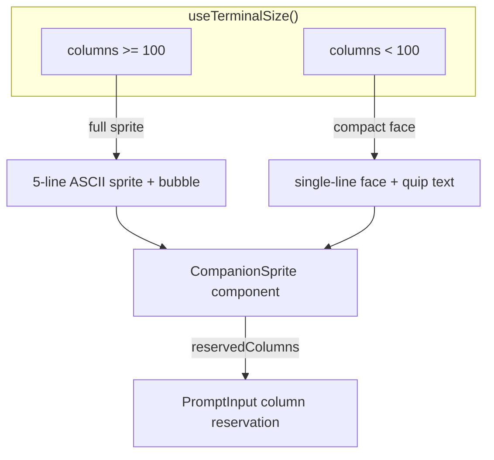

# AI Buddy (Companion)

## Overview

AI Buddy is Claude Code's playful companion feature — a companion creature rendered as ASCII art in the terminal, with randomly generated attributes (species, appearance, personality) and independent interaction capabilities. The companion expresses reactions via speech bubbles during conversation, and users can interact via `/buddy` commands.

Buddy is not a utility feature — it is a complete end-to-end subsystem with:
- **Random generation system**: deterministic companion generation based on user ID (Bones + Soul model)
- **Rendering system**: 19 ASCII art sprites with animated frames
- **React UI components**: speech bubbles, terminal column reservation, floating bubbles
- **Prompt integration**: companion intro text injected into system prompt
- **Launch notification**: time-limited rainbow teaser (April 1-7, 2026)

## Submodules

| Module | Description | Doc |
|--------|-------------|-----|
| [Companion Roll System](companion.md) | Deterministic generation, attribute calculation, caching | [companion.md](companion.md) |
| [Sprites Rendering](sprites.md) | 19 ASCII art species, animation frames, face rendering | [sprites.md](sprites.md) |
| [CompanionSprite UI](companion-sprite-ui.md) | React component, bubbles, animation timer | [companion-sprite-ui.md](companion-sprite-ui.md) |
| [Buddy Notifications](buddy-notifications.md) | Rainbow teaser, `/buddy` trigger position detection | [buddy-notifications.md](buddy-notifications.md) |

## Architecture Position



## Core Concepts

### Bones vs. Soul Separation Model

Buddy's persistence model splits a companion into two independent dimensions:



| Dimension | Contents | Persistence | Generation |
|-----------|---------|-------------|-----------|
| **Bones** (appearance) | rarity, species, eye, hat, shiny, stats | **Not persisted** | `hash(userId)` deterministic at runtime |
| **Soul** (spirit) | name, personality | `config.companion` | AI model generated at hatch |
| **hatchedAt** | hatch timestamp | `config.companion` | Recorded at first hatch |

**Key design**: Bones are never persisted — regenerated from `hash(userId)` on every read. This prevents:
1. Users from editing config to reroll higher rarity
2. Companions being lost when species names change in code

### Rarity System



| Rarity | Probability | Top Stat Range | Dump Stat Range |
|--------|------------|---------------|----------------|
| common | 60% | 60–89 | 1–30 |
| uncommon | 25% | 65–89 | 1–30 |
| rare | 10% | 70–89 | 1–30 |
| epic | 4% | 80–89 | 1–30 |
| legendary | 1% | 85–89 | 1–30 |

## Interaction Capabilities

### Speech Bubble Reactions

The companion receives reaction text via `AppState.companionReaction`, displaying in a bubble beside the ASCII sprite:

```
    /\_/\
   ( o.o )  ← ASCII sprite
    > ^ <
  ┌────────┐
  │ 哇！    │  ← bubble (fades after 10s)
  │ 好厉害！ │
  └────────┘
```

### User Commands

| Command | Effect |
|---------|--------|
| `/buddy` | Show companion info (name, rarity, personality) |
| `/buddy pet` | Trigger heart animation (floating ♥ chars for 2.5s) |
| `/buddy rename <name>` | Rename companion (modifies soul) |

### Terminal Width Adaptation



## Source References

- [types.ts](/restored-src/src/buddy/types.ts)
- [companion.ts](/restored-src/src/buddy/companion.ts)
- [sprites.ts](/restored-src/src/buddy/sprites.ts)
- [CompanionSprite.tsx](/restored-src/src/buddy/CompanionSprite.tsx)
- [useBuddyNotification.tsx](/restored-src/src/buddy/useBuddyNotification.tsx)
- [prompt.ts](/restored-src/src/buddy/prompt.ts)

## Related Documents

- [Companion Roll System](companion.md)
- [Sprites Rendering](sprites.md)
- [CompanionSprite UI](companion-sprite-ui.md)
- [Buddy Notifications](buddy-notifications.md)
- [Home](../index.md)
- [System Architecture](../architecture.md)

---

*Generated by [Nium-Wiki v0.0.0](https://github.com/niuma996/nium-wiki) | 2026-04-01*
