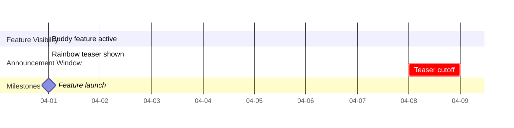
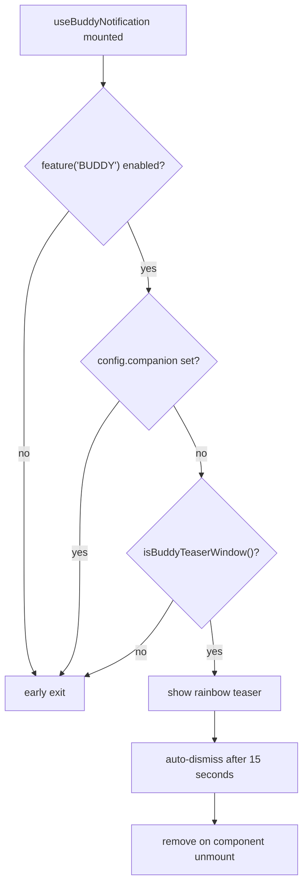
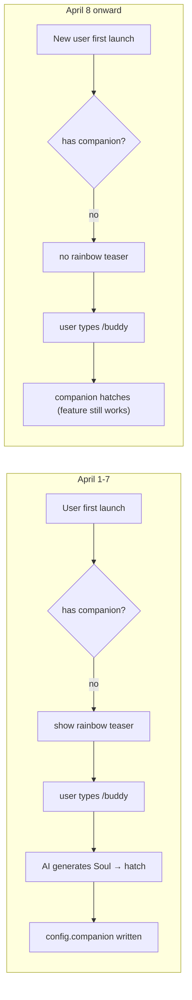

# Buddy Notifications & Teaser

## Overview

`useBuddyNotification.tsx` handles Buddy's first-launch teaser notification and `/buddy` command trigger position detection. This module is Buddy's launch and discovery entry point — a time-limited rainbow announcement (April 1-7, 2026) guides users to discover the companion feature, while `/buddy` trigger position detection enables the companion to respond to user input.

The module is compiled by Bun's React compiler (`react/compiler-runtime`) and is the only Buddy subsystem that doesn't involve companion attribute generation — pure UI only.

## API Summary

| Export | Description | Signature |
|--------|-------------|-----------|
| `isBuddyTeaserWindow()` | Whether within the rainbow teaser window | `() => boolean` |
| `isBuddyLive()` | Whether companion feature is live | `() => boolean` |
| `useBuddyNotification()` | React Hook: first-launch rainbow teaser | `() => void` |
| `findBuddyTriggerPositions(text)` | Find `/buddy` trigger positions in text | `(text: string) => Array<{ start: number; end: number }>` |

## Time Window Control



### `isBuddyTeaserWindow()` — Announcement Window

```typescript
export function isBuddyTeaserWindow(): boolean {
  // ant build variant: always true (for testing/demo)
  if (isAntBuild()) return true

  // Production: April 1-7, 2026 (local time)
  const now = new Date()
  return (
    now.getFullYear() === 2026 &&
    now.getMonth() === 3 &&       // 0-indexed: 3 = April
    now.getDate() <= 7
  )
}
```

**Uses local time, not UTC**: the announcement window is based on the user's device time, ensuring global users all see the announcement during their respective April 1-7.

**Why April 1-7?** This matches Buddy's launch window (April 1 release); the announcement is shown for one week post-launch.

### `isBuddyLive()` — Feature Launch

```typescript
export function isBuddyLive(): boolean {
  // ant build variant: always true
  if (isAntBuild()) return true

  // Production: after April 2026 (ignores day-of-month)
  const now = new Date()
  return now.getFullYear() > 2026 ||
    (now.getFullYear() === 2026 && now.getMonth() >= 3)
}
```

| Condition | `isBuddyTeaserWindow()` | `isBuddyLive()` |
|-----------|------------------------|-----------------|
| 2026-04-01 ~ 04-07 | `true` | `true` |
| 2026-04-08 ~ 04-30 | `false` | `true` |
| 2026-05-01 | `false` | `true` |
| 2026-03-15 | `false` | `false` |

## Rainbow Teaser Notification (`useBuddyNotification`)

### Trigger Conditions



### Notification Content

```typescript
// Rainbow-colored "/buddy" text
const buddyText = getRainbowColor('/buddy')  // rainbow gradient characters

// Notification title
const title = `🎉 Your new coding buddy is here!`

// Notification body
const body = `${buddyText} summon your AI companion
一起写代码，搞清楚那个 bug 在哪`

// Type
type = 'buddy-teaser'

// Priority
priority = 'immediate'

// Timeout
timeout = 15000  // 15 seconds
```

### React Hook Implementation

```typescript
export function useBuddyNotification(): void {
  const { addNotification, removeNotification } = useNotifications()

  useEffect(() => {
    // 1. Feature flag check
    if (!feature('BUDDY')) return

    // 2. Already-hatched check (config.companion exists → user already saw it)
    const { companion } = getGlobalConfig()
    if (companion) return

    // 3. Teaser window check
    if (!isBuddyTeaserWindow()) return

    // 4. Show notification
    const id = addNotification({
      type: 'buddy-teaser',
      title: '🎉 Your new coding buddy is here!',
      body: `${getRainbowColor('/buddy')} summon your AI companion`,
      immediate: true,
      timeout: 15000,
    })

    // 5. Cleanup: remove notification
    return () => removeNotification(id)
  }, [])  // empty deps — runs once on mount only
}
```

### Notification Effect

When a user first launches Claude Code (no companion hatched yet, within the teaser window), they see a rainbow-gradient "/buddy" prompt in the notification area. Typing or clicking `/buddy` summons the companion.

## `/buddy` Command Position Detection

```typescript
export function findBuddyTriggerPositions(
  text: string,
): Array<{ start: number; end: number }> {
  // Match /buddy at word boundary
  const regex = /\/buddy\b/g
  const positions: Array<{ start: number; end: number }> = []

  let match: RegExpExecArray | null
  while ((match = regex.exec(text)) !== null) {
    positions.push({
      start: match.index,
      end: match.index + match[0].length,
    })
  }

  return positions
}
```

### Usage Scenario

```typescript
import { findBuddyTriggerPositions } from './buddy/useBuddyNotification'

// Input handler detects if user is typing /buddy
function handleInput(text: string) {
  const positions = findBuddyTriggerPositions(text)

  if (positions.length > 0) {
    // Highlight /buddy command word
    for (const { start, end } of positions) {
      highlightRange(start, end, 'buddy-command')
    }
  }

  // If user fully typed /buddy (enter to submit), trigger hatch
  if (text.trim() === '/buddy') {
    hatchCompanion()
  }
}
```

### Match Examples

| Input Text | Match Result |
|-----------|-------------|
| `/buddy pet` | `[{ start: 0, end: 5 }]` |
| `try /buddy rename sparky` | `[{ start: 4, end: 9 }]` |
| `/buddybug` | no match (`\b` requires word boundary) |
| `my/buddyfriend` | no match (`\b` requires word boundary) |

## Launch Timeline Design



After the teaser window closes (April 8), the feature remains functional — the only difference is the first-launch guidance notification is no longer shown.

## Design Decisions

### Why a Notification Instead of a Modal?

Using the notification system instead of a modal preserves Claude Code's REPL interaction model. Notifications appear in the screen corner non-blocking; users can continue using the CLI without interruption.

### Why `\b` Word Boundary?

Ensures `/buddy` isn't incorrectly highlighted as part of `/buddybug` or `/buddy_something`. The word boundary `\b` matches only when `/buddy` is a standalone command word.

### Ant Build Variant Always Passes

The `isAntBuild()` check ensures the feature is always available in test/demo builds regardless of date, facilitating development and demos.

## Source References

- [useBuddyNotification.tsx](/src/buddy/useBuddyNotification.tsx)
- [prompt.ts](/src/buddy/prompt.ts) — companion intro text injection

## Related Documents

- [AI Buddy Overview](_index.md)
- [CompanionSprite UI](companion-sprite-ui.md)
- [Buddy Prompt Integration](buddy-prompt.md)

---

*Generated by [Nium-Wiki v0.0.0](https://github.com/niuma996/nium-wiki) | 2026-04-01*
