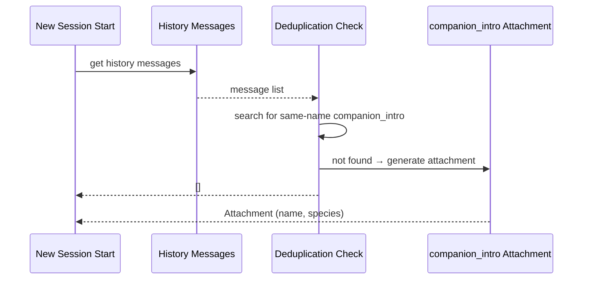

# Buddy Prompt Integration

## Overview

`prompt.ts` handles Buddy's integration with the Claude Code system prompt via two mechanisms: generating a companion description text block (for the system prompt) and producing a `companion_intro` attachment message (for first-hatch introductions).

These two mechanisms serve different purposes: the former lets the AI understand the companion's existence and behavioral norms; the latter provides visual guidance on first hatch.

## API Summary

| Function | Description | Signature |
|----------|-------------|-----------|
| `companionIntroText(name, species)` | Generates companion system prompt text | `(name: string, species: string) => string` |
| `getCompanionIntroAttachment(messages)` | Gets companion intro attachment (deduped) | `(messages?: Message[]) => Attachment[]` |

## Companion System Prompt Text

```typescript
export function companionIntroText(name: string, species: string): string {
  return `
## Your Coding Companion

You have a cute coding companion **${name}** (${species}) watching your conversation.

Companion behavior rules:
- It is an independent observer, interacting with you via speech bubbles
- When the user directly addresses it by name, give a brief reaction (one line or less)
- Do not explain "I am not ${name}" or similar denials
- Do not speak for the companion or describe what the companion would say
- Stay quiet when the user is dealing with complex problems — do not interrupt
`
}
```

### Injection Point

This text block is appended to the end of Claude Code's system prompt, after other instructions, ensuring the AI perceives the companion's presence in every conversation turn.

### Behavioral Constraint Design

| Constraint | Purpose |
|-----------|---------|
| Don't speak for the companion | Prevents AI from roleplaying the companion, which would confuse the conversation |
| Don't deny "I am not xxx" | Prevents the AI from producing meta-cognition reactions |
| Brief reactions (one line or less) | The companion is an observer, not a conversation participant |
| Stay quiet during complex work | Avoid interrupting the user's primary workflow |

## Companion Intro Attachment



```typescript
export function getCompanionIntroAttachment(
  messages: Message[] | undefined,
): Attachment[] {
  // 1. Feature flag check
  if (!feature('BUDDY')) return []
  if (isMuted()) return []

  const companion = getCompanion()
  if (!companion) return []

  // 2. Scan history for deduplication
  if (messages) {
    const alreadyAnnounced = messages.some(msg => {
      const content = msg.message?.content
      if (!Array.isArray(content)) return false
      return content.some(
        block =>
          block.type === 'attachment' &&
          (block as any).attachment?.type === 'companion_intro' &&
          (block as any).attachment?.name === companion.name,
      )
    })
    if (alreadyAnnounced) return []
  }

  // 3. Generate intro attachment
  return [{
    type: 'companion_intro',
    name: companion.name,
    species: companion.species,
  }]
}
```

### Attachment Format

```typescript
type CompanionIntroAttachment = {
  type: 'companion_intro'
  name: string        // companion name
  species: string    // species name (e.g., 'duck')
}
```

### Deduplication Mechanism

Within a single Claude Code session, a companion is introduced via `companion_intro` attachment exactly once. If the user exits and re-enters the same session, they won't see the intro again — because `companion.name` is already present in the history messages.

## Relationship with CompanionSprite

```
prompt.ts (prompt integration)
    │
    ├── companionIntroText() ──► system prompt ──► AI aware of companion behavior norms
    │
    └── getCompanionIntroAttachment() ──► first hatch intro display
            │
            └── AppState.companionReaction ──► CompanionSprite shows bubble
```

When a companion hatches, the `companion_intro` attachment triggers `companionReaction` setting, causing the companion to display a welcome bubble beside the ASCII sprite.

## Usage Examples

### Injecting into System Prompt Construction

```typescript
import { companionIntroText } from './buddy/prompt'

function buildSystemPrompt(sdkConfig) {
  const basePrompt = renderBasePrompt(sdkConfig)

  const companion = getCompanion()
  if (companion) {
    return basePrompt + companionIntroText(companion.name, companion.species)
  }

  return basePrompt
}
```

### Checking Companion Intro in Session

```typescript
import { getCompanionIntroAttachment } from './buddy/prompt'

// Called during session initialization
const attachments = getCompanionIntroAttachment(existingMessages)
if (attachments.length > 0) {
  // Companion first intro — append to initial messages
  initialMessages.push(...attachments)
}
```

## Design Decisions

### Attachment vs. Direct Message Injection

The companion intro uses a `companion_intro` attachment rather than injecting a direct user message because:
1. Attachments are structured data — easy for UI components to recognize and render bubbles
2. It doesn't pollute conversation history (no "Your companion has hatched!" user message generated)
3. Deduplication can be implemented by checking attachment types (rather than parsing text content)

### Companion Behavior Norms in System Prompt, Not Tool Description

Companion behavior is governed via system prompt rather than tool call feedback, because the companion's "speaking" is unstructured bubble text — not suited for the tool-call framework.

## Source References

- [prompt.ts](/src/buddy/prompt.ts)
- [CompanionSprite.tsx](/src/buddy/CompanionSprite.tsx)

## Related Documents

- [AI Buddy Overview](_index.md)
- [Buddy Notifications](buddy-notifications.md)
- [CompanionSprite UI](companion-sprite-ui.md)

---

*Generated by [Nium-Wiki v0.0.0](https://github.com/niuma996/nium-wiki) | 2026-04-01*
