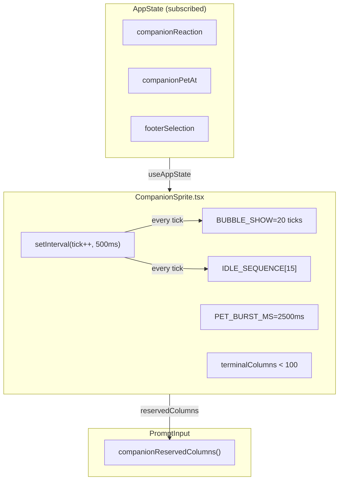
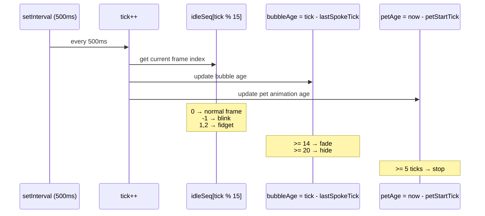
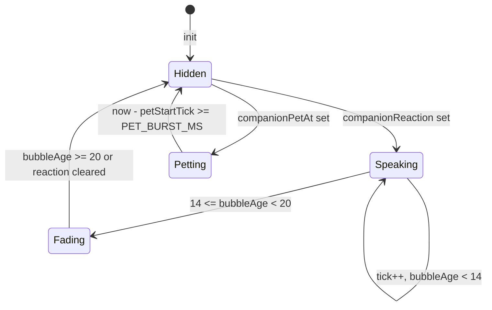
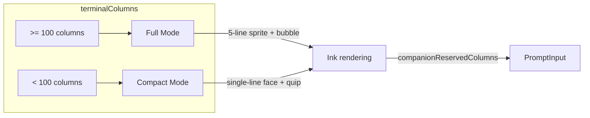
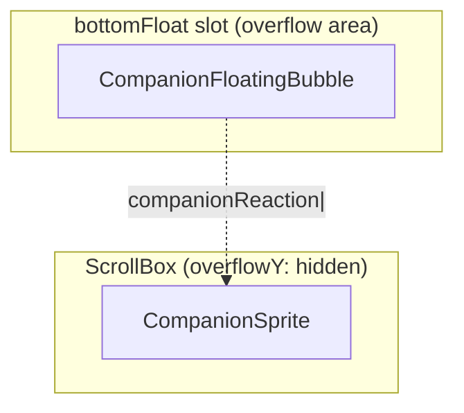

# CompanionSprite UI

## Overview

`CompanionSprite.tsx` is Buddy's core React UI component, responsible for rendering the companion's ASCII art sprite and speech bubbles in the terminal. The component handles the complete animation lifecycle: idle fidget, blinking, reaction bubbles (with fade-out), petting animation, and terminal width adaptation (full 5-line vs. compact single-line face).

The component is compiled by Bun's React compiler (`react/compiler-runtime`), using `setInterval` with a 500ms ticker to drive all animation states.

## Architecture Position



## API Summary

| Export | Description | Signature |
|--------|-------------|-----------|
| `MIN_COLS_FOR_FULL_SPRITE` | Minimum columns for full sprite | `100` |
| `companionReservedColumns()` | Columns occupied by companion | `(terminalColumns, speaking) => number` |
| `CompanionSprite` | Main sprite component | `() => React.ReactNode` |
| `CompanionFloatingBubble` | Fullscreen floating bubble component | `() => React.ReactNode` |

## Animation System

### Ticker-Driven Architecture

All animation states are derived from a monotonically increasing `tick` value — no complex state machine needed:

```typescript
const TICK_MS = 500           // ticker interval
const BUBBLE_SHOW = 20         // bubble show ticks (~10s)
const FADE_WINDOW = 6          // fade window ticks (~3s)
const PET_BURST_MS = 2500      // pet animation duration

const IDLE_SEQUENCE = [
  // 0: standing   1: fidget1   -1: blink   2: fidget2
  0, 0, 0, 0, 1, 0, 0, 0, -1, 0, 0, 2, 0, 0, 0,
]
//              ↑         ↑         ↑
//           fidget1   blink    fidget2
```



### Idle Animation Frame Mapping

| `IDLE_SEQUENCE[i]` | Meaning | Eye Handling |
|--------------------|---------|-------------|
| `0` | Standing frame | show actual eye character |
| `1` | Fidget frame 1 | show actual eye character |
| `-1` | Blink frame | eyes replaced with `-` |
| `2` | Fidget frame 2 | show actual eye character |

### Bubble Lifecycle



- **Speaking** (0–14 ticks): normal bubble, border color `success`
- **Fading** (14–20 ticks): bubble begins fading, border switches to `inactive`
- **Hidden** (> 20 ticks): bubble hidden, `bubbleAge` no longer updated

### Pet Animation

When user runs `/buddy pet`, `AppState.companionPetAt` is set to the current timestamp:

```typescript
// CompanionSprite subscribes to companionPetAt
const petStartTick = petStart.current ? tick : -1
const petAge = petStartTick >= 0 ? tick - petStartTick : -1

// when petAge >= 0: show floating hearts
// when petAge >= 5 (2500ms): stop
```

Heart characters `PET_HEARTS = ['♥', '❤', '🧡', '💛', '💚']` cycle at 500ms intervals.

### Sync-During-Render

```typescript
// Pet start time read during render, not in useEffect
const petStartTick = petStart.current ? tick : -1
```

**Why this pattern?** If the pet animation set `petStartTick = tick` in `useEffect`, the first post-pet render would already have `petAge = positive value`, skipping the first pet animation frame. Reading synchronously during render ensures the first render already shows the pet animation.

## Terminal Width Adaptation



### Full Mode (≥ 100 columns)

```
    /\_/\          ┌────────────────────┐
   ( o.o )  ← 5    │ Hello! Need help?  │  ← bubble
    > ^ <   lines  └────────────────────┘
   /|   |\
```

### Compact Mode (< 100 columns)

```
  (✦> Quackers
```

## Bubble Component (`SpeechBubble`)

```typescript
// private component, exported within CompanionSprite
function SpeechBubble({
  text,
  fade,
  tail,
}: {
  text: string
  fade: boolean
  tail: 'right' | 'down'
}): React.ReactNode
```

| Property | Description |
|----------|-------------|
| `text` | bubble text content |
| `fade` | fade state (switches border color) |
| `tail` | bubble tail direction (`right`=horizontal, `down`=diagonal) |

**Auto-wrap**: bubble text wraps at 30 characters (`wrap(text, 30)`).

## Column Reservation (`companionReservedColumns`)

```typescript
export function companionReservedColumns(
  terminalColumns: number,
  speaking: boolean,
): number {
  // feature off / no companion / muted / terminal too narrow → 0
  if (!feature('BUDDY')) return 0
  if (!companion) return 0
  if (isMuted) return 0
  if (terminalColumns < 60) return 0

  // Width: name + sprite width + padding + bubble (if speaking)
  const spriteWidth = stringWidth(buddyName) + 12
  const padding = 3
  const bubble = speaking && !fullscreen ? BUBBLE_WIDTH : 0

  return spriteWidth + padding + bubble
}
```

`PromptInput` calls this to shrink the text input area accordingly, preventing the companion and bubble from being overlaid by text.

## Fullscreen Floating Bubble (`CompanionFloatingBubble`)

In fullscreen mode (`isFullscreenActive()`), the bubble renders in a separate `bottomFloat` slot beyond the `overflowY: hidden` `ScrollBox`:



This lets the bubble extend into the lower region without being clipped by the `ScrollBox`'s `overflow: hidden`.

## Usage Examples

### Render Companion Component

```tsx
import { CompanionSprite } from './buddy/CompanionSprite'
import { Box } from 'ink'

function BuddyArea() {
  return (
    <Box>
      <CompanionSprite />
    </Box>
  )
}
```

### Get Companion Column Footprint

```typescript
import { companionReservedColumns, MIN_COLS_FOR_FULL_SPRITE } from './buddy/CompanionSprite'
import { useTerminalSize } from './hooks/useTerminalSize'

function InputArea() {
  const { columns } = useTerminalSize()
  const { companionReaction } = useAppState()
  const speaking = !!companionReaction

  const reserved = companionReservedColumns(columns, speaking)

  return (
    <Box width={columns - reserved}>
      <TextInput />
    </Box>
  )
}
```

### Trigger Pet Animation

```typescript
import { useSetAppState } from './state/AppState'

function PetBuddy() {
  const setAppState = useSetAppState()
  // user runs /buddy pet
  setAppState({ companionPetAt: Date.now() })
  // CompanionSprite automatically detects and shows 5-frame heart animation
}
```

## Design Decisions

### Tick Value vs. React State

All animation states (frame index, bubble age, pet age) are derived from `tick` rather than maintained as independent state variables. This avoids synchronization issues between multiple `useState` calls (e.g., when bubble just disappeared and pet animation starts immediately, no intermediate frames appear).

### Ink `Box` vs. Standard React

The entire Claude Code UI uses Ink (a React-like terminal UI library) instead of standard React DOM. Ink's `<Box>` provides flexbox layout; `<Text>` provides styled text.

### Fullscreen Bubble Separate Mount

In fullscreen mode, the bubble needs to extend beyond the parent `ScrollBox`'s clipping boundary. Rendering in the `bottomFloat` slot is Ink's standard layout pattern for this, avoiding `z-index` or DOM reflow tricks.

## Source References

- [CompanionSprite.tsx](/src/buddy/CompanionSprite.tsx)

## Related Documents

- [AI Buddy Overview](_index.md)
- [Companion Roll System](companion.md)
- [Sprites Rendering](sprites.md)
- [Buddy Notifications](buddy-notifications.md)

---

*Generated by [Nium-Wiki v0.0.0](https://github.com/niuma996/nium-wiki) | 2026-04-01*
