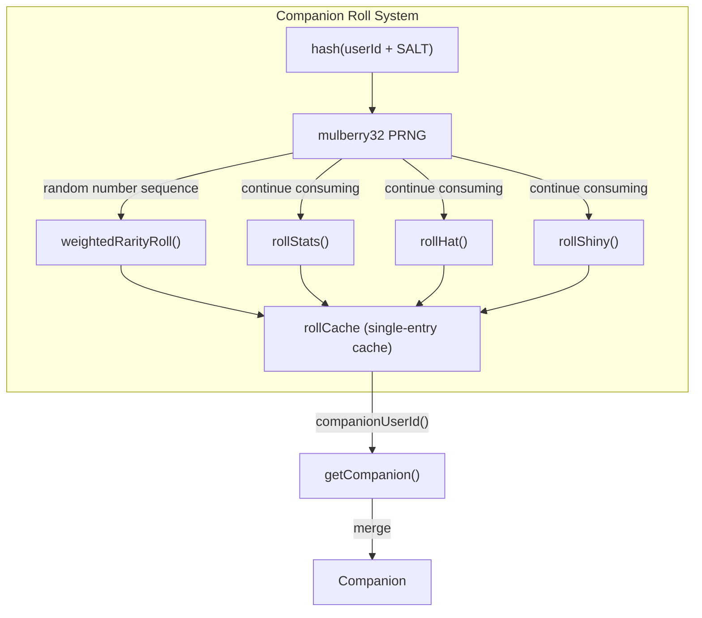

# Companion Roll System

## Overview

The Companion roll system is Buddy's core random generation engine. Based on a deterministic hash of the user ID, it generates unique companion attributes (Bones) for every user. It uses a Bones/Soul separation architecture: appearance attributes (Bones) are regenerated in real-time from `hash(userId)` and are never persisted; soul attributes (Soul) are generated by the AI model at hatch and persisted.

Core objective: prevent users from editing config files to reroll for higher rarity, while ensuring reliable companion state reconstruction on every session.

## Architecture Position



## API Summary

| Function | Description | Signature |
|----------|-------------|-----------|
| `roll(userId)` | Deterministic roll (uses current user ID) | `(userId: string) => Roll` |
| `rollWithSeed(seed)` | Deterministic roll (uses custom seed) | `(seed: string) => Roll` |
| `companionUserId()` | Gets current companion user ID | `() => string` |
| `getCompanion()` | Full companion (Bones + Soul merged) | `() => Companion \| undefined` |

## Data Types

### Roll

```typescript
export type Roll = {
  bones: CompanionBones   // complete appearance attributes
  inspirationSeed: number // random seed for AI soul generation
}
```

### CompanionBones (runtime-generated, not persisted)

```typescript
export type CompanionBones = {
  rarity: Rarity          // 'common' | 'uncommon' | 'rare' | 'epic' | 'legendary'
  species: Species        // 'duck' | 'cat' | 'dragon' | ... (19 species)
  eye: Eye               // '·' | '✦' | '×' | '◉' | '@' | '°'
  hat: Hat               // 'none' | 'crown' | 'tophat' | ...
  shiny: boolean         // shiny variant (1% chance)
  stats: Record<StatName, number>  // 5 personality dimensions
}
```

### StoredCompanion (persisted)

```typescript
export type StoredCompanion = {
  name: string        // companion name
  personality: string // companion personality (AI-generated)
  hatchedAt: number  // hatch timestamp
}
```

## Core Algorithms

### 1. Hash + Seeded PRNG

```typescript
// Mulberry32 — fast deterministic PRNG, 32-bit output
function mulberry32(seed: number): () => number {
  return function () {
    let t = (seed += 0x6d2b79f5)
    t = Math.imul(t ^ (t >>> 15), t | 1)
    t ^= t + Math.imul(t ^ (t >>> 7), t | 61)
    return ((t ^ (t >>> 14)) >>> 0) / 4294967296
  }
}

// String hash (prefers Bun.hash)
function hashString(str: string): number {
  if (typeof Bun !== 'undefined' && Bun.hash) {
    return Bun.hash(str) >>> 0  // unsigned 32-bit
  }
  return fnv1a(str)  // FNV-1a fallback
}
```

**Why not `Math.random()`?** Determinism is required: the same userId must produce the same companion across sessions and machines.

### 2. Weighted Rarity Roll

```typescript
const RARITY_WEIGHTS = {
  common: 60,
  uncommon: 25,
  rare: 10,
  epic: 4,
  legendary: 1,
} as const
// Total: 100

function weightedRarityRoll(rand: () => number): Rarity {
  const total = 100
  let r = Math.floor(rand() * total)  // [0, 99]
  for (const [rarity, weight] of Object.entries(RARITY_WEIGHTS)) {
    r -= weight
    if (r < 0) return rarity as Rarity
  }
  return 'common'  // fallback
}
```

### 3. Stat Point Allocation

```typescript
function rollStats(rarity: Rarity, rand: () => number): Record<StatName, number> {
  const floor = STAT_FLOORS[rarity]  // common=5, legendary=50
  const topMin = 60 + STAT_BONUSES[rarity]  // common=60, epic=80, legendary=85
  const topMax = 89 + STAT_BONUSES[rarity]

  const stats = {} as Record<StatName, number>

  // 1. Randomly pick one top stat
  const topIndex = Math.floor(rand() * 5)
  const topStat = STAT_NAMES[topIndex]
  stats[topStat] = topMin + Math.floor(rand() * (topMax - topMin + 1))

  // 2. Randomly pick one dump stat
  const dumpIndex = (topIndex + 1 + Math.floor(rand() * 4)) % 5
  const dumpStat = STAT_NAMES[dumpIndex]
  stats[dumpStat] = 1 + Math.floor(rand() * 30)  // [1, 30]

  // 3. Remaining 3 stats: base floor + random perturbation
  for (const stat of STAT_NAMES) {
    if (stat in stats) continue
    stats[stat] = floor + Math.floor(rand() * (50 - floor))
  }

  return stats
}
```

**Example (legendary):**
- Top stat DEBUGGING = 85 + 0~4 = **85–89**
- Dump stat PATIENCE = **1–30**
- Other stats WISDOM/SNARK/CHAOS = **50–99**

### 4. Hat Assignment

```typescript
function rollHat(rarity: Rarity, rand: () => number): Hat {
  // common companions never get hats
  if (rarity === 'common') return 'none'

  // Other rarities: random assignment
  const index = Math.floor(rand() * HATS.length)
  return HATS[index]
}
```

### 5. Shiny Roll

```typescript
function rollShiny(rand: () => number): boolean {
  return rand() < 0.01  // 1% chance, independent of rarity
}
```

## Caching Strategy

```typescript
let rollCache: { key: string; value: Roll } | null = null

export function roll(userId: string): Roll {
  const key = userId + SALT

  // Single-entry cache: hit returns immediately
  if (rollCache?.key === key) return rollCache.value

  const seed = hashString(key)
  const rand = mulberry32(seed)

  // Perform roll logic...
  const bones = { rarity, species, eye, hat, shiny, stats }
  const inspirationSeed = Math.floor(rand() * 0xffffff)

  const value = { bones, inspirationSeed }
  rollCache = { key, value }  // write to cache

  return value
}
```

**Why cache?** Three hot paths call `roll()` repeatedly:
1. `CompanionSprite.tsx` — 500ms animation ticker calls every tick
2. `PromptInput` — called on every keystroke
3. Per-turn observer calls

Without caching, every 500ms would regenerate the full companion state, wasting CPU.

**SALT defense**: `SALT = 'friend-2026-401'` prevents rainbow table attacks — attackers cannot use a userId list to look up companions directly.

## `getCompanion()` Merge Logic

```typescript
export function getCompanion(): Companion | undefined {
  // 1. Read persisted Soul
  const stored = getGlobalConfig().companion as StoredCompanion | undefined
  if (!stored) return undefined  // not hatched yet

  // 2. Generate Bones in real-time (deterministic)
  const { bones } = roll(companionUserId())

  // 3. Merge (bones fields override any stale fields in old-format config)
  return { ...stored, ...bones } as Companion
}
```

**Why `...bones` after `...stored`?** Ensures any residual bones fields in old-format configs are overwritten by the correct freshly-generated values.

## Usage Examples

### Get Companion (Basic)

```typescript
import { getCompanion } from './buddy/companion'

const buddy = getCompanion()
if (buddy) {
  console.log(`${buddy.name} (${buddy.rarity} ${buddy.species})`)
  // → "Quackers (rare duck)"
  console.log('Stats:', buddy.stats)
  // → { DEBUGGING: 73, PATIENCE: 12, CHAOS: 61, WISDOM: 88, SNARK: 44 }
}
```

### Display Companion with Rarity

```typescript
import { getCompanion } from './buddy/companion'
import { RARITY_STARS, RARITY_COLORS } from './buddy/types'

const buddy = getCompanion()
if (buddy) {
  const stars = RARITY_STARS[buddy.rarity]
  const hat = buddy.hat === 'none' ? '' : `wearing ${buddy.hat}`
  const shiny = buddy.shiny ? '✨ ' : ''

  console.log(`${shiny}${stars} ${buddy.name} — ${buddy.species} ${hat}`)
  console.log(`Eyes: ${buddy.eye}`)
  console.log(`Personality: ${buddy.personality}`)
}
```

### Debug Roll with Custom Seed

```typescript
import { rollWithSeed } from './buddy/companion'

// Use custom seed for debugging
const result = rollWithSeed('test-seed-123')
console.log(result.bones.rarity)  // deterministic output
```

## Design Decisions

### Why Not UUID as Companion Identifier?

UUIDs cannot prevent user forgery. If `companionId: uuid` were stored in config, users could generate new UUIDs to reroll. Using `hash(userId)` ensures each Claude Code account has exactly one companion, impossible to manipulate via config.

### Why inspirationSeed?

Soul (name + personality) is generated by the AI model, not deterministically by code. To maintain reproducibility and enable testing, the system generates an `inspirationSeed` during the roll that the AI can use as a random seed for injecting creativity — rather than actually calling `Math.random()`.

### Rarity Positively Correlates with Stats

Legendary companions don't just look rarer — their top stat floor is higher too (85 vs 60). This makes legendary genuinely "stronger" in gameplay terms, not just visually different.

## Source References

- [companion.ts](/src/buddy/companion.ts)
- [types.ts](/src/buddy/types.ts)

## Related Documents

- [AI Buddy Overview](_index.md)
- [Sprites Rendering](sprites.md)
- [CompanionSprite UI](companion-sprite-ui.md)

---

*Generated by [Nium-Wiki v0.0.0](https://github.com/niuma996/nium-wiki) | 2026-04-01*
