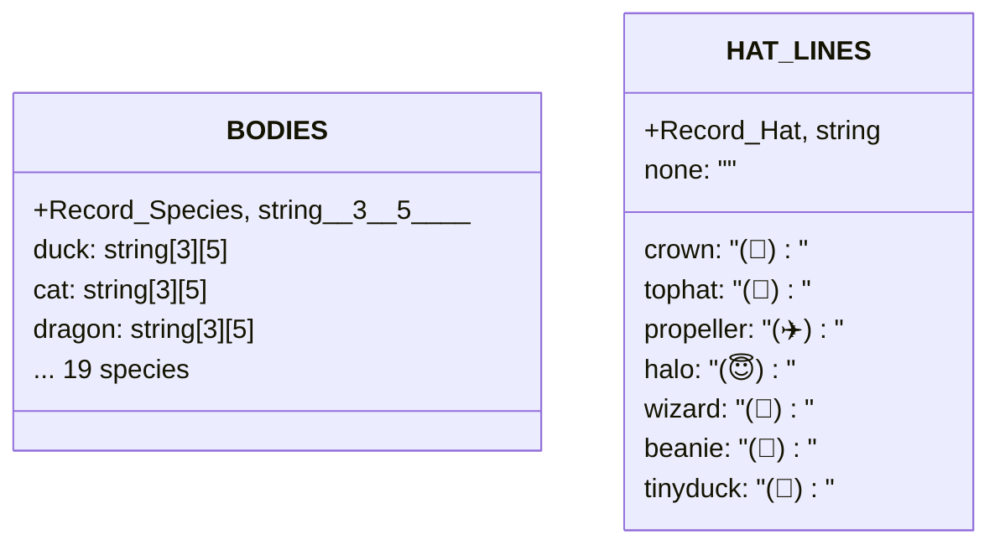
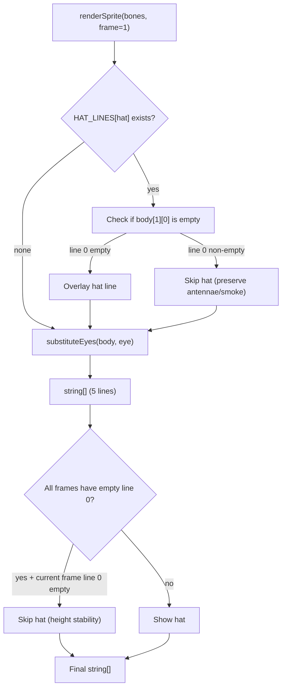

# Sprites Rendering

## Overview

`sprites.ts` is Buddy's ASCII art rendering engine, responsible for converting companion appearance attributes (Bones) into terminal-displayable string arrays. Each species has 3 sprite frames supporting idle fidget animation, with `{E}` placeholder templates enabling eye character parameterization. The system also handles hat overlays and compact terminal face rendering.

## API Summary

| Function | Description | Signature |
|----------|-------------|-----------|
| `renderSprite(bones, frame)` | Renders full sprite (5 ASCII lines) | `(bones: CompanionBones, frame?: number) => string[]` |
| `renderFace(bones)` | Renders compact face (single line, for narrow terminals) | `(bones: CompanionBones) => string` |
| `spriteFrameCount(species)` | Returns animation frame count for a species | `(species: Species) => number` |

## Sprite Data Structures



## Rendering Flow

### `renderSprite()` Full Flow



```typescript
// Pseudocode showing core logic
export function renderSprite(bones: CompanionBones, frame = 0): string[] {
  // 1. Get species' 3-frame sprite (5 lines per frame)
  const bodyFrames = BODIES[bones.species]

  // 2. If hat exists and this frame's line 0 is empty → overlay hat
  const hatLine = HAT_LINES[bones.hat]
  const frameBody = bodyFrames[frame]

  // 3. If ALL frames have empty line 0 and current frame line 0 is empty → skip hat
  const hasContentOnLine0 = bodyFrames.some(f => f[0].trim() !== '')
  if (!hasContentOnLine0 && frameBody[0] === '') {
    // Skip hat overlay to maintain height consistency
  }

  // 4. Replace {E} → eye character
  return frameBody.map(line => line.replace('{E}', bones.eye))
}
```

## Animation Frames and Idle Motion

All species have 3 animation frames. Frames are controlled via the `IDLE_SEQUENCE` array:

```
IDLE_SEQUENCE = [0, 0, 0, 0, 1, 0, 0, 0, -1, 0, 0, 2, 0, 0, 0]
                      ↑          ↑        ↑
                   fidget1     blink    fidget2
```

`-1` means blink (show frame 0 but replace eyes with `-`):

```typescript
// Blink effect implementation
function getEyeForFrame(baseEye: Eye, frameIndex: number): string {
  if (frameIndex === -1) return '-'  // blink
  return baseEye  // normal eyes
}
```

### Frame Content Structure

Each frame is exactly 5 lines of ASCII art. Example (duck):

```
Frame 0 (standing):      Frame 1 (fidget):     Frame 2 (exaggerated):
    (\-.-)                  (^-.-)                (\`-' )
    /_('_)\                /_('_)\               /_('_)\
     |  |                   |  |                  |  | |
    _|  |_                 _|  |_                _|  |_|
```

All sprites share the `{E}` placeholder, substituted with the companion's `eye` attribute.

## Hat System

### Hat Definitions

| Hat | ASCII Overlay Line | Applicable Condition |
|-----|-------------------|---------------------|
| none | none | common companions fixed to no hat |
| crown | `(👑)` | overlaid when line 0 is empty |
| tophat | `(🎩)` | overlaid when line 0 is empty |
| propeller | `(✈️)` | overlaid when line 0 is empty |
| halo | `(😇)` | overlaid when line 0 is empty |
| wizard | `(🔮)` | overlaid when line 0 is empty |
| beanie | `(🧢)` | overlaid when line 0 is empty |
| tinyduck | `(🐤)` | overlaid when line 0 is empty |

### Height Stability

Some sprite frames have content on line 0 (smoke, antennae, etc.). Hat overlay only applies when line 0 is empty, preventing decoration overlap. If one frame has content on line 0 while others don't, the hat is skipped to prevent the sprite from jumping in height during animation.

## Compact Face Rendering

Narrow terminals (< 100 columns) cannot fit 5-line sprites, collapsing to a single-line compact face:

```typescript
export function renderFace(bones: CompanionBones): string {
  // Species-specific mouth shapes
  // duck:     "(${eye}>"
  // cat:      "=${eye}ω${eye}="
  // turtle:   "[${eye}_${eye}]"
  // dragon:   "=${eye}>_/${eye}="
  // ghost:    " ${eye}~${eye} "
  // ...
}
```

## Usage Examples

### Render Companion Sprite

```typescript
import { renderSprite } from './buddy/sprites'
import { getCompanion } from './buddy/companion'

const buddy = getCompanion()
if (buddy) {
  const lines = renderSprite(buddy, 0)  // frame 0 (standing)
  console.log(lines.join('\n'))
}
```

Output example (duck, eye=✦, no hat):
```
    (\-.-)
    /_('_)\
     |  |
    _|  |_
```

### Print Full Companion with Rarity

```typescript
import { renderSprite } from './buddy/sprites'
import { RARITY_STARS } from './buddy/types'
import { getCompanion } from './buddy/companion'

const buddy = getCompanion()
if (buddy) {
  const art = renderSprite(buddy, 0)
  const stars = RARITY_STARS[buddy.rarity]
  const hat = buddy.hat === 'none' ? '' : ` + ${buddy.hat} hat`

  console.log(`${stars} ${buddy.name} the ${buddy.species}${hat}`)
  console.log(art.join('\n'))
}
```

### Animation Loop

```typescript
import { renderSprite } from './buddy/sprites'
import { getCompanion } from './buddy/companion'

const buddy = getCompanion()!
const FRAMES = [0, 0, 0, 0, 1, 0, 0, 0, -1, 0, 0, 2, 0, 0, 0]

let tick = 0
setInterval(() => {
  const frameIdx = FRAMES[tick % FRAMES.length]
  const art = renderSprite(buddy, frameIdx)
  console.clear()
  console.log(art.join('\n'))
  tick++
}, 500)
```

## Species List (19 Species)

| Species | Special Mouth | Frame Description |
|---------|--------------|-----------------|
| duck | `(${eye}>` | typical duck bill |
| goose | `${eye}>` | simplified duck bill |
| blob | `${eye}~${eye}` | slime face |
| cat | `${eye}ω${eye}` | cat mouth |
| dragon | `${eye}>_/${eye}` | dragon mouth |
| octopus | `${eye}¤${eye}` | octopus |
| owl | `${eye}◉${eye}` | owl |
| penguin | `${eye}へ${eye}` | penguin beak |
| turtle | `[${eye}_${eye}]` | turtle |
| snail | `${eye}` | snail |
| ghost | `${eye}~${eye}` | ghost |
| axolotl | `${eye}<${eye}` | axolotl |
| capybara | `${eye}~${eye}` | capybara |
| cactus | `${eye}T${eye}` | cactus |
| robot | `${eye}[ ]${eye}` | robot |
| rabbit | `${eye}ε${eye}` | rabbit |
| mushroom | `${eye}_${eye}` | mushroom |
| chonk | `${eye}///${eye}` | chonky cat |

## Design Decisions

### `{E}` Placeholder vs. Full Sprite Arrays

Each species needs 3 frames × 5 lines = 15 strings, plus 6 eye types = 90 variants. Defining 90 sprites in code would be extremely bloated. Using `{E}` placeholders reduces each frame to just 5 lines regardless of eye type count, cutting code size by ~90%.

### String Concatenation over Template Literals

Sprites use string concatenation rather than template literals primarily to avoid species name literals appearing in the compiled bundle (complementing the `String.fromCharCode` anti-canary measures in `types.ts`).

## Source References

- [sprites.ts](/src/buddy/sprites.ts)

## Related Documents

- [AI Buddy Overview](_index.md)
- [Companion Roll System](companion.md)
- [CompanionSprite UI](companion-sprite-ui.md)

---

*Generated by [Nium-Wiki v0.0.0](https://github.com/niuma996/nium-wiki) | 2026-04-01*
