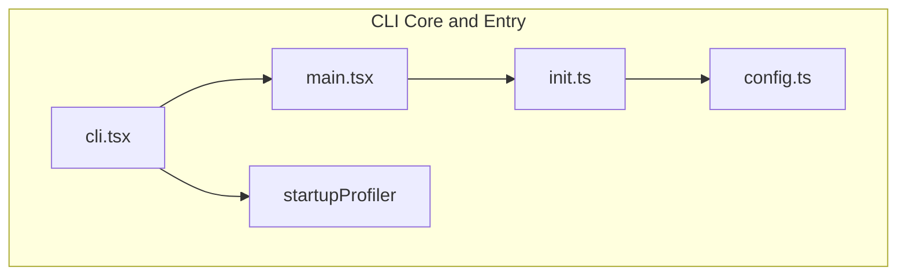

# CLI Core and Entry

## Overview

The CLI Core and Entry module is the startup layer of Claude Code, responsible for process initialization, command-line argument parsing, and fast-path optimization. The module uses a **dynamic import strategy** to achieve zero-module loading for version checks, ensuring that fast paths like `--version` have minimal startup time.

The CLI layer contains no business logic — its sole purpose is **routing**: directing execution to the correct subsystem (full CLI, Remote Control Bridge, Daemon process, etc.) based on command-line arguments.

## Submodules

| Module | Description | Document |
|--------|-------------|----------|
| [CLI Entry Points](entrypoints.md) | Entry files and argument routing | [entrypoints.md](entrypoints.md) |
| [Startup and Fast Paths](startup.md) | Dynamic imports, profiler, performance optimization | [startup.md](startup.md) |

## Architecture Position



## Core Design Principles

### 1. Dynamic Import

The CLI entry file [cli.tsx](/restored-src/src/entrypoints/cli.tsx) uses `await import()` for all heavy modules. This ensures the `--version` fast path loads no modules at all.

```typescript
// Fast path: version check — zero imports
if (args.length === 1 && (args[0] === '--version' || args[0] === '-v')) {
  console.log(`${MACRO.VERSION} (Claude Code)`)
  return
}

// Slow path: full CLI
const { main: cliMain } = await import('../main.js')
await cliMain()
```

### 2. Conditional Compilation (Feature Flags)

`feature('FEATURE_NAME')` enables build-time feature switches. Internal builds (Ant) include experimental features; external builds eliminate this code via DCE (Dead Code Elimination).

### 3. Startup Profiling

[startupProfiler.ts](/restored-src/src/utils/startupProfiler.ts) records checkpoints at critical module-loading points. `profileCheckpoint()` marks timestamps throughout the startup process.

### 4. Environment Adaptation

The CLI layer adapts behavior to the runtime environment (local, Remote Container, BYOC, etc.), such as setting larger Node.js heap memory in CCR environments (16GB container → `--max-old-space-size=8192`).

## Entry Command Routing Table

| Command / Argument | Target Module | Description |
|-------------------|--------------|-------------|
| `--version` / `-v` | Direct output | Zero-import fast path |
| `--dump-system-prompt` | prompts.js | Output system prompt and exit |
| `remote-control` / `bridge` | bridgeMain.ts | Start Remote Control Bridge |
| `daemon` | daemon/main.ts | Start Daemon supervisor process |
| `ps` / `logs` / `attach` / `kill` | cli/bg.js | Background session management |
| `new` / `list` / `reply` | templateJobs.js | Template job commands |
| `environment-runner` | environment-runner/main.js | BYOC runner |
| `--tmux --worktree` | worktree.js | Tmux worktree fast path |
| No special args | main.tsx | Full interactive CLI |

## Key Types

| Type | Definition Location | Description |
|------|-------------------|-------------|
| `profileCheckpoint` | [startupProfiler.ts](/restored-src/src/utils/startupProfiler.ts) | Startup profiling checkpoint function |
| `feature` | bun:bundle | Conditional compilation feature switch macro |
| `enableConfigs` | [config.ts](/restored-src/src/utils/config.ts) | Enable configuration reading |

## Related Documents

- [Architecture Overview](../architecture.md)
- [Home](../index.md)
- [CLI Entry Points](entrypoints.md)
- [Startup and Fast Paths](startup.md)

---

*Generated by [Nium-Wiki v0.0.0](https://github.com/niuma996/nium-wiki) | 2026-03-31*
