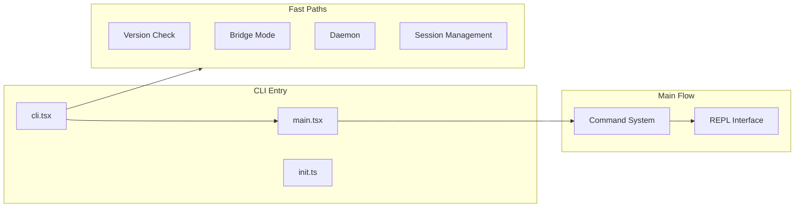
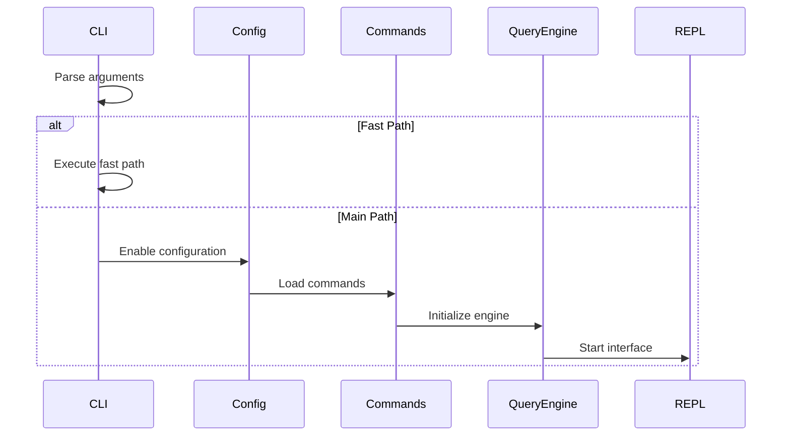

# CLI Entry

## Overview

The CLI entry module handles command-line argument parsing, fast-path optimization, and application startup.

## Architecture Position



## Entry Files

| File | Description | Responsibilities |
|------|-------------|------------------|
| [cli.tsx](/restored-src/src/entrypoints/cli.tsx) | CLI main entry | Argument parsing, fast-path dispatch |
| [main.tsx](/restored-src/src/main.tsx) | Main flow | Full CLI initialization |
| [init.ts](/restored-src/src/entrypoints/init.ts) | Initialization | Config loading and environment setup |

## Fast-Path Optimization

Claude Code uses dynamic import strategies for fast-path optimization, minimizing module loading at startup.

### Version Check

```bash
claude --version
claude -v
```

Zero module loading, directly outputs the inlined version number.

### Bridge Mode

```bash
claude remote-control
claude rc
claude bridge
```

Starts the bridge service, allowing remote control.

### Daemon

```bash
claude daemon
```

Starts a long-running daemon process.

### Session Management

```bash
claude ps
claude logs <id>
claude attach <id>
claude kill <id>
```

Manages background sessions.

### Template Commands

```bash
claude new <template>
claude list
claude reply
```

Template job management.

## Conditional Compilation

Uses `feature()` function for build-time feature switches:

| Feature | Description |
|---------|-------------|
| `BRIDGE_MODE` | Bridge mode support |
| `DAEMON` | Daemon support |
| `BG_SESSIONS` | Background session support |
| `TEMPLATES` | Template support |
| `COORDINATOR_MODE` | Coordinator mode |

## Startup Flow



## Environment Variables

| Variable | Description | Default |
|----------|-------------|---------|
| `CLAUDE_CODE_REMOTE` | Remote environment flag | - |
| `CLAUDE_CODE_SIMPLE` | Simple mode (no TUI) | - |
| `NODE_OPTIONS` | Node.js options | - |

## Source References

- [cli.tsx](/restored-src/src/entrypoints/cli.tsx)
- [main.tsx](/restored-src/src/main.tsx)
- [init.ts](/restored-src/src/entrypoints/init.ts)

## Related Documents

- [Entry Points Details](entrypoints.md)
- [Startup Flow](startup.md)
- [Architecture Documentation](../architecture.md)

---

*Generated by [Nium-Wiki v0.0.0](https://github.com/niuma996/nium-wiki) | 2026-05-12*
